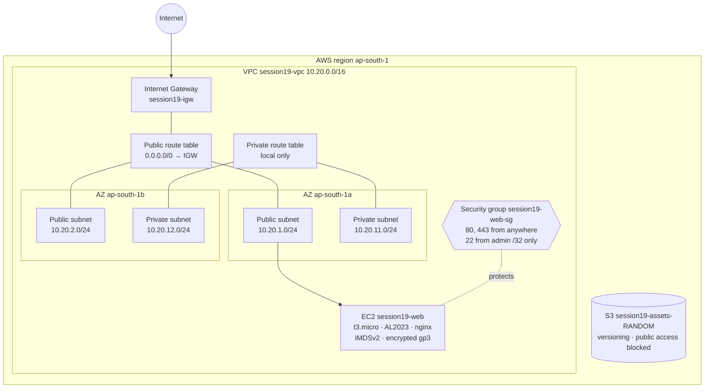
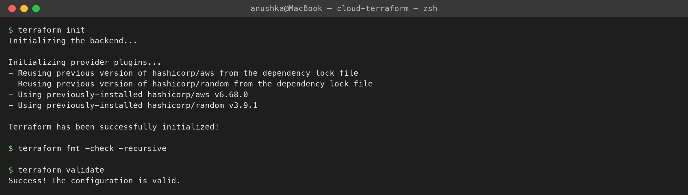
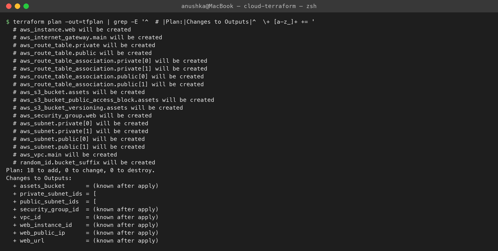
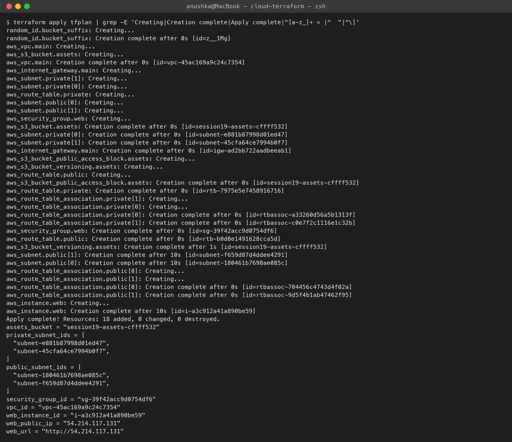
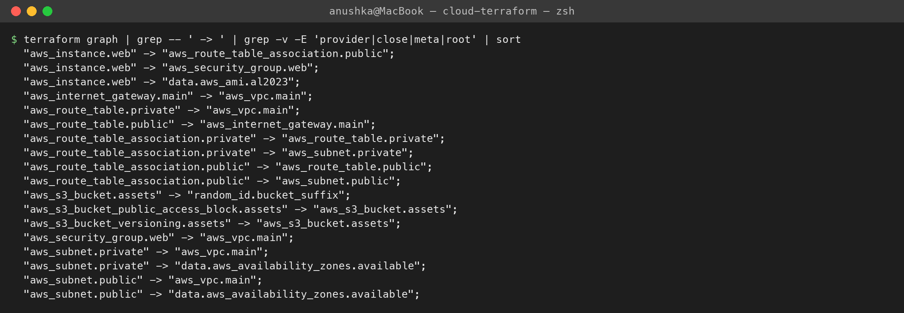
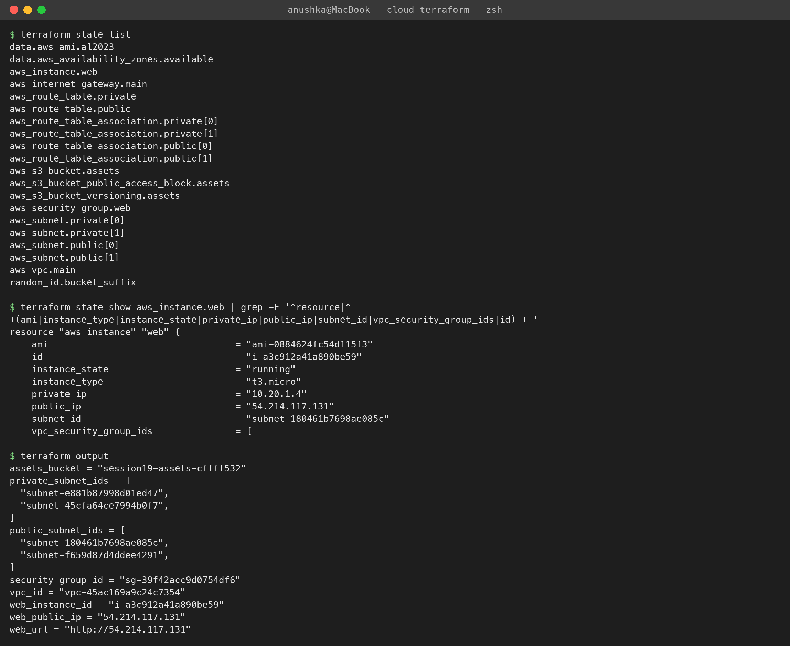
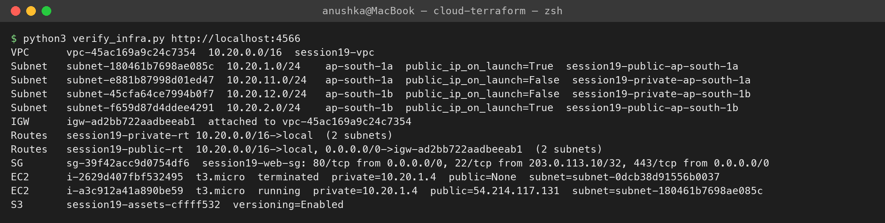
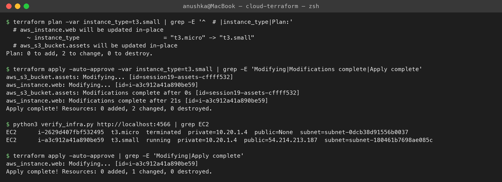
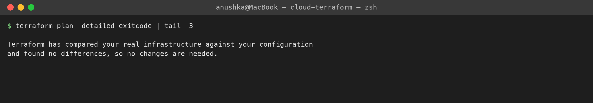
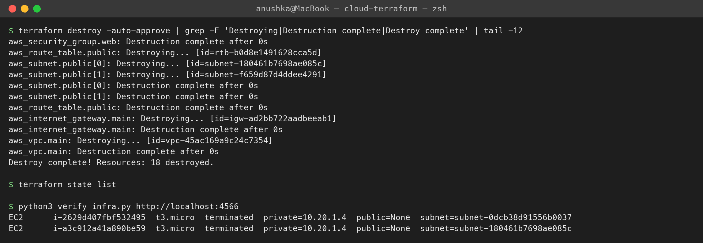

# Cloud & Terraform in Action Homework

**Name:** Anushka Jain

Session 19 project: an **end-to-end AWS infrastructure built with Terraform** — VPC, public + private subnets in two Availability Zones, Internet Gateway, route tables, a security group, an EC2 web server and an S3 bucket — following the suggested architecture in the homework doc and extending Nency's `session19-cloud-terraform/08-mini-project`. All output was generated on my machine by [`run.sh`](./run.sh).

> **Where it ran:** there's no AWS account configured on this laptop, so the AWS provider points at **Moto**, an open-source AWS API emulator running in Docker (`localhost:4566`). The Terraform code, provider, plan and apply are identical to real AWS — set `use_local_emulator = false` in `terraform.tfvars` and run `aws configure` to deploy for real. (Emulator side effects: the "public IPs" are fake and the EC2 instance doesn't actually boot Linux, so the nginx user-data isn't executed.)

## Architecture

```text
Terraform
   ├── VPC (10.20.0.0/16, DNS support + hostnames)
   ├── Subnets: 2 public (map public IP) + 2 private, spread over 2 AZs   (count + list variables)
   ├── Internet Gateway + public route table (0.0.0.0/0 → IGW) + associations
   ├── Private route table (no internet route; a NAT gateway would go here - skipped to avoid cost)
   ├── Security Group (HTTP/HTTPS public, SSH only from admin_cidr)
   ├── EC2 (latest Amazon Linux 2023 via data source, user_data installs nginx, IMDSv2, encrypted root)
   └── S3 bucket (random suffix, versioning, Block Public Access)
```

## Project structure
| File | Contents | Terraform concept |
|---|---|---|
| [`versions.tf`](./versions.tf) | required Terraform + `hashicorp/aws ~> 6.0` + `hashicorp/random ~> 3.6` | **providers** (two of them) |
| [`providers.tf`](./providers.tf) | AWS provider (region, default_tags, emulator switch), random provider | provider configuration |
| [`variables.tf`](./variables.tf) | region, project, CIDRs (lists), instance type, admin CIDR (with **validation**), emulator flag | **variables** |
| [`terraform.tfvars`](./terraform.tfvars) | my values | variable values |
| [`network.tf`](./network.tf) | AZ data source, VPC, subnets (`count`), IGW, route tables, associations | **resources**, data sources, `count`, locals |
| [`security.tf`](./security.tf) | web security group | resources |
| [`compute.tf`](./compute.tf) | AL2023 AMI data source, EC2 instance with user_data, `depends_on` | **dependencies** (implicit + explicit) |
| [`storage.tf`](./storage.tf) | `random_id` + S3 bucket, versioning, public access block | cross-provider references |
| [`outputs.tf`](./outputs.tf) | IDs, IPs, URL, bucket name (incl. splat `aws_subnet.public[*].id`) | **outputs** |
| [`verify_infra.py`](./verify_infra.py) | checks the result through the AWS API (boto3), independent of Terraform | verification |

---

## 1. `terraform init`, `fmt`, `validate`
```text
$ terraform init
Initializing provider plugins...
- Installed hashicorp/random v3.9.1 (signed by HashiCorp)
- Installed hashicorp/aws v6.68.0 (signed by HashiCorp)
Terraform has been successfully initialized!

$ terraform fmt -check -recursive
$ terraform validate
Success! The configuration is valid.
```

## 2. `terraform plan`
```text
$ terraform plan -out=tfplan
  # aws_instance.web will be created
  # aws_internet_gateway.main will be created
  # aws_route_table.private will be created
  # aws_route_table.public will be created
  # aws_route_table_association.private[0] will be created
  # aws_route_table_association.private[1] will be created
  # aws_route_table_association.public[0] will be created
  # aws_route_table_association.public[1] will be created
  # aws_s3_bucket.assets will be created
  # aws_s3_bucket_public_access_block.assets will be created
  # aws_s3_bucket_versioning.assets will be created
  # aws_security_group.web will be created
  # aws_subnet.private[0] will be created
  # aws_subnet.private[1] will be created
  # aws_subnet.public[0] will be created
  # aws_subnet.public[1] will be created
  # aws_vpc.main will be created
  # random_id.bucket_suffix will be created
Plan: 18 to add, 0 to change, 0 to destroy.
```
Before planning, Terraform read two **data sources**: the AZs of the region and the newest Amazon Linux 2023 AMI (`ami-0884624fc54d115f3`) — nothing is hard-coded per region.

## 3. `terraform apply`
```text
$ terraform apply tfplan
random_id.bucket_suffix: Creating...
aws_vpc.main: Creating...
aws_s3_bucket.assets: Creating...
aws_vpc.main: Creation complete after 0s [id=vpc-45ac169a9c24c7354]
aws_internet_gateway.main: Creating...           <- these wait for the VPC...
aws_subnet.public[0]: Creating...                <- ...then run in parallel
aws_security_group.web: Creating...
...
aws_route_table_association.public[0]: Creation complete after 0s
aws_instance.web: Creating...                    <- last: waits for the route table association (depends_on)
aws_instance.web: Creation complete after 10s [id=i-a3c912a41a890be59]
Apply complete! Resources: 18 added, 0 changed, 0 destroyed.

Outputs:
assets_bucket = "session19-assets-cffff532"
private_subnet_ids = ["subnet-e881b87998d01ed47", "subnet-45cfa64ce7994b0f7"]
public_subnet_ids = ["subnet-180461b7698ae085c", "subnet-f659d87d4ddee4291"]
security_group_id = "sg-39f42acc9d0754df6"
vpc_id = "vpc-45ac169a9c24c7354"
web_instance_id = "i-a3c912a41a890be59"
web_public_ip = "54.214.117.131"
web_url = "http://54.214.117.131"
```

## 4. Dependencies
Terraform builds a **dependency graph** from references and creates independent resources in parallel:
```text
$ terraform graph | grep -- ' -> ' | ...
  "aws_instance.web" -> "aws_route_table_association.public";     <- explicit (depends_on)
  "aws_instance.web" -> "aws_security_group.web";                  <- implicit (vpc_security_group_ids)
  "aws_instance.web" -> "data.aws_ami.al2023";                     <- implicit (ami)
  "aws_internet_gateway.main" -> "aws_vpc.main";
  "aws_route_table.public" -> "aws_internet_gateway.main";
  "aws_route_table_association.public" -> "aws_route_table.public";
  "aws_route_table_association.public" -> "aws_subnet.public";
  "aws_s3_bucket.assets" -> "random_id.bucket_suffix";             <- across providers
  "aws_security_group.web" -> "aws_vpc.main";
  "aws_subnet.public" -> "aws_vpc.main";
  "aws_subnet.public" -> "data.aws_availability_zones.available";
  ...
```
- **Implicit dependency**: writing `vpc_id = aws_vpc.main.id` tells Terraform the subnet needs the VPC first. This covers 99% of cases.
- **Explicit dependency** (`depends_on`): the EC2 instance doesn't reference the route table, but its `user_data` needs internet to `dnf install nginx`, which only works once the public route table is associated. Terraform can't see that, so I declared it.
- `destroy` walks the same graph **in reverse** (instance first, VPC last).

## 5. Terraform state
```text
$ terraform state list
data.aws_ami.al2023
data.aws_availability_zones.available
aws_instance.web
aws_internet_gateway.main
aws_route_table.private
aws_route_table.public
aws_route_table_association.private[0]
...
aws_vpc.main
random_id.bucket_suffix

$ terraform state show aws_instance.web
resource "aws_instance" "web" {
    ami            = "ami-0884624fc54d115f3"
    id             = "i-a3c912a41a890be59"
    instance_state = "running"
    instance_type  = "t3.micro"
    private_ip     = "10.20.1.4"
    public_ip      = "54.214.117.131"
    subnet_id      = "subnet-180461b7698ae085c"
```
The state file maps each resource address (`aws_subnet.public[0]`) to a real ID (`subnet-180461b7698ae085c`). Terraform uses it to compute diffs, and it can contain secrets — so it's **git-ignored** here, and in a team it lives in a **remote backend** (S3 with locking) so everyone shares one state and two applies can't run at once.

## 6. Verification through the AWS API
`verify_infra.py` asks the EC2/S3 APIs directly (not Terraform) what exists:
```text
$ python3 verify_infra.py http://localhost:4566
VPC      vpc-45ac169a9c24c7354  10.20.0.0/16  session19-vpc
Subnet   subnet-180461b7698ae085c  10.20.1.0/24    ap-south-1a  public_ip_on_launch=True   session19-public-ap-south-1a
Subnet   subnet-e881b87998d01ed47  10.20.11.0/24   ap-south-1a  public_ip_on_launch=False  session19-private-ap-south-1a
Subnet   subnet-45cfa64ce7994b0f7  10.20.12.0/24   ap-south-1b  public_ip_on_launch=False  session19-private-ap-south-1b
Subnet   subnet-f659d87d4ddee4291  10.20.2.0/24    ap-south-1b  public_ip_on_launch=True   session19-public-ap-south-1b
IGW      igw-ad2bb722aadbeeab1  attached to vpc-45ac169a9c24c7354
Routes   session19-private-rt 10.20.0.0/16->local  (2 subnets)
Routes   session19-public-rt  10.20.0.0/16->local, 0.0.0.0/0->igw-ad2bb722aadbeeab1  (2 subnets)
SG       sg-39f42acc9d0754df6  session19-web-sg: 80/tcp from 0.0.0.0/0, 22/tcp from 203.0.113.10/32, 443/tcp from 0.0.0.0/0
EC2      i-a3c912a41a890be59  t3.micro  running  private=10.20.1.4  public=54.214.117.131  subnet=subnet-180461b7698ae085c
S3       session19-assets-cffff532  versioning=Enabled
```
Exactly the intended wiring: public route table → IGW for the two public subnets, private route table with only the local route, SSH limited to one /32. (The extra `terminated` instance in the screenshot is from my previous run — AWS keeps terminated instances visible for about an hour.)

## 7. Changing infrastructure
Resize the web server by changing one variable:
```text
$ terraform plan -var instance_type=t3.small
  # aws_instance.web will be updated in-place
      ~ instance_type = "t3.micro" -> "t3.small"
Plan: 0 to add, 2 to change, 0 to destroy.

$ terraform apply -auto-approve -var instance_type=t3.small
aws_instance.web: Modifying... [id=i-a3c912a41a890be59]
aws_instance.web: Modifications complete after 21s [id=i-a3c912a41a890be59]
Apply complete! Resources: 0 added, 2 changed, 0 destroyed.

$ python3 verify_infra.py | grep EC2
EC2      i-a3c912a41a890be59  t3.small  running  private=10.20.1.4  public=54.214.213.187
```
- `~` = **update in place**: same instance ID, but AWS must **stop → change type → start** it, which is why it took 21 s — and why the **public IP changed** (54.214.117.131 → 54.214.213.187): auto-assigned public IPs are released on stop. An **Elastic IP** (`aws_eip`) would keep it stable.
- Some changes can't be done in place (e.g. a new AMI or subnet) and show as `-/+` **replace** (destroy + create).
- The second "change" (`aws_s3_bucket.assets`) is a quirk of the emulator: it doesn't return the bucket's tags on the first read after creation, so Terraform re-applies them once. After that, the config and the infrastructure match.

Then I applied the original config again to resize back to `t3.micro`.

## 8. Idempotency check
```text
$ terraform plan -detailed-exitcode
Terraform has compared your real infrastructure against your configuration
and found no differences, so no changes are needed.
```

## 9. `terraform destroy`
```text
$ terraform destroy -auto-approve
aws_security_group.web: Destruction complete after 0s
aws_subnet.public[0]: Destruction complete after 0s
aws_route_table.public: Destruction complete after 0s
aws_internet_gateway.main: Destruction complete after 0s
aws_vpc.main: Destroying... [id=vpc-45ac169a9c24c7354]
aws_vpc.main: Destruction complete after 0s
Destroy complete! Resources: 18 destroyed.

$ terraform state list          <- empty
$ python3 verify_infra.py
EC2      i-a3c912a41a890be59  t3.micro  terminated  ...   <- only terminated-instance records remain
```

## Security choices in this config
- SSH only from a single admin `/32`, enforced by a variable **validation** that rejects `0.0.0.0/0`
- **IMDSv2 required** on EC2 (blocks SSRF-style credential theft from the metadata service)
- Encrypted gp3 root volume
- S3: versioning + all four Block Public Access settings
- Private subnets with no internet route for future databases / app servers
- `default_tags` (Project / ManagedBy / Owner / Session) on every resource for cost tracking and ownership

## Run it yourself
```bash
docker run -d --name moto -p 4566:5000 motoserver/moto:latest
pip install boto3
cd cloud-terraform && ./run.sh
```

## Screenshots









