# DevSecOps Pipeline Homework

**Name:** Anushka Jain

Session 17 demo project: a complete **CI/CD + DevSecOps pipeline** on GitHub Actions for Nency's `session-17-devsecops` Flask "DevSecOps Dashboard" app. Security checks run on every push, and a **security gate** decides whether the image may be pushed and deployed. All pipeline output below is from the **real runs on this repository**:
- ✅ full pass, pushed + deployed: [run #37648446681](https://github.com/anushkabhansalii/devops-homework/actions/runs/37648446681)
- ⛔ gate blocking a vulnerable build: [run #37714692090](https://github.com/anushkabhansalii/devops-homework/actions/runs/37714692090)

```text
devsecops/
├── app/                    Flask app (app.py, templates/, static/)
├── tests/test_app.py       8 unit tests
├── k8s/                    deployment.yaml (hardened securityContext) + service.yaml
├── Dockerfile              alpine, no pip at runtime, numeric non-root user, gunicorn
├── requirements.txt / requirements-dev.txt / pytest.ini
├── .gitleaks.toml          secret-scanning config (default rules)
└── screenshots/
.github/workflows/session17-devsecops.yml     the pipeline
```

## Pipeline flow
```text
Code (push to main / PR / manual)
  │
  ▼
1. Build ──► 2. Unit Test ──┬──► 3. SAST (Bandit) ───────────────┐
                            ├──► 4. SCA (pip-audit) ─────────────┤
                            ├──► 5. Secret scan (gitleaks) ──────┼──► 8. SECURITY GATE ──► 9. Push image ──► 10. Deploy to
                            └──► 6. Docker build ──► 7. Image ───┘        (all must pass)      (GHCR)             Kubernetes (kind)
                                                        scan (Trivy)                                               + smoke test
```
This matches the doc's required order — Code → Build → Unit Test → SAST → SCA → Secret Scan → Docker Build → Image Scan → Security Gate → Push → Deploy — with the independent scans running **in parallel** to keep the pipeline fast.

| # | Stage | Tool | Fails the job when… | Report artifact |
|---|---|---|---|---|
| 1 | Build | `python -m compileall` | code doesn't compile | — |
| 2 | Unit test | pytest + pytest-cov | any test fails | `coverage-report` |
| 3 | **SAST** (static application security testing) | **Bandit** | MEDIUM+ severity & confidence finding in *my code* | `sast-bandit-report` (JSON) |
| 4 | **SCA** (software composition analysis) | **pip-audit** (PyPI/OSV advisories) | any dependency has a known vulnerability | `sca-pip-audit-report` |
| 5 | **Secret scanning** | **gitleaks** (whole git history of `devsecops/`) | a key/token/password pattern is found | `secret-scan-gitleaks-report` |
| 6 | Docker build | docker | build fails | image tarball (1 day) |
| 7 | **Container image scanning** | **Trivy** (OS packages + Python packages in the image) | fixable HIGH/CRITICAL CVE | `image-scan-trivy-report` |
| 8 | **Security gate** | `needs.*.result` | any of 3/4/5/7 did not succeed → `exit 1` | job summary table |
| 9 | Push | docker → **GHCR** with `GITHUB_TOKEN` | — | `ghcr.io/anushkabhansalii/devsecops-app:<sha>` |
| 10 | Deploy | **kind** cluster on the runner | rollout/smoke test fails | — |

Design decisions:
- **The gate is a separate job** with `if: always()` — so it still runs (and fails loudly) when a scan fails, and `push`/`deploy` are skipped because they `need` it. Nothing that failed a scan can reach the registry.
- **Shift left**: the cheapest checks (SAST, SCA, secrets) run right after unit tests, before anything is built or pushed.
- **Least privilege tokens**: workflow default `contents: read`; only `push` gets `packages: write`.
- **Pinned scanner images** (`aquasec/trivy:0.65.0`, `ghcr.io/gitleaks/gitleaks:v8.28.0`) instead of `aquasecurity/trivy-action` — that action's tags were hijacked in a supply-chain attack earlier in 2026, which is itself a lesson in pinning CI dependencies.
- **Manual demo switch**: `workflow_dispatch` input `inject_vulnerable_dependency` adds `requests==2.25.1` before the SCA scan, to prove the gate actually blocks.

---

## What the scans found — and how I fixed it
The lab app didn't pass the gate as-is. These are real findings from running the tools.

### SAST: Bandit found HIGH + MEDIUM issues
```text
$ bandit -r app -ll
>> Issue: [B201:flask_debug_true] A Flask app appears to be run with debug=True, which exposes the Werkzeug
   debugger and allows the execution of arbitrary code.
   Severity: High   Confidence: Medium
   CWE: CWE-94
   Location: app/app.py:234:4
233	if __name__ == "__main__":
234	    app.run(host="0.0.0.0", port=5001, debug=True)

>> Issue: [B104:hardcoded_bind_all_interfaces] Possible binding to all interfaces.
   Severity: Medium   Confidence: Medium
   CWE: CWE-605
```
`debug=True` would give anyone who can reach the app an interactive Python console (remote code execution). **Fix**: the container runs **gunicorn** (no debug server at all); the `__main__` block is for local dev only and takes host/debug from env vars, defaulting to `127.0.0.1` and debug off.
```text
$ bandit -r app -ll     (after fix)
	No issues identified.
	Total issues (by severity):  Low: 5   Medium: 0   High: 0
```
The 5 remaining LOW findings are `random` (B311) used for demo data, not for security — acceptable, so the gate is set to MEDIUM and above (`-ll -ii`).

### Image scan: Trivy found HIGH CVEs in tools the app never uses
```text
$ trivy image --severity HIGH,CRITICAL --ignore-unfixed --exit-code 1 devsecops-app:before
Python   msgpack     1.1.2    → 1.2.1    GHSA-6v7p-g79w-8964   HIGH
Python   setuptools  70.3.0   → 78.1.1   CVE-2025-47273        HIGH
Python   urllib3     2.7.0    → 2.8.0    CVE-2026-97687        HIGH
Python   urllib3     2.7.0    → 2.8.0    CVE-2026-97689        HIGH
exit code: 1

$ docker run --rm --entrypoint sh devsecops-app:before -c "pip --version; ls .../pip/_vendor | grep -E 'urllib3|msgpack'"
pip 26.2.1 from /usr/local/lib/python3.13/site-packages/pip (python 3.13)
msgpack
urllib3
```
None of these are the app's dependencies — they're **pip's vendored copies** and an old **setuptools** that ship in the `python` base image. **Fix**: uninstall `pip setuptools wheel` in the same layer right after installing requirements (they're build-time tools). Result:
```text
$ trivy image --severity HIGH,CRITICAL --ignore-unfixed --exit-code 1 devsecops-app:after
│ devsecops-app:after (alpine 3.24.2)                                     │   alpine   │        0        │
│ .../flask-3.1.3.dist-info/METADATA                                      │ python-pkg │        0        │
│ .../gunicorn-23.0.0.dist-info/METADATA                                  │ python-pkg │        0        │
...
exit code: 0
$ docker run --rm --entrypoint sh devsecops-app:after -c "pip --version"
sh: pip: not found
```
Smaller attack surface: an attacker who gets a shell can't `pip install` tools either.

### Deploy: hardened pod refused to start
My first pipeline run passed every scan but **failed at deploy** (rollout timed out). Reproduced on minikube:
```text
$ kubectl get pods -l app=devsecops-app
devsecops-app-df5d4f875-5m45m   0/1     CreateContainerConfigError   0          10s

$ kubectl get events --field-selector involvedObject.name=devsecops-app-df5d4f875-5m45m,reason=Failed
Error: container has runAsNonRoot and image has non-numeric user (appuser), cannot verify user is non-root
```
The pod's `securityContext.runAsNonRoot: true` makes the kubelet **verify** the container isn't root, but the Dockerfile said `USER appuser` — a *name*, which the kubelet can't resolve. **Fix**: `adduser -u 10001` + `USER 10001` in the Dockerfile and `runAsUser/runAsGroup: 10001` in the pod spec. I also added an `if: failure()` step that dumps `kubectl describe` + events so the next failure explains itself in the logs.
```text
$ kubectl get pods -l app=devsecops-app
devsecops-app-7d684f777-74p6x   1/1     Running   0          7s
$ kubectl exec deploy/devsecops-app -- id
uid=10001(appuser) gid=10001(appuser) groups=10001(appuser)
$ kubectl exec deploy/devsecops-app -- touch /app/x
touch: /app/x: Read-only file system                 <- readOnlyRootFilesystem works too
```
Pod hardening in [`k8s/deployment.yaml`](./k8s/deployment.yaml): `runAsNonRoot`, numeric `runAsUser/Group`, `seccompProfile: RuntimeDefault`, `allowPrivilegeEscalation: false`, `readOnlyRootFilesystem: true` (+ an emptyDir for `/tmp`), `capabilities.drop: [ALL]`, resource limits, readiness/liveness probes.

---

## Successful pipeline run
```text
$ gh run view 37648446681
✓ main Session 17 - DevSecOps · 37648446681
JOBS
✓ 1. Build in 12s
✓ 2. Unit tests in 17s
✓ 4. SCA (pip-audit) in 21s
✓ 3. SAST (Bandit) in 12s
✓ 6. Docker build in 24s
✓ 5. Secret scan (gitleaks) in 11s
✓ 7. Image scan (Trivy) in 40s
✓ 8. Security gate in 2s
✓ 9. Push image (GHCR) in 15s
✓ 10. Deploy to Kubernetes (kind) in 1m13s
```
Scans:
```text
2. pytest      → 8 passed (test_home, test_health, test_greet, test_add_numbers, ... test_status)
3. Bandit      → No issues identified.  (Low: 5, Medium: 0, High: 0)
4. pip-audit   → No known vulnerabilities found
5. gitleaks    → 2 commits scanned. no leaks found
7. Trivy       → alpine 3.24.2: 0, every python package: 0
```
Gate, push, deploy:
```text
## Security gate
| SAST (Bandit)          | success |
| SCA (pip-audit)        | success |
| Secret scan (gitleaks) | success |
| Image scan (Trivy)     | success |
Security gate PASSED - all scans clean

Loaded image: devsecops-app:f017f9a
Login Succeeded
f017f9a: digest: sha256:2afe41f0fb616ee19d9f52b5b1ff2dc11e590e1cb8f735b41a4dff43d473b3f9 size: 2407
latest: digest: sha256:2afe41f0fb616ee19d9f52b5b1ff2dc11e590e1cb8f735b41a4dff43d473b3f9 size: 2407

deployment "devsecops-app" successfully rolled out
pod/devsecops-app-6b49fbd8b6-8mkbk   1/1     Running   0          7s    10.244.0.6   devsecops-control-plane
pod/devsecops-app-6b49fbd8b6-k287x   1/1     Running   0          7s    10.244.0.5   devsecops-control-plane
{"status":"healthy","timestamp":"2026-10-07T16:02:46.035151Z","uptime_seconds":5.93}
{"app":"DevSecOps Dashboard","platform":"Linux","python_version":"3.13.16","status":"running",...,"version":"2.0.0"}
```
The deployed image is pulled **from GHCR by digest-tagged SHA** — the exact bytes that were scanned.

## Security gate blocking a vulnerable build
Manual run with `inject_vulnerable_dependency = true`:
```text
$ gh run view 37714692090
X main Session 17 - DevSecOps · 37714692090
Triggered via workflow_dispatch
JOBS
✓ 1. Build
✓ 2. Unit tests
✓ 3. SAST (Bandit)
X 4. SCA (pip-audit)
  ✓ Inject vulnerable dependency (demo only)
  X Audit dependencies against the PyPI/OSV advisory database
✓ 6. Docker build
✓ 5. Secret scan (gitleaks)
✓ 7. Image scan (Trivy)
X 8. Security gate
- 9. Push image (GHCR)             <- skipped
- 10. Deploy to Kubernetes (kind)  <- skipped

$ echo "requests==2.25.1" >> requirements.txt
WARNING: Demo mode - injected requests==2.25.1 into requirements.txt
$ pip-audit -r requirements.txt --desc on -f columns
Found 13 known vulnerabilities in 3 packages
Name     Version ID              Fix Versions Description
requests 2.25.1  PYSEC-2023-74   2.31.0       ... leaking Proxy-Authorization headers to destination servers ...
requests 2.25.1  PYSEC-2026-1872 2.32.4       ... may leak .netrc credentials to third parties ...
idna     2.10    PYSEC-2024-60   3.7          ...
urllib3  1.26.20 PYSEC-2026-141  2.7.0        ... cross-origin redirects ...
...
ERROR: Process completed with exit code 1.

## Security gate
| SAST (Bandit)          | success |
| SCA (pip-audit)        | failure |
| Secret scan (gitleaks) | success |
| Image scan (Trivy)     | success |
ERROR: Security gate FAILED - image will NOT be pushed or deployed
```
One old library (`requests 2.25.1`) pulled in **13 known vulnerabilities** through itself and its transitive dependencies (`idna`, `urllib3`) — which is exactly why SCA matters: most of the code in an app is other people's code.

## Concept summary
| Term | Meaning |
|---|---|
| **DevSecOps** | security built into every stage of the pipeline and owned by the team, not a final manual audit |
| **SAST** | analyses *your source code* without running it (injection, debug mode, hard-coded binds, weak crypto) |
| **SCA** | checks *third-party dependencies* (direct + transitive) against vulnerability databases |
| **Secret scanning** | finds credentials committed to code or **git history** (deleting a file doesn't remove it from history — rotate the secret) |
| **Container image scanning** | finds CVEs in the image's OS packages and language packages |
| **Security gate** | an automated policy decision: if any check fails, the artifact doesn't get promoted |
| **Container registry** | stores versioned images — here GitHub Container Registry, authenticated with the per-run `GITHUB_TOKEN` |

## Screenshots
**Findings and fixes (local)**
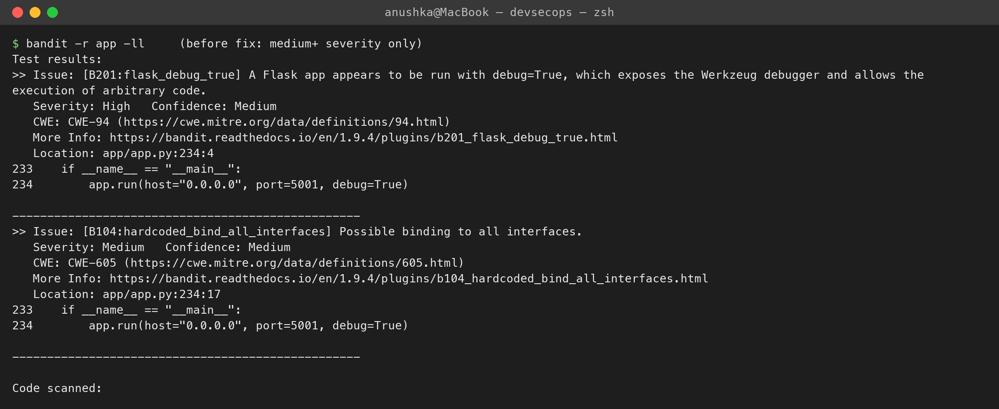
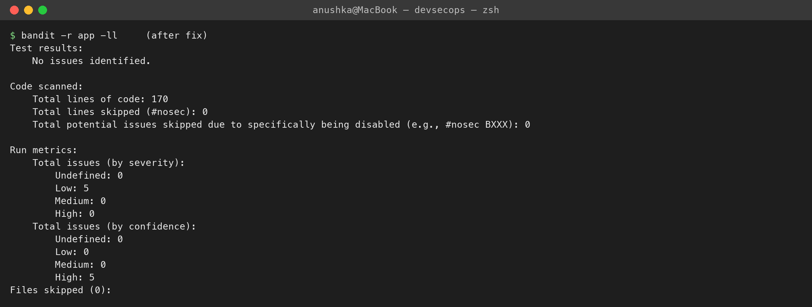
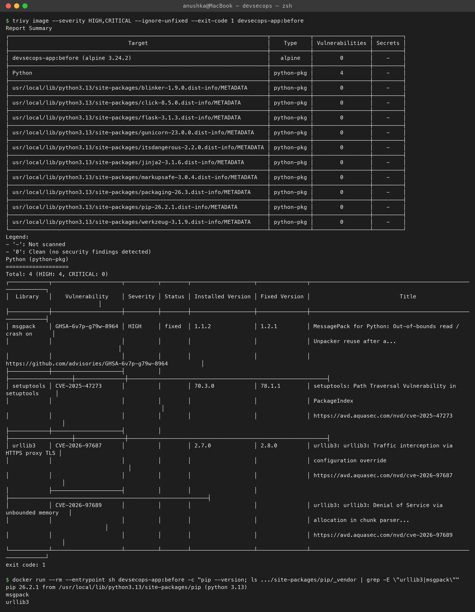
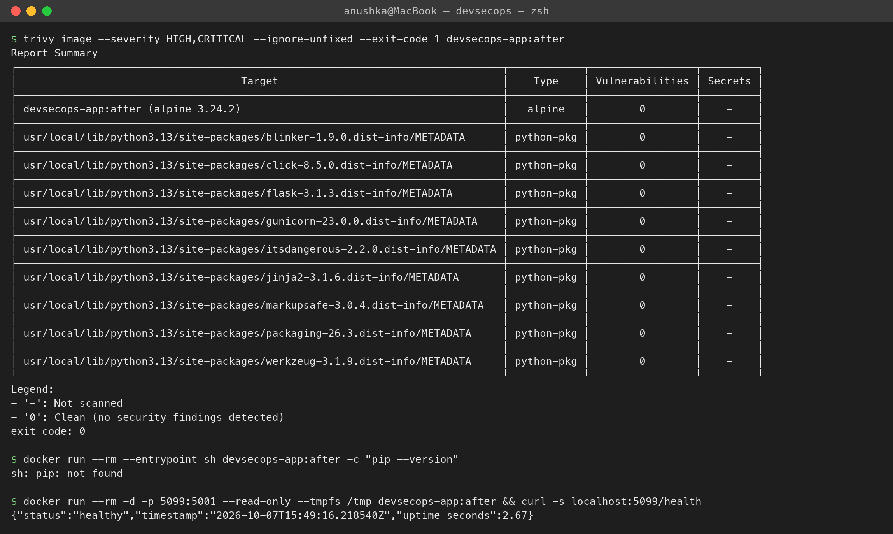
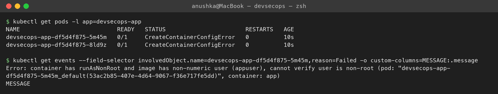
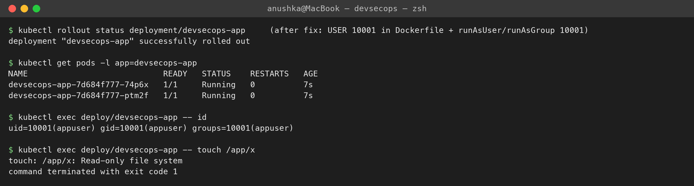

**Pipeline — full pass**
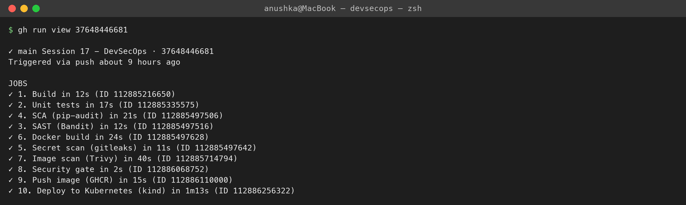
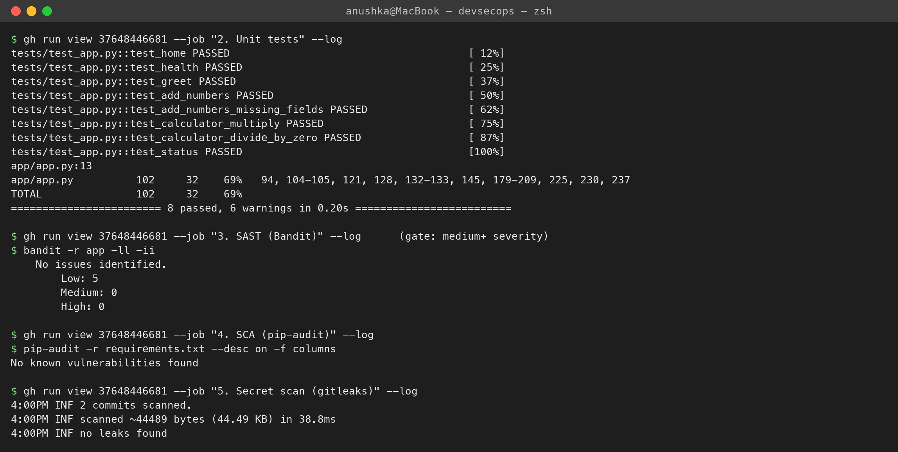
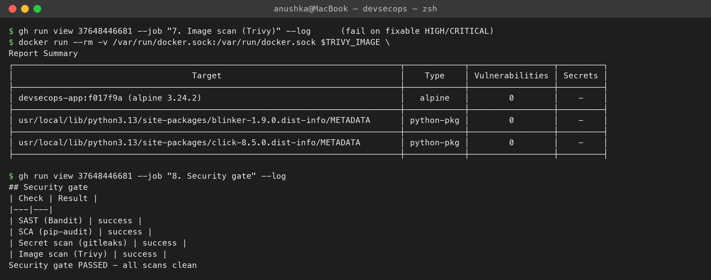
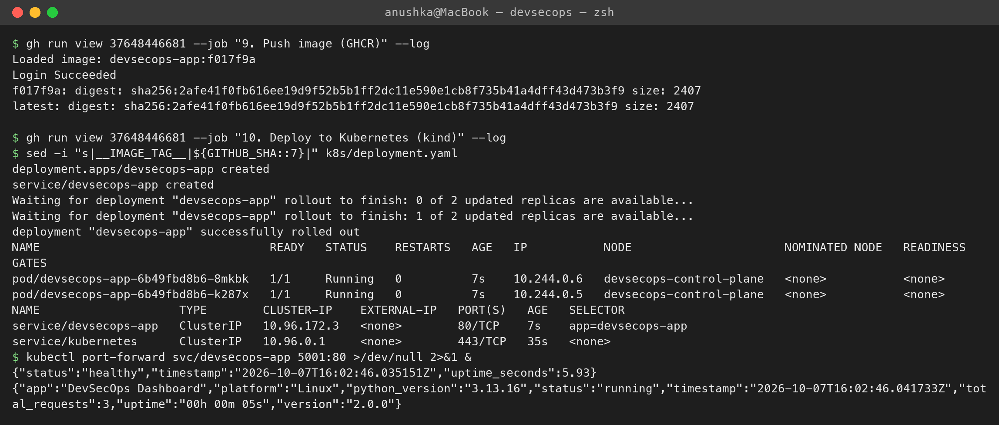

**Pipeline — gate blocks a vulnerable dependency**
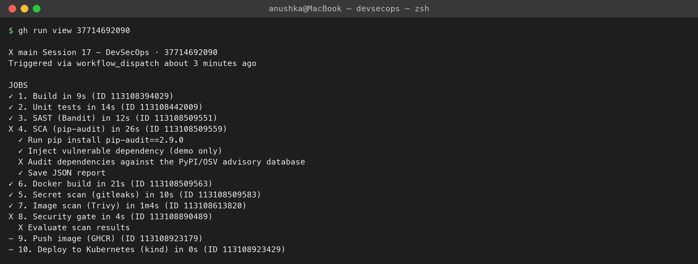
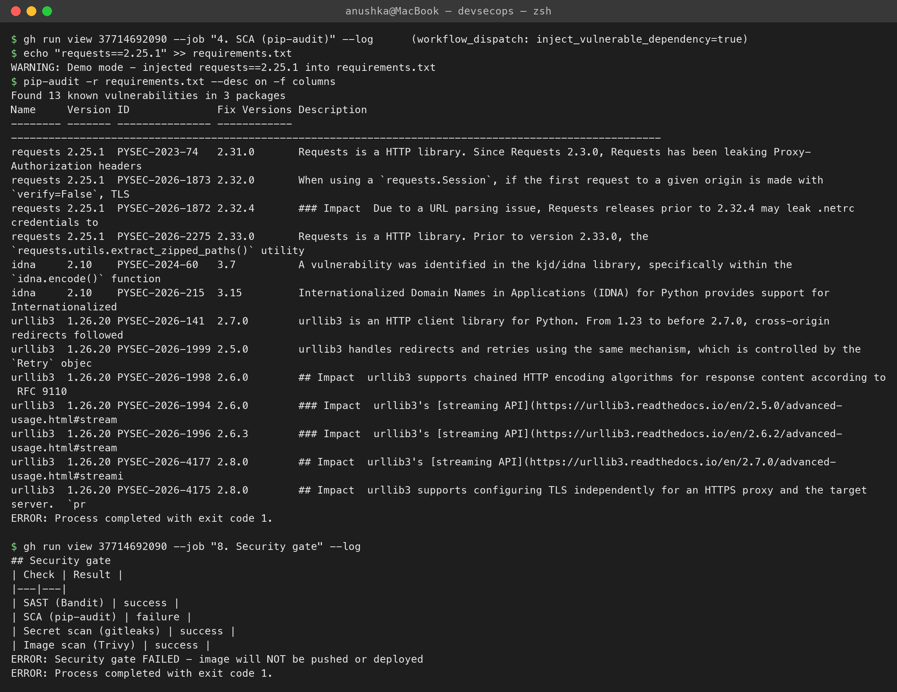
