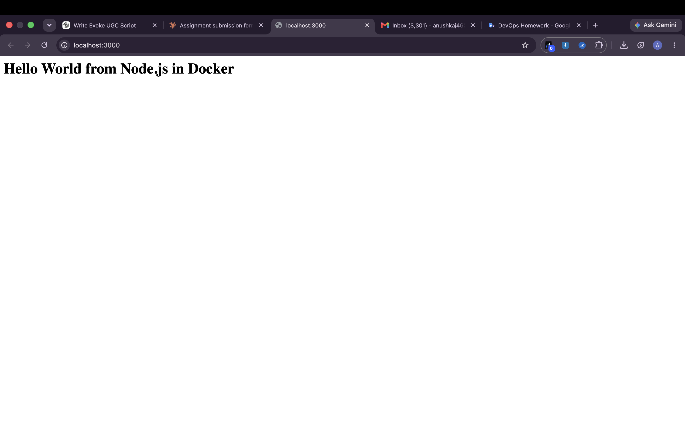
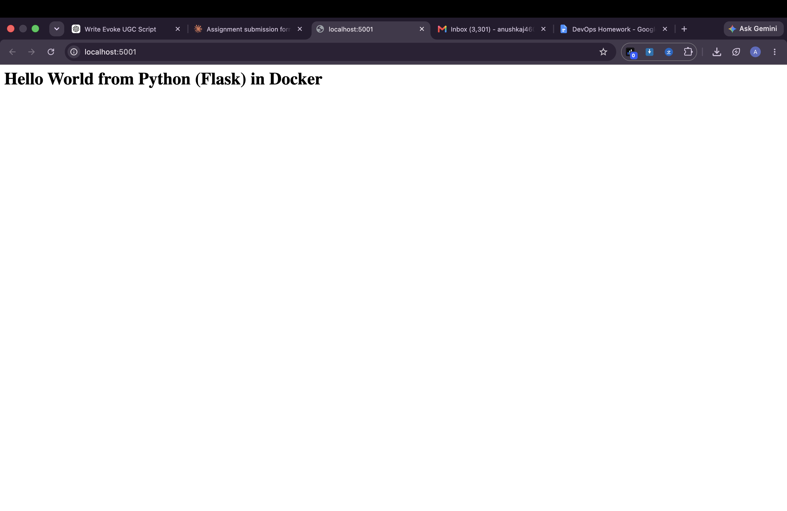
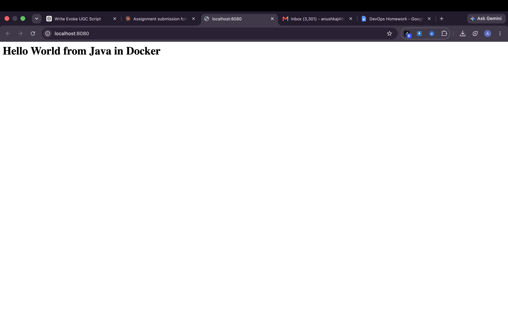
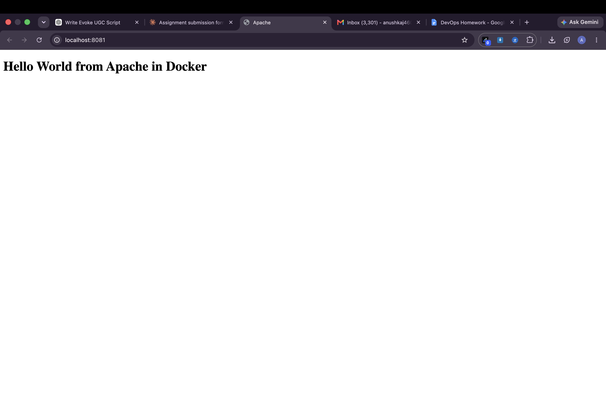
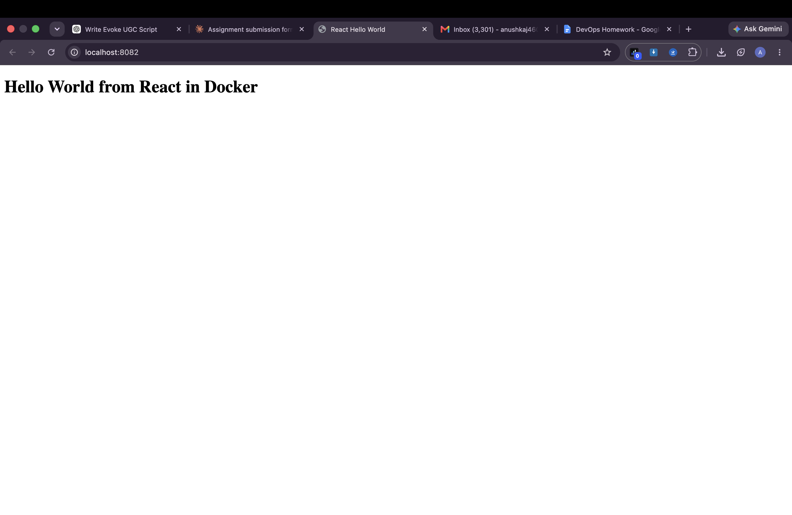
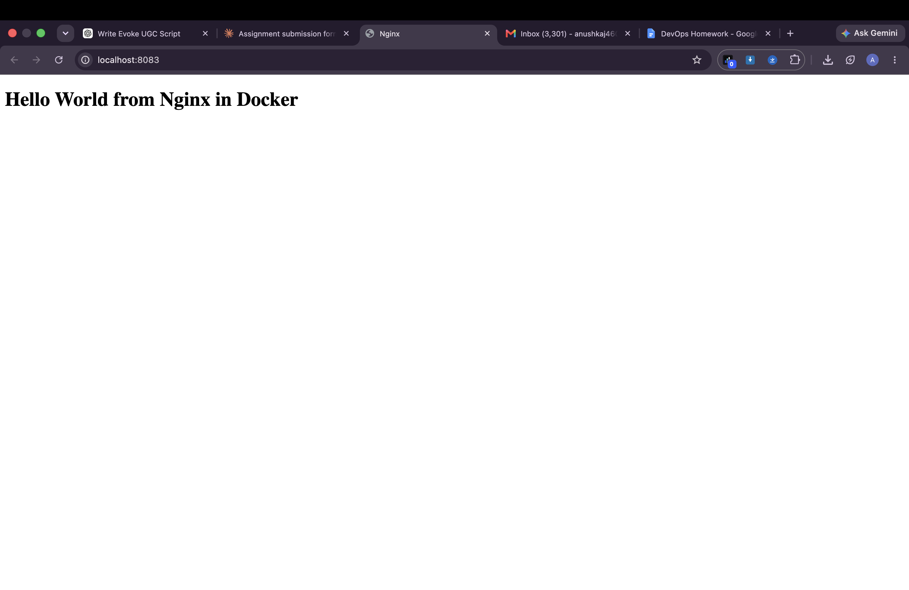

# Docker Fundamentals Homework - Hello World Applications

**Name:** Anushka Jain

Six Hello World web apps, each in its own folder with its own Dockerfile. Every app was built, run in a container, and verified in the browser / with `curl`.

## Folder structure

```text
docker-fundamentals/
├── nodejs-app/   server.js, package.json, Dockerfile        -> port 3000
├── python-app/   app.py (Flask), requirements.txt, Dockerfile -> port 5001
├── java-app/     HelloServer.java, Dockerfile               -> port 8080
├── Apache-app/   index.html, Dockerfile (httpd)             -> port 8081
├── React-app/    Vite + React, multi-stage Dockerfile       -> port 8082
├── nginx-app/    index.html, Dockerfile (nginx)             -> port 8083
├── run_all.sh    builds + runs + verifies everything
└── README.md
```

## How each one works

| App | Base image | What the Dockerfile does |
|---|---|---|
| Node.js | `node:20-alpine` | copies `server.js`, runs `npm start` (plain `http` server on 3000) |
| Python | `python:3.12-slim` | installs Flask from `requirements.txt`, runs `app.py` on 5000 |
| Java | `eclipse-temurin:21-jdk-alpine` | compiles `HelloServer.java` with `javac`, runs built-in `HttpServer` on 8080 |
| Apache | `httpd:2.4-alpine` | copies `index.html` into `/usr/local/apache2/htdocs` |
| React | `node:20-alpine` -> `nginx:alpine` | stage 1 runs `npm run build` (Vite), stage 2 serves `dist/` with nginx |
| Nginx | `nginx:alpine` | copies `index.html` into `/usr/share/nginx/html` |

## Commands to build and run

```bash
docker build -t hello-nodejs ./nodejs-app  && docker run -d --name hello-nodejs -p 3000:3000 hello-nodejs
docker build -t hello-python ./python-app  && docker run -d --name hello-python -p 5001:5000 hello-python
docker build -t hello-java   ./java-app    && docker run -d --name hello-java   -p 8080:8080 hello-java
docker build -t hello-apache ./Apache-app  && docker run -d --name hello-apache -p 8081:80   hello-apache
docker build -t hello-react  ./React-app   && docker run -d --name hello-react  -p 8082:80   hello-react
docker build -t hello-nginx  ./nginx-app   && docker run -d --name hello-nginx  -p 8083:80   hello-nginx
```

Or just run `./run_all.sh`.

## Verification

Open in browser: http://localhost:3000, :5001, :8080, :8081, :8082, :8083. Each page shows **Hello World from &lt;app&gt; in Docker**.

## Output from my machine

```text
=================== nodejs-app ===================
$ docker build -t hello-nodejs ./nodejs-app
#0 building with "desktop-linux" instance using docker driver

#1 [internal] load build definition from Dockerfile
#1 transferring dockerfile: 140B done
#1 DONE 0.0s

#2 [internal] load metadata for docker.io/library/node:20-alpine
#2 DONE 2.0s

#3 [internal] load .dockerignore
#3 transferring context: 2B done
#3 DONE 0.0s

#4 [internal] load build context
#4 transferring context: 62B done
#4 DONE 0.0s

#5 [1/4] FROM docker.io/library/node:20-alpine@sha256:fb4cd12c85ee03686f6af5362a0b0d56d50c58a04632e6c0fb8363f609372293
#5 resolve docker.io/library/node:20-alpine@sha256:fb4cd12c85ee03686f6af5362a0b0d56d50c58a04632e6c0fb8363f609372293 0.0s done
#5 DONE 0.0s

#6 [2/4] WORKDIR /app
#6 CACHED

#7 [3/4] COPY package.json .
#7 CACHED

#8 [4/4] COPY server.js .
#8 CACHED

#9 exporting to image
#9 exporting layers done
#9 exporting manifest sha256:0cdb6a4678099dac363f883bfc702d16be9c9a180dd9bc6f995ea1be8d1e8e63 done
#9 exporting config sha256:243a3c2b468b61c632ff28e0e525e8f6cb2382c06f86a4c67effabf2b9527a43 done
#9 exporting attestation manifest sha256:3d511423a9952fde4d435f03561f0308e30c1a37e7a4a443ef5f81fb8c745ecb done
#9 exporting manifest list sha256:298928818563debe3dacee05de3dd7941ff042374e1c38275878ebc32586c12e done
#9 naming to docker.io/library/hello-nodejs:latest done
#9 unpacking to docker.io/library/hello-nodejs:latest done
#9 DONE 0.0s

$ docker run -d --name hello-nodejs -p 3000:3000 hello-nodejs
6cbdb6c8661b2a60d16b2bdc124ec0fd58bc8c969ed822a72b8dc523381ee03a

$ curl -s http://localhost:3000
<h1>Hello World from Node.js in Docker</h1>
=================== python-app ===================
$ docker build -t hello-python ./python-app
#0 building with "desktop-linux" instance using docker driver

#1 [internal] load build definition from Dockerfile
#1 transferring dockerfile: 200B done
#1 DONE 0.0s

#2 [internal] load metadata for docker.io/library/python:3.12-slim
#2 DONE 1.9s

#3 [internal] load .dockerignore
#3 transferring context: 2B done
#3 DONE 0.0s

#4 [internal] load build context
#4 transferring context: 63B done
#4 DONE 0.0s

#5 [1/5] FROM docker.io/library/python:3.12-slim@sha256:78387bc3881b8273120a12ebe6c1ab22b018ccc2c9adf565ae1ac9b536e184ea
#5 resolve docker.io/library/python:3.12-slim@sha256:78387bc3881b8273120a12ebe6c1ab22b018ccc2c9adf565ae1ac9b536e184ea 0.0s done
#5 DONE 0.0s

#6 [2/5] WORKDIR /app
#6 CACHED

#7 [3/5] COPY requirements.txt .
#7 CACHED

#8 [4/5] RUN pip install --no-cache-dir -r requirements.txt
#8 CACHED

#9 [5/5] COPY app.py .
#9 CACHED

#10 exporting to image
#10 exporting layers done
#10 exporting manifest sha256:7429e73d3b76d24f36a903d1c8b14b8c3c9a069139d40f2b2e301ef4c0b26515 done
#10 exporting config sha256:6141de460305352f2d400fbca647a1f9c0e43948aa91952ffbb899c51f2c169e done
#10 exporting attestation manifest sha256:78cc2047c34282e2a909ef8308e307cafc99718deb9978cf2493bab25bc3f425 done
#10 exporting manifest list sha256:3ea0c21b73fef31d49f040667a3894122bb0928fa0e0b09a39c6a3615b9ea7bf done
#10 naming to docker.io/library/hello-python:latest done
#10 unpacking to docker.io/library/hello-python:latest done
#10 DONE 0.0s

$ docker run -d --name hello-python -p 5001:5000 hello-python
c4be947555c8a00566a6d146f4dbdfbefd18cded6dde55fed359af0bfc1a085b

$ curl -s http://localhost:5001
<h1>Hello World from Python (Flask) in Docker</h1>
=================== java-app ===================
$ docker build -t hello-java ./java-app
#0 building with "desktop-linux" instance using docker driver

#1 [internal] load build definition from Dockerfile
#1 transferring dockerfile: 178B done
#1 DONE 0.0s

#2 [internal] load metadata for docker.io/library/eclipse-temurin:21-jdk-alpine
#2 DONE 1.9s

#3 [internal] load .dockerignore
#3 transferring context: 2B done
#3 DONE 0.0s

#4 [1/4] FROM docker.io/library/eclipse-temurin:21-jdk-alpine@sha256:6ea5548706b60ac0a602eaf48af74792cbab012d90e811ca8db6184b16b5c3d6
#4 resolve docker.io/library/eclipse-temurin:21-jdk-alpine@sha256:6ea5548706b60ac0a602eaf48af74792cbab012d90e811ca8db6184b16b5c3d6 done
#4 DONE 0.0s

#5 [internal] load build context
#5 transferring context: 38B done
#5 DONE 0.0s

#6 [2/4] WORKDIR /app
#6 CACHED

#7 [3/4] COPY HelloServer.java .
#7 CACHED

#8 [4/4] RUN javac HelloServer.java
#8 CACHED

#9 exporting to image
#9 exporting layers done
#9 exporting manifest sha256:91a595d18e2e49c0a2e7e7c3b9ac2dccf223f36052f9e61e269075d8601c07fd done
#9 exporting config sha256:7efa32ad3e0c34a493e1564e1cf90073b89b1ba5e241c748b52e6b3e41a56296 done
#9 exporting attestation manifest sha256:35a8f19ce99e22cd110551b9020d11c26e43044b9de2ee21dc40f03610ff20de done
#9 exporting manifest list sha256:3d600bb3b6c0a0079baaa4ab49596203473d35462882fd97eaa1125ea4c578dc done
#9 naming to docker.io/library/hello-java:latest done
#9 unpacking to docker.io/library/hello-java:latest done
#9 DONE 0.0s

$ docker run -d --name hello-java -p 8080:8080 hello-java
64ca5ad7e83f2d2562521bece3bb89ca166159886fb3658c02f65a60f23df292

$ curl -s http://localhost:8080
<h1>Hello World from Java in Docker</h1>
=================== Apache-app ===================
$ docker build -t hello-apache ./Apache-app
#0 building with "desktop-linux" instance using docker driver

#1 [internal] load build definition from Dockerfile
#1 transferring dockerfile: 122B done
#1 DONE 0.0s

#2 [internal] load metadata for docker.io/library/httpd:2.4-alpine
#2 DONE 2.0s

#3 [internal] load .dockerignore
#3 transferring context: 2B done
#3 DONE 0.0s

#4 [internal] load build context
#4 transferring context: 31B done
#4 DONE 0.0s

#5 [1/2] FROM docker.io/library/httpd:2.4-alpine@sha256:1b766f17b84026429b7cb243317b142921b24432336e798bc881c43f45ed9567
#5 resolve docker.io/library/httpd:2.4-alpine@sha256:1b766f17b84026429b7cb243317b142921b24432336e798bc881c43f45ed9567 0.0s done
#5 DONE 0.0s

#6 [2/2] COPY index.html /usr/local/apache2/htdocs/index.html
#6 CACHED

#7 exporting to image
#7 exporting layers done
#7 exporting manifest sha256:682788ca18a9ad7e5169ef1c548f0f0eb63ff1655595f91c878df8150653b09c done
#7 exporting config sha256:a32aba8dabdb6e3e1af1ca23661facb36abf73d129ad4fa6b73c7cff3b5f0582 done
#7 exporting attestation manifest sha256:215165595f6362ac610f3990811935253fdd31226e133b0c00ee1813c89d85a0 done
#7 exporting manifest list sha256:3c3348d701ed78837df0abb5f65d72c9f923b7c42b9b36786473349142ec051d done
#7 naming to docker.io/library/hello-apache:latest done
#7 unpacking to docker.io/library/hello-apache:latest done
#7 DONE 0.0s

$ docker run -d --name hello-apache -p 8081:80 hello-apache
784d51d3fa547ae04ed4aed49a446c764fa6a82c26adfd33002c2b050d9e9206

$ curl -s http://localhost:8081
<!DOCTYPE html>
<html><head><title>Apache</title></head>
<body><h1>Hello World from Apache in Docker</h1></body></html>

=================== React-app ===================
$ docker build -t hello-react ./React-app
#0 building with "desktop-linux" instance using docker driver

#1 [internal] load build definition from Dockerfile
#1 transferring dockerfile: 299B done
#1 DONE 0.0s

#2 [internal] load metadata for docker.io/library/node:20-alpine
#2 DONE 0.5s

#3 [internal] load metadata for docker.io/library/nginx:alpine
#3 DONE 1.8s

#4 [internal] load .dockerignore
#4 transferring context: 58B done
#4 DONE 0.0s

#5 [build 1/6] FROM docker.io/library/node:20-alpine@sha256:fb4cd12c85ee03686f6af5362a0b0d56d50c58a04632e6c0fb8363f609372293
#5 resolve docker.io/library/node:20-alpine@sha256:fb4cd12c85ee03686f6af5362a0b0d56d50c58a04632e6c0fb8363f609372293 0.0s done
#5 DONE 0.0s

#6 [stage-1 1/2] FROM docker.io/library/nginx:alpine@sha256:db35bfc6b2951e7f8a72db5db120288c127ffaeeb4a6d4b95a26fead017d5913
#6 resolve docker.io/library/nginx:alpine@sha256:db35bfc6b2951e7f8a72db5db120288c127ffaeeb4a6d4b95a26fead017d5913 0.0s done
#6 DONE 0.0s

#7 [internal] load build context
#7 transferring context: 245B done
#7 DONE 0.0s

#8 [build 2/6] WORKDIR /app
#8 CACHED

#9 [build 6/6] RUN npm run build
#9 CACHED

#10 [build 5/6] COPY . .
#10 CACHED

#11 [build 3/6] COPY package.json .
#11 CACHED

#12 [build 4/6] RUN npm install
#12 CACHED

#13 [stage-1 2/2] COPY --from=build /app/dist /usr/share/nginx/html
#13 CACHED

#14 exporting to image
#14 exporting layers done
#14 exporting manifest sha256:ba10c67adda706778a46c5aa6490031ce91216ac4ced393f54496073c1146ccb done
#14 exporting config sha256:a0b49cb7cd6b0c91e84082f47742205bee56a5e541c64a590d9aded9e583788b done
#14 exporting attestation manifest sha256:294fb43cfd7bfb7d615e67745a80324a706dc594a641475a9df60949066d2df0 done
#14 exporting manifest list sha256:b909b6f7bdd0c38869a4c0f2e8e5a5a3c1f800b6e28b8bc9283344bd4f3e76ef done
#14 naming to docker.io/library/hello-react:latest done
#14 unpacking to docker.io/library/hello-react:latest done
#14 DONE 0.0s

$ docker run -d --name hello-react -p 8082:80 hello-react
2ec23029e643e107b26d642c281bc7f7c37eaa96d8564bc92393c72fa59838e3

$ curl -s http://localhost:8082
<!DOCTYPE html>
<html>
  <head><meta charset="UTF-8" /><title>React Hello World</title>  <script type="module" crossorigin src="/assets/index-CAoatoIi.js"></script>
</head>
  <body>
    <div id="root"></div>
  </body>
</html>

=================== nginx-app ===================
$ docker build -t hello-nginx ./nginx-app
#0 building with "desktop-linux" instance using docker driver

#1 [internal] load build definition from Dockerfile
#1 transferring dockerfile: 114B done
#1 DONE 0.0s

#2 [internal] load metadata for docker.io/library/nginx:alpine
#2 DONE 0.5s

#3 [internal] load .dockerignore
#3 transferring context: 2B done
#3 DONE 0.0s

#4 [internal] load build context
#4 transferring context: 31B done
#4 DONE 0.0s

#5 [1/2] FROM docker.io/library/nginx:alpine@sha256:db35bfc6b2951e7f8a72db5db120288c127ffaeeb4a6d4b95a26fead017d5913
#5 resolve docker.io/library/nginx:alpine@sha256:db35bfc6b2951e7f8a72db5db120288c127ffaeeb4a6d4b95a26fead017d5913 done
#5 DONE 0.0s

#6 [2/2] COPY index.html /usr/share/nginx/html/index.html
#6 CACHED

#7 exporting to image
#7 exporting layers done
#7 exporting manifest sha256:aea0483a0faa3a4d35329c0f8e14a62fed0737ba2bb86c1d676cf17f48c9def7 done
#7 exporting config sha256:a8280937135ba54b2814ff6097446b5207c7f10c2a38a7df96b3d94b3693fa6a done
#7 exporting attestation manifest sha256:5e1bec81ce08840114cbb2485dd11e5bb322236498678e98a6d004aa33936db5 done
#7 exporting manifest list sha256:cfa606d0b521460fe40ed765d3a4255fc448eeeb3b957863c84a8fa815588b7e done
#7 naming to docker.io/library/hello-nginx:latest done
#7 unpacking to docker.io/library/hello-nginx:latest done
#7 DONE 0.0s

$ docker run -d --name hello-nginx -p 8083:80 hello-nginx
ae4b314d9fe4f2e36c2008f4d65993b129243165e8131147cf014739863ad861

$ curl -s http://localhost:8083
<!DOCTYPE html>
<html><head><title>Nginx</title></head>
<body><h1>Hello World from Nginx in Docker</h1></body></html>

=================== docker ps ===================
$ docker ps
CONTAINER ID   IMAGE          COMMAND                  CREATED          STATUS          PORTS                                         NAMES
ae4b314d9fe4   hello-nginx    "/docker-entrypoint.…"   3 seconds ago    Up 3 seconds    0.0.0.0:8083->80/tcp, [::]:8083->80/tcp       hello-nginx
2ec23029e643   hello-react    "/docker-entrypoint.…"   7 seconds ago    Up 6 seconds    0.0.0.0:8082->80/tcp, [::]:8082->80/tcp       hello-react
784d51d3fa54   hello-apache   "httpd-foreground"       12 seconds ago   Up 12 seconds   0.0.0.0:8081->80/tcp, [::]:8081->80/tcp       hello-apache
64ca5ad7e83f   hello-java     "/__cacert_entrypoin…"   17 seconds ago   Up 17 seconds   0.0.0.0:8080->8080/tcp, [::]:8080->8080/tcp   hello-java
c4be947555c8   hello-python   "python app.py"          23 seconds ago   Up 22 seconds   0.0.0.0:5001->5000/tcp, [::]:5001->5000/tcp   hello-python
6cbdb6c8661b   hello-nodejs   "docker-entrypoint.s…"   28 seconds ago   Up 28 seconds   0.0.0.0:3000->3000/tcp, [::]:3000->3000/tcp   hello-nodejs

=================== docker images ===================
$ docker images | grep hello-
hello-apache:latest                                  3c3348d701ed        105MB         21.1MB   U    
hello-java:latest                                    3d600bb3b6c0        555MB          182MB   U    
hello-nginx:latest                                   cfa606d0b521       92.7MB         26.2MB   U    
hello-nodejs:latest                                  298928818563        194MB           49MB   U    
hello-python:latest                                  3ea0c21b73fe        234MB         51.8MB   U    
hello-react:latest                                   b909b6f7bdd0       92.9MB         26.2MB   U    
```

## Screenshots

### nodejs


### python


### java


### apache


### react


### nginx



## Cleanup

```bash
docker rm -f hello-nodejs hello-python hello-java hello-apache hello-react hello-nginx
```
