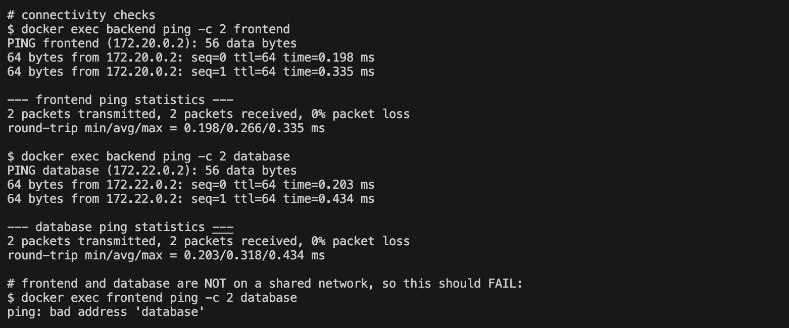

# Docker Networking & Volume Homework

**Name:** Anushka Jain

All output generated on my machine by [`run_all.sh`](./run_all.sh).

## Task 1: Container networking
Three containers (frontend = nginx, backend = alpine, database = mysql) on three separate networks. Backend is connected to two extra networks so it can talk to both frontend and database, while frontend and database cannot see each other. Docker's built-in DNS lets containers reach each other by **name** on a shared user-defined network.

## Task 2: Host network
`--network host` removes network isolation: the container shares the host's network stack, so Apache is directly on port 80 with no `-p` mapping. Only works natively on Linux.

## Task 2 (Mac follow-up)
Since `--network host` does not expose ports on Docker Desktop for Mac, I re-ran Apache with a port mapping to verify it on port 80:

```text
$ docker run -d --name apache2-host -p 80:80 httpd:2.4 && curl -s http://localhost:80
6806dbb13b611de7d44f0777ecf7de0666b966f240447b3dbef02145f03752d5
<!DOCTYPE HTML PUBLIC "-//W3C//DTD HTML 4.01//EN" "http://www.w3.org/TR/html4/strict.dtd">
<html>
<head>
<title>It works! Apache httpd</title>
</head>
<body>
<p>It works!</p>
</body>
</html>
```

## Task 3: Bind mount
`-v /host/path:/container/path` mounts a host folder into the container. Editing `index.html` on the host is instantly visible in nginx because it is the same file, no rebuild or restart needed.

## Task 4: Overlay network (research)
- An **overlay network** spans multiple Docker hosts (used with Docker Swarm). Containers on different physical machines get one flat virtual network and can talk by name.
- Works by encapsulating container traffic in **VXLAN** packets over the host network; Swarm manages the routing and a distributed key-value store keeps the IP/MAC mappings in sync.
- Use cases: multi-node microservices, service discovery and load balancing across a cluster, keeping DB traffic on a private network across hosts.
- Create with: `docker network create -d overlay --attachable my-overlay` (needs `docker swarm init`).

## Full command log with output

```text
### TASK 1: container networking
$ docker network create net-frontend
d3d8422c318acb570a4b08fb96ea13b7cc453e72c4d8c6f4be1b75aeae10cf30

$ docker network create net-backend
79d533b5ee0db659661eb64943d00cb35363e0a5672c9f5d3c2c79670a3b2778

$ docker network create net-db
beccb42c98be3555d183c7eaf0d15fc5c0dd790d5f97a115896976f42aa0c10e

$ docker run -d --name frontend --network net-frontend nginx:alpine
Unable to find image 'nginx:alpine' locally
alpine: Pulling from library/nginx
Digest: sha256:db35bfc6b2951e7f8a72db5db120288c127ffaeeb4a6d4b95a26fead017d5913
Status: Downloaded newer image for nginx:alpine
390a80ca3c3fdb607a94b495f0915c4deffdbf5fa1dfd0c511f95e67af644f33

$ docker run -d --name backend  --network net-backend  alpine sleep 3600
Unable to find image 'alpine:latest' locally
latest: Pulling from library/alpine
df8ce8557afe: Download complete
aa3ec251a2db: Download complete
Digest: sha256:28bd5fe8b56d1bd048e5babf5b10710ebe0bae67db86916198a6eec434943f8b
Status: Downloaded newer image for alpine:latest
17c2dd401c63960d4f6a296863902e9f0ad4d94785bdf67d5fb50a51fb12da27

$ docker run -d --name database --network net-db -e MYSQL_ROOT_PASSWORD=root mysql:8
Unable to find image 'mysql:8' locally
8: Pulling from library/mysql
19c1e4d5e56d: Pulling fs layer
3d7f10ed4edf: Pulling fs layer
c1a8d43326b8: Pulling fs layer
1ff71ea7626e: Pulling fs layer
26eb9d6698f0: Pulling fs layer
d3c86b417a74: Pulling fs layer
8a905d3b3fdf: Pulling fs layer
bec4c5f6b46d: Pulling fs layer
b12e28485eff: Pulling fs layer
ac21e899ba1c: Pulling fs layer
1ff71ea7626e: Download complete
d3c86b417a74: Download complete
b12e28485eff: Download complete
26eb9d6698f0: Download complete
8a905d3b3fdf: Download complete
3d7f10ed4edf: Download complete
ac21e899ba1c: Download complete
64896815bd4e: Download complete
c1a8d43326b8: Download complete
c1a8d43326b8: Pull complete
1ff71ea7626e: Pull complete
d3c86b417a74: Pull complete
8a905d3b3fdf: Pull complete
3d7f10ed4edf: Pull complete
ac21e899ba1c: Pull complete
541dad502f35: Download complete
bec4c5f6b46d: Download complete
b12e28485eff: Pull complete
bec4c5f6b46d: Pull complete
19c1e4d5e56d: Download complete
26eb9d6698f0: Pull complete
19c1e4d5e56d: Pull complete
Digest: sha256:b3b90af2a6552ae30c266fdb7d5dd55f3afb72404bb78d37fe8a23eb857fd3fb
Status: Downloaded newer image for mysql:8
620c079eb50b9883ceef440d2df513f9983934ab9668a2441fad847aeb904f21

# backend joins a second network so it can reach both frontend and database
$ docker network connect net-frontend backend

$ docker network connect net-db backend

$ docker network ls
NETWORK ID     NAME                  DRIVER    SCOPE
0123528ad0fa   approvalops_default   bridge    local
106ee81c7023   bridge                bridge    local
94d4278d0e66   host                  host      local
79d533b5ee0d   net-backend           bridge    local
beccb42c98be   net-db                bridge    local
d3d8422c318a   net-frontend          bridge    local
8c4feee22d11   none                  null      local
8f8af887285c   recruitify_default    bridge    local

$ docker inspect backend --format "{{json .NetworkSettings.Networks}}"
{"net-backend":{"IPAMConfig":null,"Links":null,"Aliases":null,"DriverOpts":null,"GwPriority":0,"NetworkID":"79d533b5ee0db659661eb64943d00cb35363e0a5672c9f5d3c2c79670a3b2778","EndpointID":"bbcb698a65a90198d0ea25b58e4dd6493a6c664358b4ed39932ae383d4e12fdd","Gateway":"172.21.0.1","IPAddress":"172.21.0.2","MacAddress":"be:34:6f:f0:d7:ae","IPPrefixLen":16,"IPv6Gateway":"","GlobalIPv6Address":"","GlobalIPv6PrefixLen":0,"DNSNames":["backend","17c2dd401c63"]},"net-db":{"IPAMConfig":{},"Links":null,"Aliases":[],"DriverOpts":{},"GwPriority":0,"NetworkID":"beccb42c98be3555d183c7eaf0d15fc5c0dd790d5f97a115896976f42aa0c10e","EndpointID":"09d2069bde57bf40909169a81ab2a0c9324628a8f0ced7141251e3a40cbe2203","Gateway":"172.22.0.1","IPAddress":"172.22.0.3","MacAddress":"7e:f7:21:0f:7c:d1","IPPrefixLen":16,"IPv6Gateway":"","GlobalIPv6Address":"","GlobalIPv6PrefixLen":0,"DNSNames":["backend","17c2dd401c63"]},"net-frontend":{"IPAMConfig":{},"Links":null,"Aliases":[],"DriverOpts":{},"GwPriority":0,"NetworkID":"d3d8422c318acb570a4b08fb96ea13b7cc453e72c4d8c6f4be1b75aeae10cf30","EndpointID":"b6b15f7b93b7ffef05bf32c04ad1af8c19720e16877fc9672f0e837639c7871e","Gateway":"172.20.0.1","IPAddress":"172.20.0.3","MacAddress":"02:ac:ec:77:57:50","IPPrefixLen":16,"IPv6Gateway":"","GlobalIPv6Address":"","GlobalIPv6PrefixLen":0,"DNSNames":["backend","17c2dd401c63"]}}

# connectivity checks
$ docker exec backend ping -c 2 frontend
PING frontend (172.20.0.2): 56 data bytes
64 bytes from 172.20.0.2: seq=0 ttl=64 time=0.198 ms
64 bytes from 172.20.0.2: seq=1 ttl=64 time=0.335 ms

--- frontend ping statistics ---
2 packets transmitted, 2 packets received, 0% packet loss
round-trip min/avg/max = 0.198/0.266/0.335 ms

$ docker exec backend ping -c 2 database
PING database (172.22.0.2): 56 data bytes
64 bytes from 172.22.0.2: seq=0 ttl=64 time=0.203 ms
64 bytes from 172.22.0.2: seq=1 ttl=64 time=0.434 ms

--- database ping statistics ---
2 packets transmitted, 2 packets received, 0% packet loss
round-trip min/avg/max = 0.203/0.318/0.434 ms

# frontend and database are NOT on a shared network, so this should FAIL:
$ docker exec frontend ping -c 2 database
ping: bad address 'database'

### TASK 2: host network (Apache2)
$ docker pull httpd:2.4
2.4: Pulling from library/httpd
fff91e36faf1: Pulling fs layer
4f4fb700ef54: Pulling fs layer
91eac6ee2743: Pulling fs layer
01289bdb7344: Pulling fs layer
cea950926c89: Pulling fs layer
4f4fb700ef54: Already exists
01289bdb7344: Download complete
fff91e36faf1: Download complete
cea950926c89: Download complete
4f4fb700ef54: Pull complete
01289bdb7344: Pull complete
cea950926c89: Pull complete
d461d957ad8a: Download complete
91eac6ee2743: Download complete
e78b009430d6: Download complete
fff91e36faf1: Pull complete
91eac6ee2743: Pull complete
Digest: sha256:979c38c2228d28c2edfd45c6e27dcee1c7b4a101a5526721ae8ece454e89e99e
Status: Downloaded newer image for httpd:2.4
docker.io/library/httpd:2.4

$ docker run -d --name apache2-host --network host httpd:2.4
e353e859e3768ba948936faebfa5d6a480e8a3867487170b559c80d5fef4c644

$ curl -s http://localhost:80

# NOTE: --network host only works on Linux. On Mac/Windows Docker Desktop use: docker run -d --name apache2-host -p 80:80 httpd:2.4
### TASK 3: bind mount
$ cat html/index.html
<h1>Hello students</h1>

$ docker run -d --name nginx-bind -p 8090:80 -v "$(pwd)/html:/usr/share/nginx/html" nginx:alpine
d40f9eadf11b8479177ff779bb5c0499e7f487d47bd2d801977e36aacc73afb2

$ curl -s http://localhost:8090
<h1>Hello students</h1>

# modify the file on host, no restart
$ echo "<h1>Hello students - updated without restart</h1>" > html/index.html

$ curl -s http://localhost:8090
<h1>Hello students - updated without restart</h1>

$ echo "<h1>Hello students</h1>" > html/index.html

$ docker ps
CONTAINER ID   IMAGE          COMMAND                  CREATED              STATUS              PORTS                                         NAMES
d40f9eadf11b   nginx:alpine   "/docker-entrypoint.…"   3 seconds ago        Up 2 seconds        0.0.0.0:8090->80/tcp, [::]:8090->80/tcp       nginx-bind
e353e859e376   httpd:2.4      "httpd-foreground"       7 seconds ago        Up 6 seconds                                                      apache2-host
620c079eb50b   mysql:8        "docker-entrypoint.s…"   25 seconds ago       Up 23 seconds       3306/tcp, 33060/tcp                           database
17c2dd401c63   alpine         "sleep 3600"             57 seconds ago       Up 56 seconds                                                     backend
390a80ca3c3f   nginx:alpine   "/docker-entrypoint.…"   About a minute ago   Up About a minute   80/tcp                                        frontend
ae4b314d9fe4   hello-nginx    "/docker-entrypoint.…"   6 minutes ago        Up 6 minutes        0.0.0.0:8083->80/tcp, [::]:8083->80/tcp       hello-nginx
2ec23029e643   hello-react    "/docker-entrypoint.…"   6 minutes ago        Up 6 minutes        0.0.0.0:8082->80/tcp, [::]:8082->80/tcp       hello-react
784d51d3fa54   hello-apache   "httpd-foreground"       7 minutes ago        Up 7 minutes        0.0.0.0:8081->80/tcp, [::]:8081->80/tcp       hello-apache
64ca5ad7e83f   hello-java     "/__cacert_entrypoin…"   7 minutes ago        Up 7 minutes        0.0.0.0:8080->8080/tcp, [::]:8080->8080/tcp   hello-java
c4be947555c8   hello-python   "python app.py"          7 minutes ago        Up 7 minutes        0.0.0.0:5001->5000/tcp, [::]:5001->5000/tcp   hello-python
6cbdb6c8661b   hello-nodejs   "docker-entrypoint.s…"   7 minutes ago        Up 7 minutes        0.0.0.0:3000->3000/tcp, [::]:3000->3000/tcp   hello-nodejs
```

## Screenshots



## Cleanup
```bash
docker rm -f frontend backend database apache2-host nginx-bind
docker network rm net-frontend net-backend net-db
```
