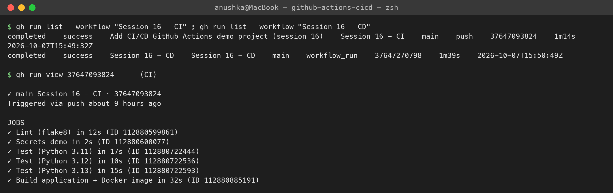
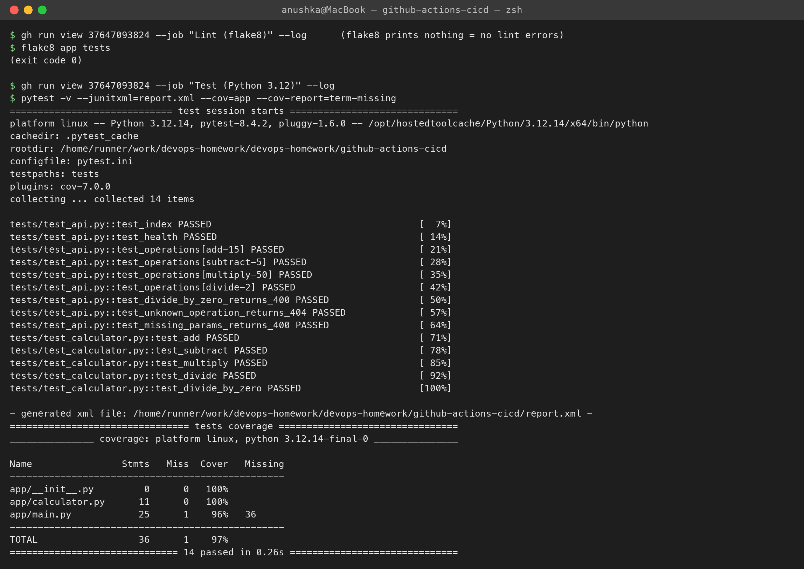
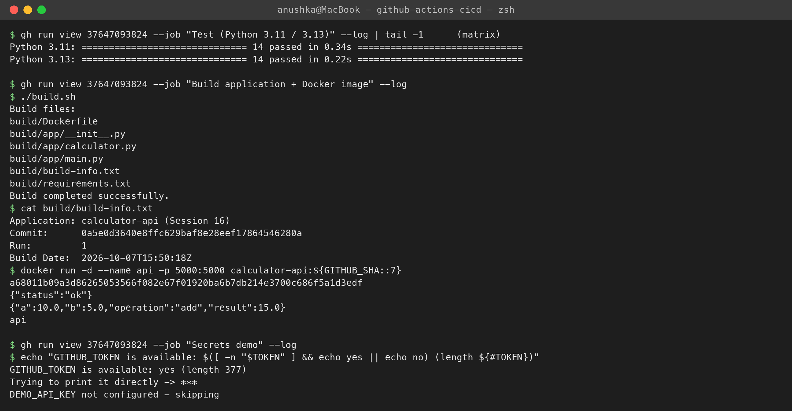
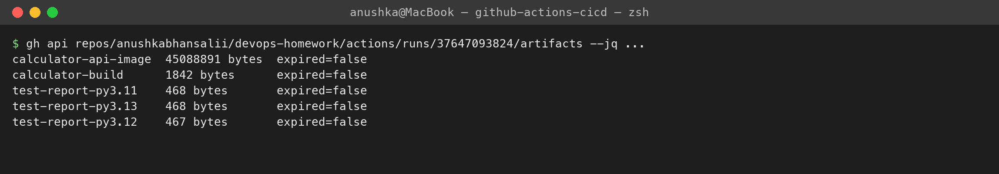
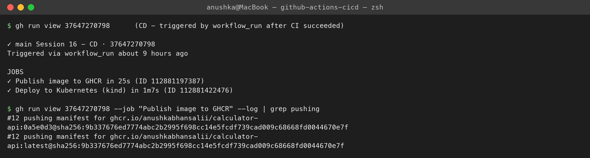
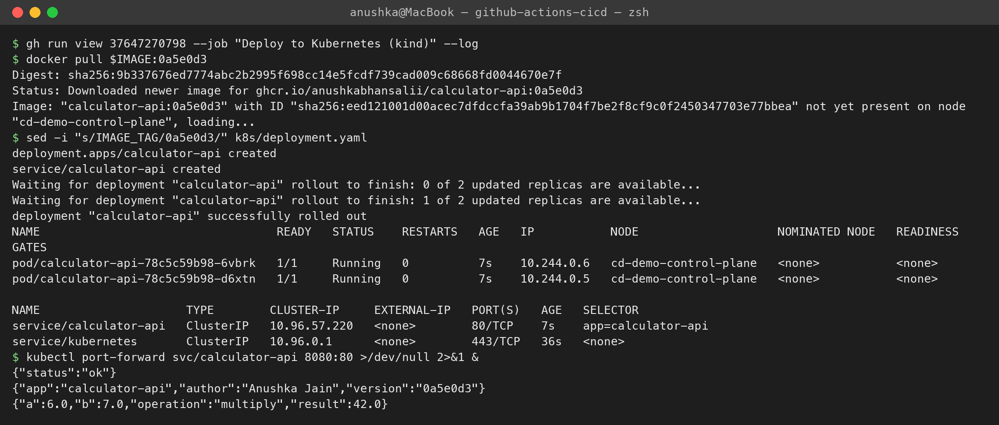

# CI/CD with GitHub Actions — Demo Project

**Name:** Anushka Jain

Session 16 demo project: a small **Flask calculator API** with a complete **CI pipeline** and **CD pipeline** on GitHub Actions, modelled on Nency's `10-final-cicd-pipeline`. Everything below comes from the **real runs on this repository** (fetched with the `gh` CLI):
- CI run [#37647093824](https://github.com/anushkabhansalii/devops-homework/actions/runs/37647093824) ✅
- CD run [#37647270798](https://github.com/anushkabhansalii/devops-homework/actions/runs/37647270798) ✅

```text
github-actions-cicd/
├── app/                   calculator.py (logic) + main.py (Flask API: /, /health, /api/<op>?a=&b=)
├── tests/                 test_calculator.py + test_api.py  (14 tests)
├── k8s/                   deployment.yaml (2 replicas, probes, resources) + service.yaml
├── Dockerfile             python:3.12-slim, non-root user, gunicorn, HEALTHCHECK
├── build.sh               packages the app into build/ with build-info.txt
├── requirements.txt / requirements-dev.txt / pytest.ini / .flake8
└── screenshots/
.github/workflows/         (workflows must live at the repo root to run)
├── session16-ci.yml       CI
└── session16-cd.yml       CD
```

## CI vs CD
| | **Continuous Integration** | **Continuous Delivery / Deployment** |
|---|---|---|
| Goal | every change is automatically **built and tested** so problems are caught minutes after a push | every change that passes CI is automatically **packaged and released** to an environment |
| Triggered by | push / pull request | a successful CI run on the main branch (or a tag / manual approval) |
| Typical steps | checkout → install → lint → unit tests → build → artifacts | build image → push to registry → deploy → smoke test (→ promote) |
| Output | a tested, versioned **artifact** | the artifact **running** somewhere |
| Delivery vs Deployment | — | *Delivery* = always deployable, final prod step manual; *Deployment* = fully automatic to prod |

## The pipeline
```text
 git push (main, changes in github-actions-cicd/**)
        │
        ▼
 ┌──────────────── Session 16 - CI ───────────────────────────────────────────────┐
 │  Lint (flake8) ──► Test (Py 3.11) ┐                                             │
 │                    Test (Py 3.12) ├──► Build app + Docker image ──► artifacts    │
 │                    Test (Py 3.13) ┘     (build.sh, docker build, smoke test,     │
 │  Secrets demo (parallel)                 docker save)                            │
 └────────────────────────────────────────────────────────────────────────────────┘
        │ workflow_run: completed + success
        ▼
 ┌──────────────── Session 16 - CD ───────────────────────────────────────────────┐
 │  Publish image ──► ghcr.io/anushkabhansalii/calculator-api:<sha> + :latest      │
 │        │                                                                         │
 │        ▼                                                                         │
 │  Deploy: kind cluster on the runner → pull image → kubectl apply → rollout →    │
 │          smoke test through the Service                                          │
 └────────────────────────────────────────────────────────────────────────────────┘
```

## GitHub Actions concepts (as used here)
| Concept | Where in my workflows |
|---|---|
| **Workflow** | a YAML file in `.github/workflows/` — `session16-ci.yml`, `session16-cd.yml` |
| **Events / triggers** | CI: `push` to main and `pull_request` filtered by `paths:` (only this folder), plus `workflow_dispatch` (manual button). CD: `workflow_run` on CI `completed`, gated by `conclusion == 'success'` |
| **Jobs** | `lint`, `test`, `build`, `secrets-demo` / `publish`, `deploy` — each runs on a fresh runner |
| **Dependencies** | `needs: lint`, `needs: test`, `needs: publish` make them sequential; `secrets-demo` has no `needs` so it runs in parallel |
| **Steps** | `uses:` an action (`actions/checkout@v5`, `actions/setup-python@v6`, `docker/build-push-action@v6`, `helm/kind-action@v1`) or `run:` a shell command |
| **Runners** | `runs-on: ubuntu-latest` — GitHub-hosted VM, new for every job (self-hosted runners are the alternative) |
| **Matrix** | `strategy.matrix.python-version: ["3.11","3.12","3.13"]` → 3 parallel test jobs from one definition, `fail-fast: false` |
| **Secrets** | `${{ secrets.GITHUB_TOKEN }}` (auto-created per run) to log in to GHCR; GitHub **masks** secret values in logs as `***` |
| **Permissions** | CD sets `permissions: packages: write` so the token may push to GHCR (least privilege: `contents: read`) |
| **Artifacts** | `actions/upload-artifact@v4`: test reports (per Python version), the build folder, and the Docker image tarball |
| **Outputs** | `publish` exposes `outputs.tag` (short SHA) used by `deploy` via `needs.publish.outputs.tag` |
| **Caching** | `setup-python` with `cache: pip` caches downloaded packages between runs |
| **Defaults** | `defaults.run.working-directory: github-actions-cicd` since the app is in a subfolder |

---

## CI run results
```text
$ gh run view 37647093824
✓ main Session 16 - CI · 37647093824
Triggered via push

JOBS
✓ Lint (flake8) in 12s
✓ Secrets demo in 2s
✓ Test (Python 3.11) in 17s
✓ Test (Python 3.12) in 10s
✓ Test (Python 3.13) in 15s
✓ Build application + Docker image in 32s
```

**Lint + test** (flake8 prints nothing when there are no problems):
```text
$ flake8 app tests
$ pytest -v --junitxml=report.xml --cov=app --cov-report=term-missing
platform linux -- Python 3.12.14, pytest-8.4.2, pluggy-1.6.0
collected 14 items
tests/test_api.py::test_index PASSED                                     [  7%]
tests/test_api.py::test_health PASSED                                    [ 14%]
tests/test_api.py::test_operations[add-15] PASSED                        [ 21%]
...
tests/test_calculator.py::test_divide_by_zero PASSED                     [100%]
Name                Stmts   Miss  Cover   Missing
app/calculator.py      11      0   100%
app/main.py            25      1    96%   36
TOTAL                  36      1    97%
============================== 14 passed in 0.26s ==============================
```
The matrix ran the same suite on 3.11, 3.12 and 3.13 — all `14 passed`.

**Build job** — package, build the Docker image, smoke-test the container:
```text
$ ./build.sh
Build files:
build/Dockerfile
build/app/__init__.py
build/app/calculator.py
build/app/main.py
build/build-info.txt
build/requirements.txt
Build completed successfully.
$ cat build/build-info.txt
Application: calculator-api (Session 16)
Commit:      0a5e0d3640e8ffc629baf8e28eef17864546280a
Run:         1
Build Date:  2026-10-07T15:50:18Z
$ docker run -d --name api -p 5000:5000 calculator-api:${GITHUB_SHA::7}
{"status":"ok"}
{"a":10.0,"b":5.0,"operation":"add","result":15.0}
```

**Secrets** — the job can use the token, but GitHub never shows it:
```text
GITHUB_TOKEN is available: yes (length 377)
Trying to print it directly -> ***
DEMO_API_KEY not configured - skipping
```
Repository secrets (Settings → Secrets and variables → Actions) work the same way: `${{ secrets.NAME }}`, encrypted at rest, masked in logs, not passed to workflows from forks. For cloud deploys, prefer **OIDC** (short-lived credentials) over long-lived keys stored as secrets.

**Artifacts** produced by the run:
```text
calculator-api-image  45088891 bytes      <- docker save | gzip of the tested image
calculator-build      1842 bytes          <- build/ folder
test-report-py3.11    468 bytes           <- JUnit XML per matrix leg
test-report-py3.12    467 bytes
test-report-py3.13    468 bytes
```

## CD run results
```text
$ gh run view 37647270798
✓ main Session 16 - CD · 37647270798
Triggered via workflow_run

JOBS
✓ Publish image to GHCR in 25s
✓ Deploy to Kubernetes (kind) in 1m7s
```
**Publish** — pushed to GitHub Container Registry with the commit SHA tag and `latest`:
```text
#12 pushing manifest for ghcr.io/anushkabhansalii/calculator-api:0a5e0d3@sha256:9b337676ed77…
#12 pushing manifest for ghcr.io/anushkabhansalii/calculator-api:latest@sha256:9b337676ed77…
```
**Deploy** — the same image digest is pulled back from GHCR and deployed:
```text
$ docker pull $IMAGE:0a5e0d3
Digest: sha256:9b337676ed7774abc2b2995f698cc14e5fcdf739cad009c68668fd0044670e7f
$ sed -i "s/IMAGE_TAG/0a5e0d3/" k8s/deployment.yaml && kubectl apply -f k8s/
deployment.apps/calculator-api created
service/calculator-api created
deployment "calculator-api" successfully rolled out
pod/calculator-api-78c5c59b98-6vbrk   1/1     Running   0          7s    10.244.0.6   cd-demo-control-plane
pod/calculator-api-78c5c59b98-d6xtn   1/1     Running   0          7s    10.244.0.5   cd-demo-control-plane
service/calculator-api   ClusterIP   10.96.57.220   <none>        80/TCP    7s

$ kubectl port-forward svc/calculator-api 8080:80 &      (smoke test)
{"status":"ok"}
{"app":"calculator-api","author":"Anushka Jain","version":"0a5e0d3"}
{"a":6.0,"b":7.0,"operation":"multiply","result":42.0}
```
The `/` endpoint reports `version: 0a5e0d3` — the commit that triggered the pipeline — so you can always trace a running deployment back to its source.

> The deploy target is a throwaway **kind** (Kubernetes-in-Docker) cluster created inside the GitHub runner, so the pipeline proves the full deploy path without needing a real cluster. Pointing it at a real cluster means replacing the kind step with a kubeconfig (stored as a secret) or OIDC auth to EKS/GKE/AKS.

## Run it locally
```bash
cd github-actions-cicd
python3 -m venv .venv && . .venv/bin/activate
pip install -r requirements-dev.txt
flake8 app tests && pytest -v
./build.sh
docker build -t calculator-api . && docker run -p 5000:5000 calculator-api
curl "localhost:5000/api/add?a=10&b=5"
```

## Screenshots






