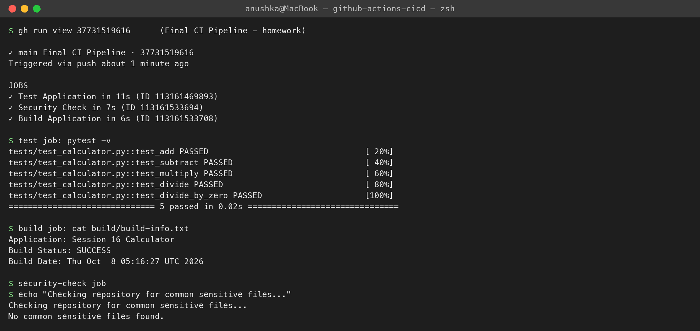

# research.md — what I learned from the Final CI Pipeline

**Name:** Anushka Jain

Homework: run the class `10-final-cicd-pipeline` (calculator app) in my own repo and analyse it.
Workflow: [`.github/workflows/session16-final-pipeline.yml`](../../.github/workflows/session16-final-pipeline.yml) — run [37731519616](https://github.com/anushkabhansalii/devops-homework/actions/runs/37731519616) ✅

## What the pipeline does
```text
push to main ──► Test Application ──┬──► Build Application ──► artifact "calculator-build"
                                    └──► Security Check
```
| Job | Steps | Result in my run |
|---|---|---|
| **Test Application** | checkout → setup Python 3.12 → `pip install -r requirements.txt` → `pytest -v` | 5 passed (add, subtract, multiply, divide, divide_by_zero) |
| **Build Application** (`needs: test`) | checkout → `./build.sh` → `cat build/build-info.txt` → upload artifact | `Build Status: SUCCESS`, artifact uploaded |
| **Security Check** (`needs: test`) | look for `.env`, `*.pem`, `*.key` files | `No common sensitive files found.` |

## What I learned
1. **Jobs vs steps** — a job runs on its own fresh runner (`ubuntu-latest` VM); steps inside a job run in order and share the filesystem. Build and Security Check are separate jobs, so each one checks out the code again.
2. **`needs:` creates dependencies** — in the earlier class workflow all jobs ran in parallel (no lines between them in the graph). Here `needs: test` draws the joins: if a test fails, Build and Security Check are skipped, so broken code is never packaged.
3. **Parallelism** — Build and Security Check both depend only on Test, so they run at the same time after it.
4. **Actions (`uses:`) vs commands (`run:`)** — `actions/checkout`, `actions/setup-python`, `actions/upload-artifact` are ready-made actions from the marketplace; `run:` executes shell commands like on my laptop.
5. **Artifacts** — files produced in a job disappear with the runner unless uploaded; `upload-artifact` stores `build/` as a zip I can download from the run page (or pass to a later CD job).
6. **Triggers** — `on: push` (only for this folder via `paths:`) runs it automatically; `pull_request` tests PRs before merge; `workflow_dispatch` adds the manual **Run workflow** button.
7. **Why CI instead of `build.sh` on my laptop** — every developer's push is tested the same way, in a clean environment, with a visible history of passes/failures; nobody has to share or run scripts manually.
8. **Limits of the security check** — it only looks for file names. Real pipelines add SAST, SCA, secret scanning and image scanning (my session 17 DevSecOps pipeline).


