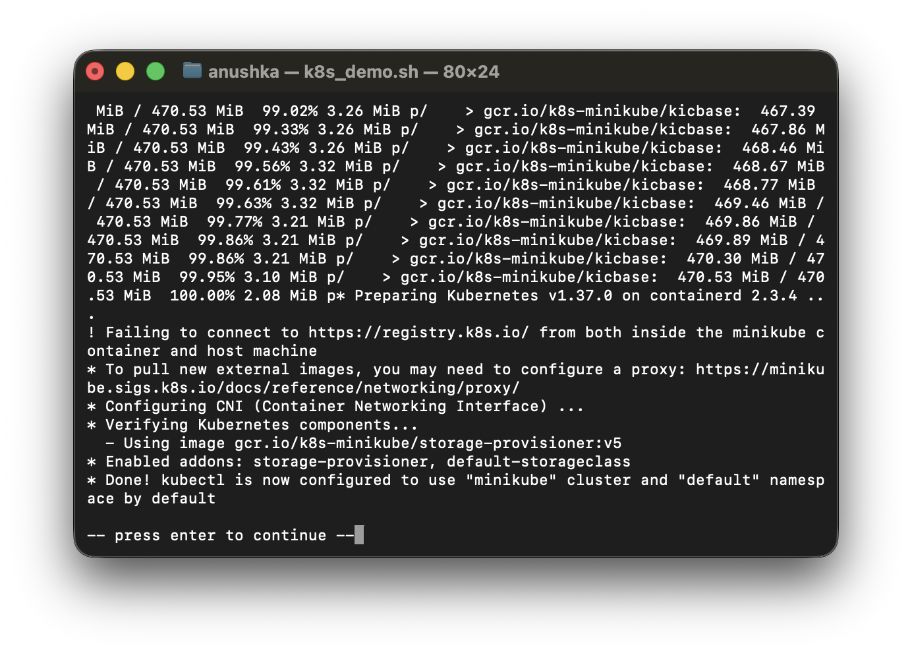
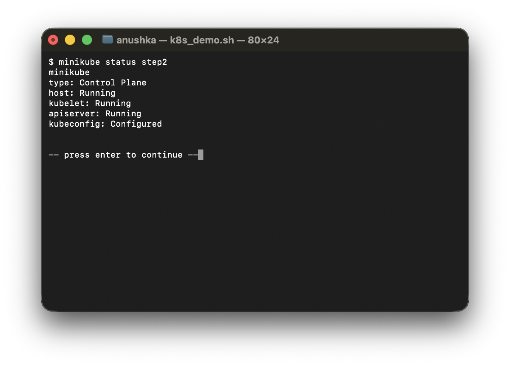
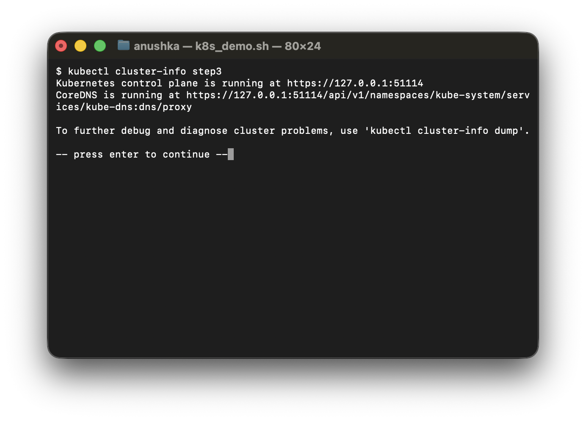
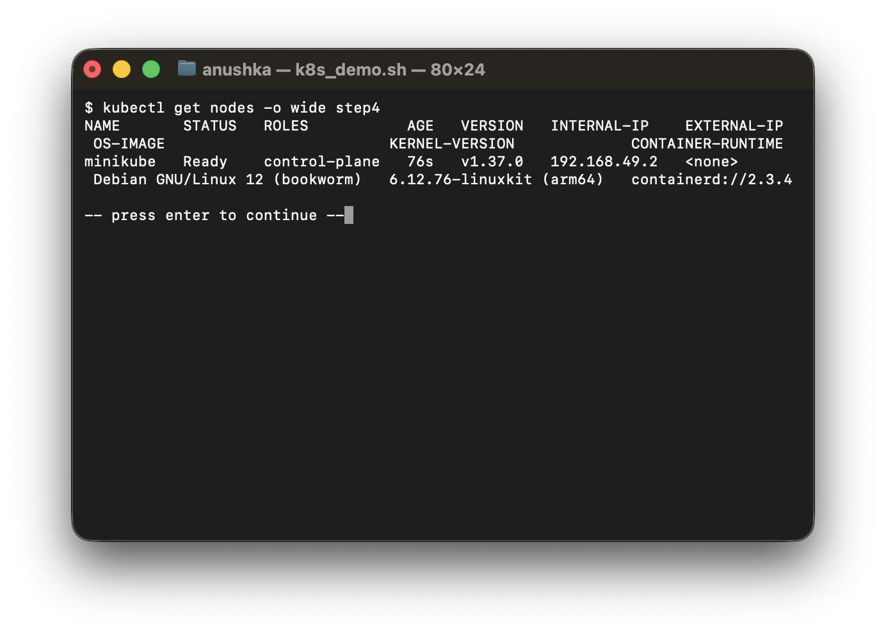
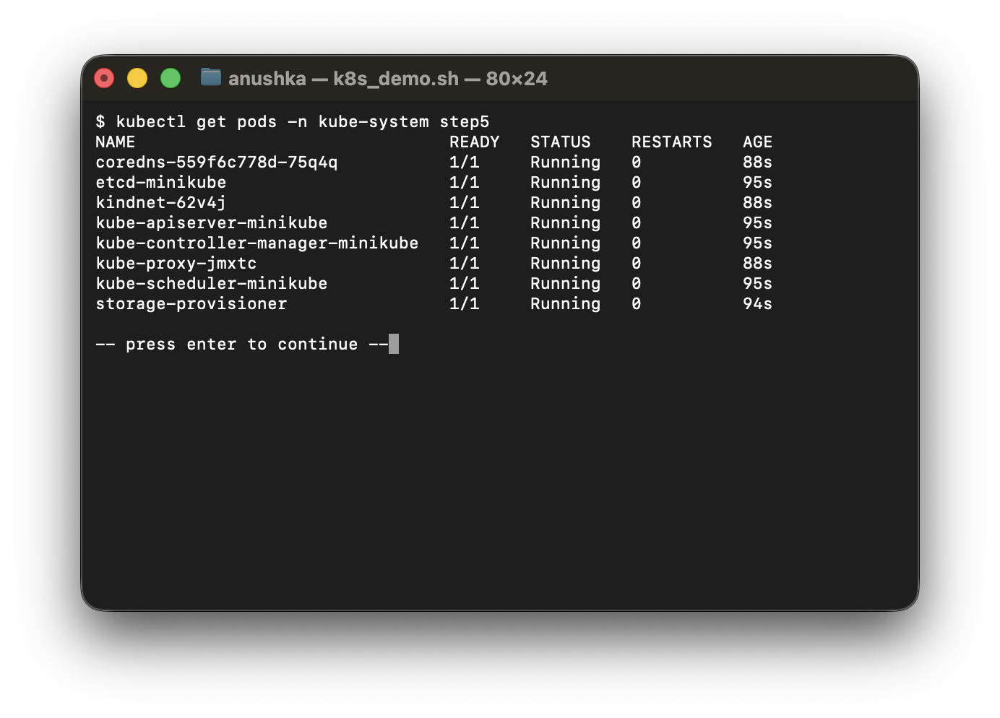
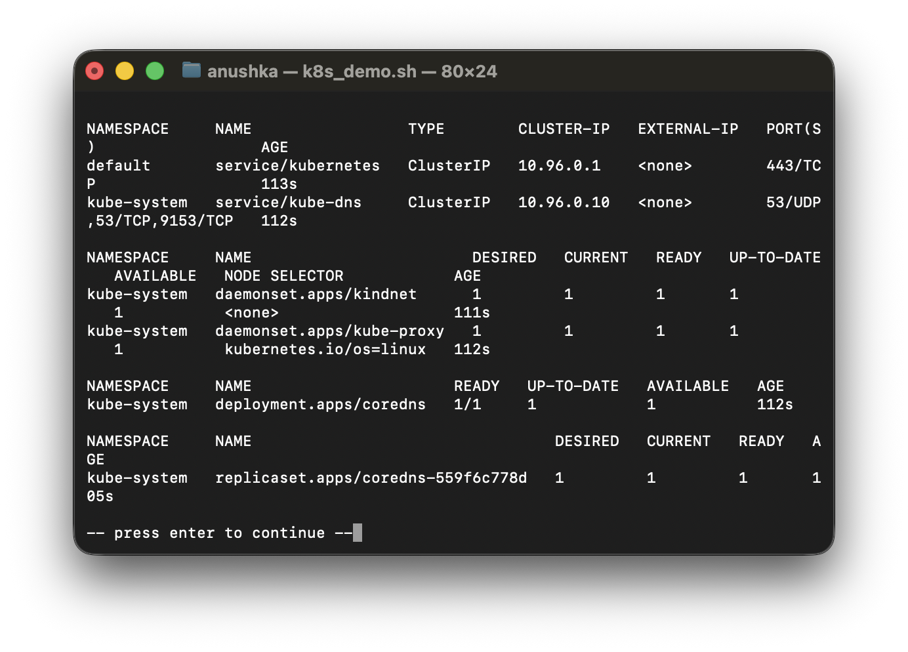

# Kubernetes Fundamentals Homework

**Name:** Anushka Jain

All output generated on my machine by [`run.sh`](./run.sh), using minikube (Docker driver) as the local cluster.

## Overview
Kubernetes has a **master-worker (control plane / worker node)** architecture. The control plane never runs application workloads itself — it only manages the cluster. It has four core components:

- **etcd** – key-value store holding the entire cluster state (nodes, pods, secrets, configmaps).
- **kube-apiserver** – the front door of the cluster; every other component (including `kubectl`) talks to the cluster only through it.
- **kube-scheduler** – decides which worker node a new pod should run on, based on available resources.
- **kube-controller-manager** – runs the controllers (node controller, replica-set controller, etc.) that keep the actual cluster state matching the desired state.

Each worker node runs:
- **kubelet** – the node agent; makes sure the containers described for that node are actually running, and sends a heartbeat to the API server.
- **kube-proxy** – handles networking/service routing rules on the node.
- **container runtime** – `containerd` (Docker was used originally, now replaced by containerd as the CRI).

A **pod** is the smallest deployable unit in Kubernetes — one or more containers sharing network and storage. Kubernetes itself is what Docker Swarm tried to be before it, minus the scaling/rollback limitations Swarm had.

## Task: install minikube and inspect a running cluster
Installed minikube (`brew install minikube`) and started a local single-node cluster, then inspected it with `kubectl` to see the control plane components from the lecture actually running as pods.

```text
$ minikube start
* minikube v1.39.0 on Darwin 26.6.2 (arm64)
* Automatically selected the docker driver
* Using Docker Desktop driver with root privileges
* Starting "minikube" primary control-plane node in "minikube" cluster
* Pulling base image v0.0.51 ...
! Failing to connect to https://registry.k8s.io/ from both inside the minikube container and host machine
* To pull new external images, you may need to configure a proxy: https://minikube.sigs.k8s.io/docs/reference/networking/proxy/
* Configuring CNI (Container Networking Interface) ...
* Verifying Kubernetes components...
  - Using image gcr.io/k8s-minikube/storage-provisioner:v5
* Enabled addons: storage-provisioner, default-storageclass
* Done! kubectl is now configured to use "minikube" cluster and "default" namespace by default

$ minikube status
minikube
type: Control Plane
host: Running
kubelet: Running
apiserver: Running
kubeconfig: Configured

$ kubectl cluster-info
Kubernetes control plane is running at https://127.0.0.1:51114
CoreDNS is running at https://127.0.0.1:51114/api/v1/namespaces/kube-system/services/kube-dns:dns/proxy
To further debug and diagnose cluster problems, use 'kubectl cluster-info dump'.

$ kubectl get nodes -o wide
NAME       STATUS   ROLES           AGE   VERSION   INTERNAL-IP    EXTERNAL-IP   OS-IMAGE                         KERNEL-VERSION             CONTAINER-RUNTIME
minikube   Ready    control-plane   76s   v1.37.0   192.168.49.2   <none>        Debian GNU/Linux 12 (bookworm)   6.12.76-linuxkit (arm64)   containerd://2.3.4

$ kubectl get pods -n kube-system
NAME                               READY   STATUS    RESTARTS   AGE
coredns-559f6c778d-75q4q           1/1     Running   0          88s
etcd-minikube                      1/1     Running   0          95s
kindnet-62v4j                      1/1     Running   0          88s
kube-apiserver-minikube            1/1     Running   0          95s
kube-controller-manager-minikube   1/1     Running   0          95s
kube-proxy-jmxtc                   1/1     Running   0          88s
kube-scheduler-minikube            1/1     Running   0          95s
storage-provisioner                1/1     Running   0          94s

$ kubectl get all -A
NAMESPACE     NAME                                   READY   STATUS    RESTARTS   AGE
kube-system   pod/coredns-559f6c778d-75q4q           1/1     Running   0          105s
kube-system   pod/etcd-minikube                      1/1     Running   0          112s
kube-system   pod/kindnet-62v4j                      1/1     Running   0          105s
kube-system   pod/kube-apiserver-minikube            1/1     Running   0          112s
kube-system   pod/kube-controller-manager-minikube   1/1     Running   0          112s
kube-system   pod/kube-proxy-jmxtc                   1/1     Running   0          105s
kube-system   pod/kube-scheduler-minikube            1/1     Running   0          112s
kube-system   pod/storage-provisioner                1/1     Running   0          111s
NAMESPACE     NAME                 TYPE        CLUSTER-IP   EXTERNAL-IP   PORT(S)                  AGE
default       service/kubernetes   ClusterIP   10.96.0.1    <none>        443/TCP                  113s
kube-system   service/kube-dns     ClusterIP   10.96.0.10   <none>        53/UDP,53/TCP,9153/TCP   112s
NAMESPACE     NAME                        DESIRED   CURRENT   READY   UP-TO-DATE   AVAILABLE   NODE SELECTOR            AGE
kube-system   daemonset.apps/kindnet      1         1         1       1            1           <none>                   111s
kube-system   daemonset.apps/kube-proxy   1         1         1       1            1           kubernetes.io/os=linux   112s
NAMESPACE     NAME                      READY   UP-TO-DATE   AVAILABLE   AGE
kube-system   deployment.apps/coredns   1/1     1            1           112s
NAMESPACE     NAME                                 DESIRED   CURRENT   READY   AGE
kube-system   replicaset.apps/coredns-559f6c778d   1         1         1       105s
```

**Mapping the output back to the lecture:** `etcd-minikube`, `kube-apiserver-minikube`, `kube-scheduler-minikube` and `kube-controller-manager-minikube` are exactly the four control-plane components, each literally running as a pod in the `kube-system` namespace. `kube-proxy` is the per-node networking component, and `kubectl get nodes` shows the node is using `containerd` as its container runtime (CRI), not raw Docker.

## Screenshots







## Cleanup
```bash
minikube stop
```
