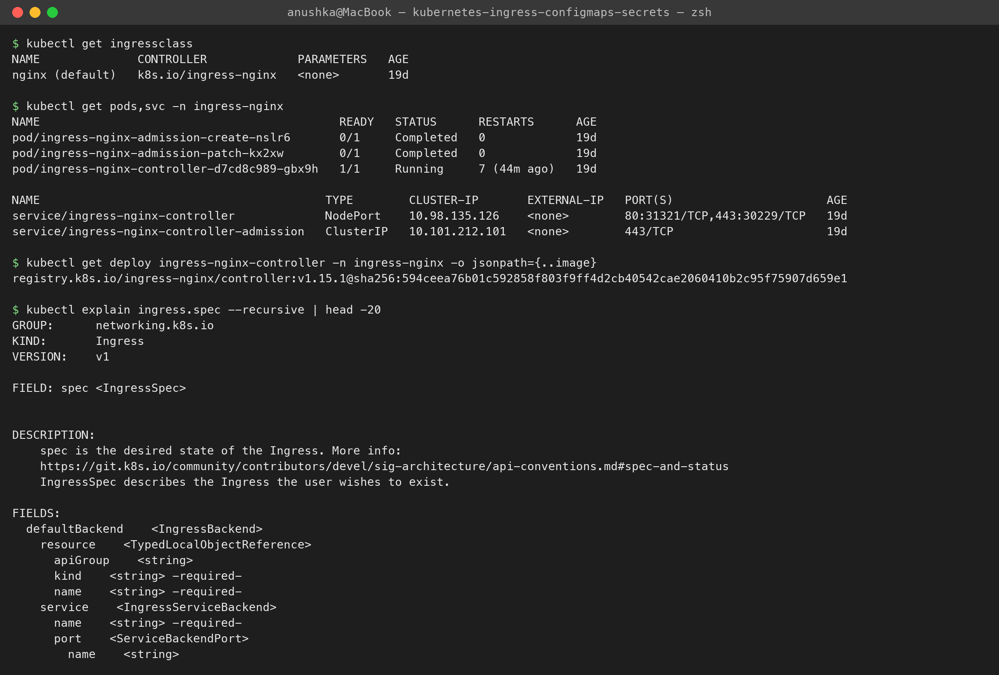

# Ingress vs Ingress Controller

**Name:** Anushka Jain

Research homework from the class (session 12, Task 4).

## What is an Ingress?
An **Ingress** is a Kubernetes **API object** (`kind: Ingress`, `networking.k8s.io/v1`): a set of **HTTP/HTTPS routing rules** that say *which host/path goes to which Service*. It is only configuration stored in etcd. It doesn't receive traffic itself.
```yaml
apiVersion: networking.k8s.io/v1
kind: Ingress
metadata:
  name: yatri-ingress
spec:
  ingressClassName: nginx            # which controller should implement me
  rules:
    - host: yatri.local              # host-based routing
      http:
        paths:
          - path: /api               # path-based routing
            pathType: Prefix
            backend: {service: {name: yatri-backend-service, port: {number: 80}}}
          - path: /
            pathType: Prefix
            backend: {service: {name: yatri-frontend-service, port: {number: 80}}}
  tls:
    - hosts: [yatri.local]
      secretName: yatri-tls          # TLS termination with a certificate Secret
```

## What is an Ingress Controller?
An **Ingress Controller** is the **actual software running in the cluster** (Pods + a Service) that **watches Ingress objects through the API server** and turns them into a real reverse-proxy / load-balancer configuration. It receives the traffic and forwards it to the Service endpoints.

On my minikube it's the NGINX Ingress Controller (`minikube addons enable ingress`):
```text
$ kubectl get ingressclass
NAME              CONTROLLER             PARAMETERS   AGE
nginx (default)   k8s.io/ingress-nginx   <none>       19d

$ kubectl get pods,svc -n ingress-nginx
pod/ingress-nginx-controller-d7cd8c989-gbx9h   1/1     Running
service/ingress-nginx-controller             NodePort    10.98.135.126   80:31321/TCP,443:30229/TCP
service/ingress-nginx-controller-admission   ClusterIP   10.101.212.101  443/TCP        <- validating webhook

$ image: registry.k8s.io/ingress-nginx/controller:v1.15.1
```


## Difference
| | Ingress | Ingress Controller |
|---|---|---|
| What it is | a Kubernetes **resource** (YAML rules) | a running **application** (Deployment/DaemonSet + Service) |
| Who writes it | app developers / DevOps, per application | installed once per cluster by the platform team (Helm, addon, managed add-on) |
| Does it handle traffic? | **no** — it's just desired state in etcd | **yes** — it is the reverse proxy / load balancer |
| Comes with Kubernetes? | the API type is built in | **no** — you must install one (unlike most controllers in kube-controller-manager) |
| How many | many (one per app/team) | usually one or a few, selected with `ingressClassName` |
| Analogy | the **rule book** / config file | the **traffic police** / nginx process that reads it |

```text
client ──► LoadBalancer/NodePort ──► Ingress Controller pod (nginx) ──► Service ──► Pods
                                          ▲
                                          │ watches (via API server)
                                     Ingress objects (rules)
```

## Why both are required
- An **Ingress without a controller does nothing** — `kubectl get ingress` shows it, but there's no ADDRESS and no traffic is routed.
- A **controller without Ingress objects** has nothing to route (it serves its default backend / 404).
- Splitting them means apps describe routing in a **portable, standard** way, while the cluster chooses the implementation (NGINX, Traefik, AWS ALB...) without changing the app's YAML beyond `ingressClassName`.
- Cost and management: one controller (one cloud load balancer) serves *many* Services through host/path rules instead of one LoadBalancer Service per app (what we did in this session: `/` → frontend and `/api` → backend through one entry point).

## Examples
| Ingress Controller | Notes |
|---|---|
| **ingress-nginx** (Kubernetes community) | what I use on minikube; annotations like `nginx.ingress.kubernetes.io/rewrite-target` |
| **AWS Load Balancer Controller** | turns an Ingress into an AWS **ALB** (`ingressClassName: alb`) on EKS |
| **GKE Ingress** | Google Cloud HTTP(S) Load Balancer |
| **Azure Application Gateway Ingress Controller (AGIC)** | AKS |
| **Traefik** | default in k3s, auto Let's Encrypt |
| **HAProxy, Kong, Contour/Envoy, Istio Gateway** | other popular options |

The successor API, **Gateway API** (`Gateway` + `HTTPRoute`, which Helm 4's `helm create` scaffolds as `httproute.yaml`), splits it further: infrastructure team owns the Gateway, app teams own routes.
