# Kubernetes Ingress, ConfigMaps & Secrets Homework

**Name:** Anushka Jain

All output generated on my machine by [`run.sh`](./run.sh) against a local minikube cluster, following Nency's `session-12-ingress-configmaps-secrets/lab.md` full demo (`yatri-app`: an Nginx frontend + Python backend fronted by one Ingress). Manifests: [`configmap.yaml`](./configmap.yaml), [`secret.yaml`](./secret.yaml), [`backend.yaml`](./backend.yaml), [`frontend.yaml`](./frontend.yaml), [`ingress.yaml`](./ingress.yaml), [`cleanup.sh`](./cleanup.sh).

> Note on the transcript for this lecture: the audio/transcript I was given was almost entirely a recap of the previous lecture's rolling-update rollout commands (`rollout status/history/undo`) plus a homework list (blue-green/canary/recreate strategies, daemonsets, 5 service types) — it didn't actually cover Ingress/ConfigMap/Secret teaching content, likely a transcription issue. I built this submission from the matching repo folder's `lab.md`, which has the real hands-on content for this exact topic.

## Task 1: Enable the Ingress Controller
```text
$ minikube addons enable ingress
* Using image registry.k8s.io/ingress-nginx/controller:v1.15.1
* Using image registry.k8s.io/ingress-nginx/kube-webhook-certgen:v1.6.9
* The 'ingress' addon is enabled

$ kubectl get pods -n ingress-nginx
NAME                                       READY   STATUS      RESTARTS   AGE
ingress-nginx-admission-create-nslr6       0/1     Completed   0          85s
ingress-nginx-admission-patch-kx2xw        0/1     Completed   0          85s
ingress-nginx-controller-d7cd8c989-gbx9h   1/1     Running     0          85s
```

## Task 2: ConfigMap — plain-text configuration
```text
$ kubectl apply -f configmap.yaml
configmap/yatri-app-config created

$ kubectl get configmap yatri-app-config
NAME               DATA   AGE
yatri-app-config   5      0s

$ kubectl describe configmap yatri-app-config
Data
====
APP_PORT:          5000
DEFAULT_CURRENCY:  INR
ENVIRONMENT:       production
LOG_LEVEL:         INFO
MAX_BOOKING_DAYS:  30

$ kubectl get configmap yatri-app-config -o jsonpath='{.data.ENVIRONMENT}'
production
```

## Task 3: The `echo` vs `echo -n` newline gotcha
Standard `echo` appends a trailing `\n`, which base64-encodes into the value and silently corrupts a secret (14 chars become 15). Always use `echo -n`.
```text
$ echo "mypassword" | base64
bXlwYXNzd29yZAo=      <- ends in "Ao=" (the "o=" hides an encoded \n)

$ echo -n "mypassword" | base64
bXlwYXNzd29yZA==      <- ends cleanly in "=="
```

## Task 4: Secret — sensitive database credentials
```text
$ kubectl apply -f secret.yaml
secret/yatri-db-secret created

$ kubectl get secret yatri-db-secret
NAME              TYPE     DATA   AGE
yatri-db-secret   Opaque   3      0s

$ kubectl describe secret yatri-db-secret
Data
====
POSTGRES_DB:        19 bytes
POSTGRES_PASSWORD:  14 bytes
POSTGRES_USER:      11 bytes
```
`describe` only shows byte counts, never the actual value — but this is masking, not encryption:
```text
$ kubectl get secret yatri-db-secret -o jsonpath='{.data.POSTGRES_PASSWORD}' | base64 --decode
secretpassword
```
Base64 is trivially reversible. Real protection comes from RBAC restricting who can run `kubectl get secret`.

## Task 5: Backend — inject ConfigMap + Secret as env vars
`envFrom.configMapRef` pulls every ConfigMap key at once; `env[].valueFrom.secretKeyRef` picks individual Secret keys one by one.
```text
$ kubectl apply -f backend.yaml
deployment.apps/yatri-backend created
service/yatri-backend-service created
deployment "yatri-backend" successfully rolled out

$ kubectl exec -it deployment/yatri-backend -- env | grep -E "ENVIRONMENT|LOG_LEVEL|DEFAULT_CURRENCY|POSTGRES"
POSTGRES_USER=yatri_admin
POSTGRES_PASSWORD=secretpassword
POSTGRES_DB=yatri_production_db
ENVIRONMENT=production
LOG_LEVEL=INFO
DEFAULT_CURRENCY=INR
```
Both the ConfigMap and Secret values landed as normal Linux environment variables inside the pod.

## Task 6: Frontend — still not reachable from outside
```text
$ kubectl apply -f frontend.yaml
deployment.apps/yatri-frontend created
service/yatri-frontend-service created
deployment "yatri-frontend" successfully rolled out

$ kubectl get svc yatri-frontend-service yatri-backend-service
NAME                     TYPE        CLUSTER-IP     EXTERNAL-IP   PORT(S)   AGE
yatri-frontend-service   ClusterIP   10.96.47.210   <none>        80/TCP    1s
yatri-backend-service    ClusterIP   10.99.196.11   <none>        80/TCP    60s
```
Both are ClusterIP — exactly why Ingress is needed next.

## Task 7: Ingress — one entry point, two path-based routes
```text
$ kubectl apply -f ingress.yaml
ingress.networking.k8s.io/yatri-ingress created

$ kubectl get ingress yatri-ingress
NAME            CLASS   HOSTS         ADDRESS        PORTS   AGE
yatri-ingress   nginx   yatri.local   192.168.49.2   80      17s

$ kubectl describe ingress yatri-ingress
Rules:
  Host         Path                Backends
  ----         ----                --------
  yatri.local
               /api(/|$)(.*)       yatri-backend-service:80 (10.244.0.6:5000,10.244.0.7:5000)
               /                   yatri-frontend-service:80 (10.244.0.9:80,10.244.0.8:80)
Annotations:   nginx.ingress.kubernetes.io/rewrite-target: /$2
               nginx.ingress.kubernetes.io/ssl-redirect: false
               nginx.ingress.kubernetes.io/use-regex: true
```
One host (`yatri.local`), one IP, two rules: `/api/*` → backend, `/` → frontend.

## Task 8: Testing the routes
On macOS with minikube's Docker driver, curling `$(minikube ip)` directly **hangs/times out** — same limitation hit with NodePort in the previous lecture (the addon itself even prints "run `minikube tunnel`"). Port-forwarding straight to the ingress controller's own service is the reliable local workaround:
```text
$ kubectl port-forward -n ingress-nginx svc/ingress-nginx-controller 8090:80 &
$ curl -s -H "Host: yatri.local" http://localhost:8090/ | grep -i "<title>"
<title>Welcome to nginx!</title>

$ curl -s -H "Host: yatri.local" http://localhost:8090/api/
Yatri Backend API
=================
ENVIRONMENT     : production
LOG_LEVEL       : INFO
DEFAULT_CURRENCY: INR
POSTGRES_USER   : yatri_admin
POSTGRES_DB     : yatri_production_db
```
One Ingress Controller, one IP, both apps reachable by path — this is what replaces provisioning a separate cloud load balancer per service.

## Task 9: ConfigMap live update — env vars are read once at container start
```text
$ kubectl patch configmap yatri-app-config --type merge -p '{"data":{"ENVIRONMENT":"staging"}}'
configmap/yatri-app-config patched

$ kubectl exec -it deployment/yatri-backend -- env | grep ENVIRONMENT
ENVIRONMENT=production        <- unchanged! env vars don't hot-reload

$ kubectl rollout restart deployment/yatri-backend
deployment.apps/yatri-backend restarted
deployment "yatri-backend" successfully rolled out

$ kubectl exec -it deployment/yatri-backend -- env | grep ENVIRONMENT
ENVIRONMENT=staging            <- now picked up, after a fresh container start
```
Patching a ConfigMap does not restart pods or refresh already-injected env vars — you need an explicit `kubectl rollout restart` to force new containers to read the updated value.

## Cleanup
```text
$ bash cleanup.sh
[INFO] Deleting Ingress...
ingress.networking.k8s.io "yatri-ingress" deleted from default namespace
[INFO] Deleting Backend Deployment and Service...
deployment.apps "yatri-backend" deleted from default namespace
service "yatri-backend-service" deleted from default namespace
[INFO] Deleting Frontend Deployment and Service...
deployment.apps "yatri-frontend" deleted from default namespace
service "yatri-frontend-service" deleted from default namespace
[INFO] Deleting Secret...
secret "yatri-db-secret" deleted from default namespace
[INFO] Deleting ConfigMap...
configmap "yatri-app-config" deleted from default namespace
[INFO] All demo resources removed.

$ kubectl get all -l app=yatri-app
No resources found in default namespace.
```
```bash
minikube stop
```

## Screenshots
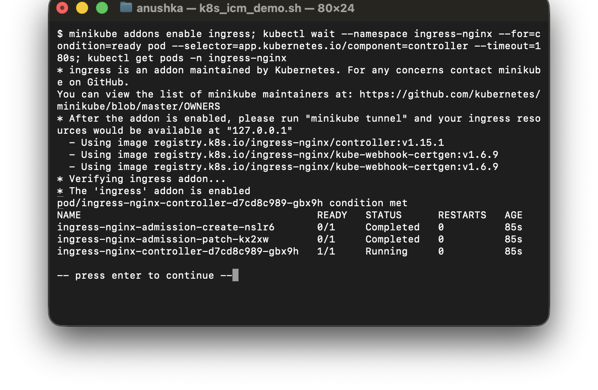
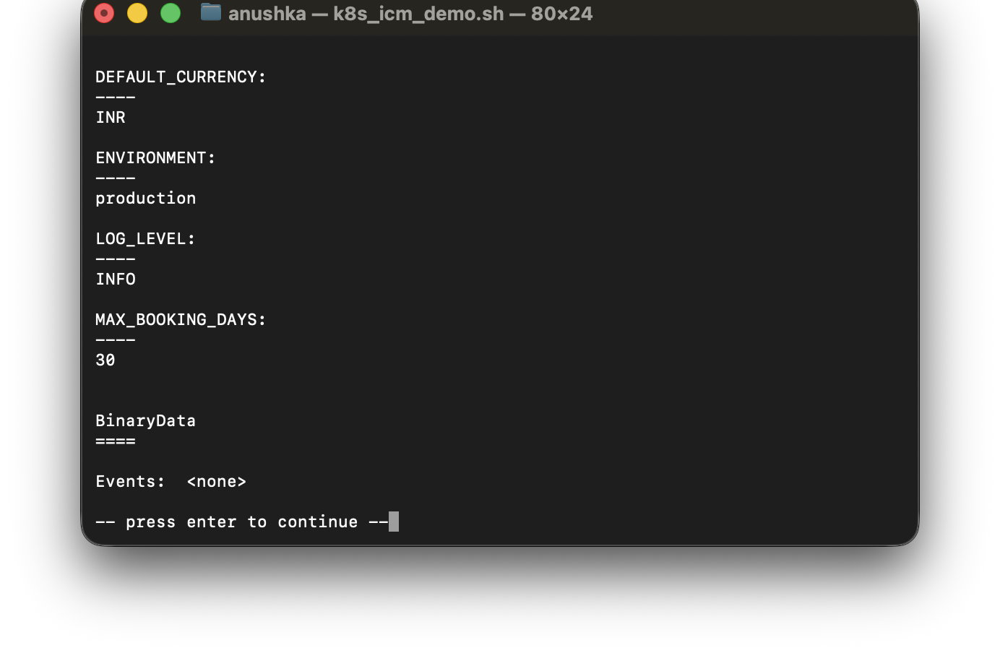
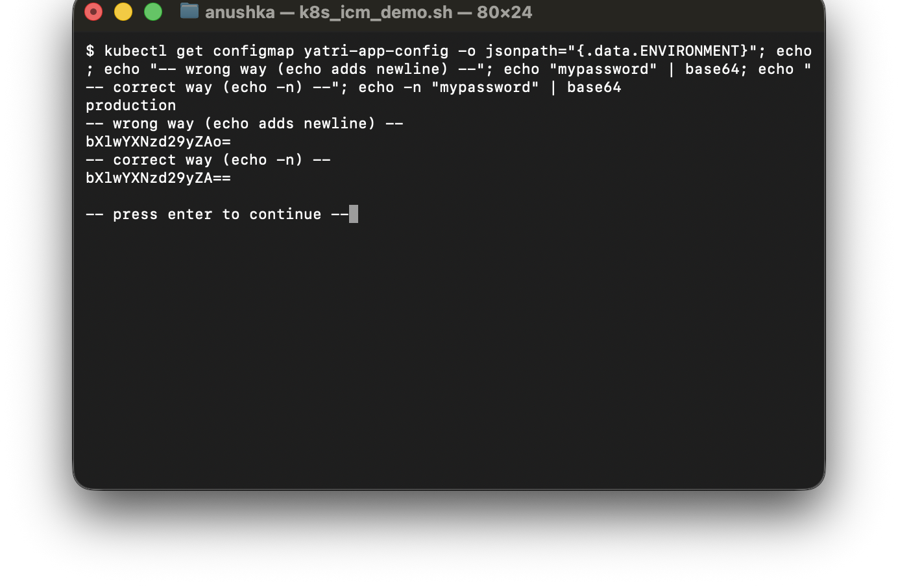
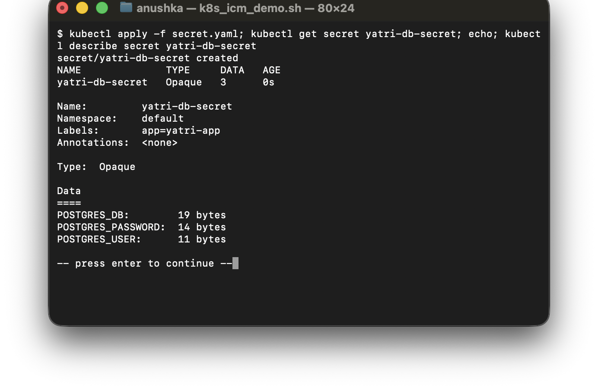
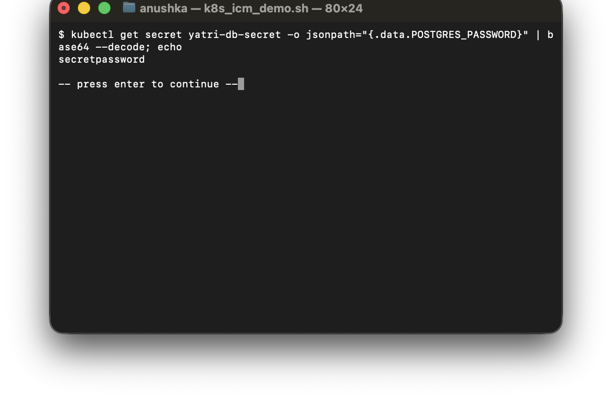
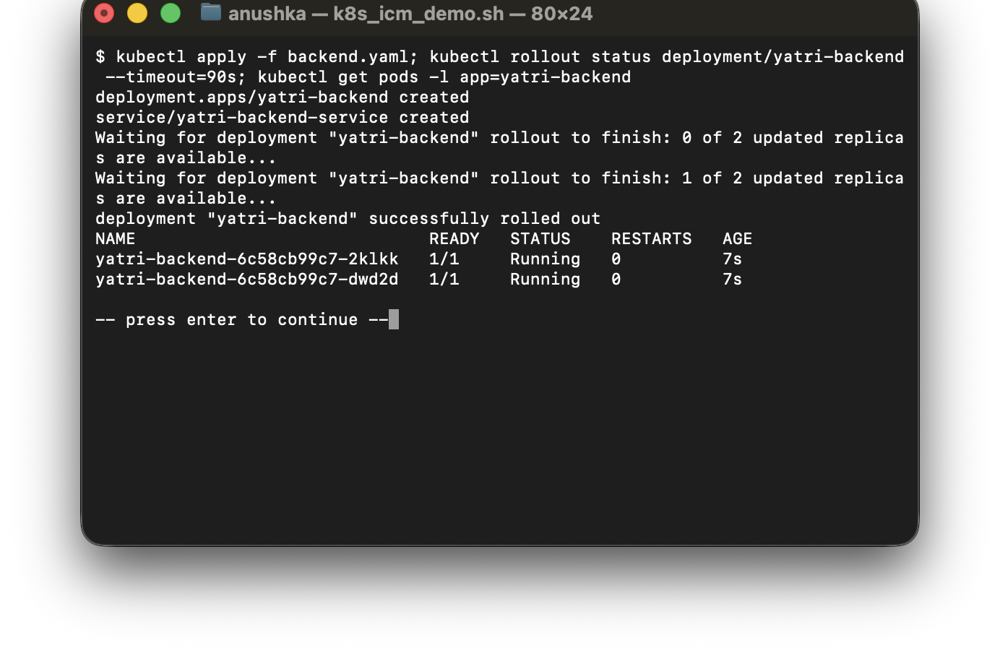
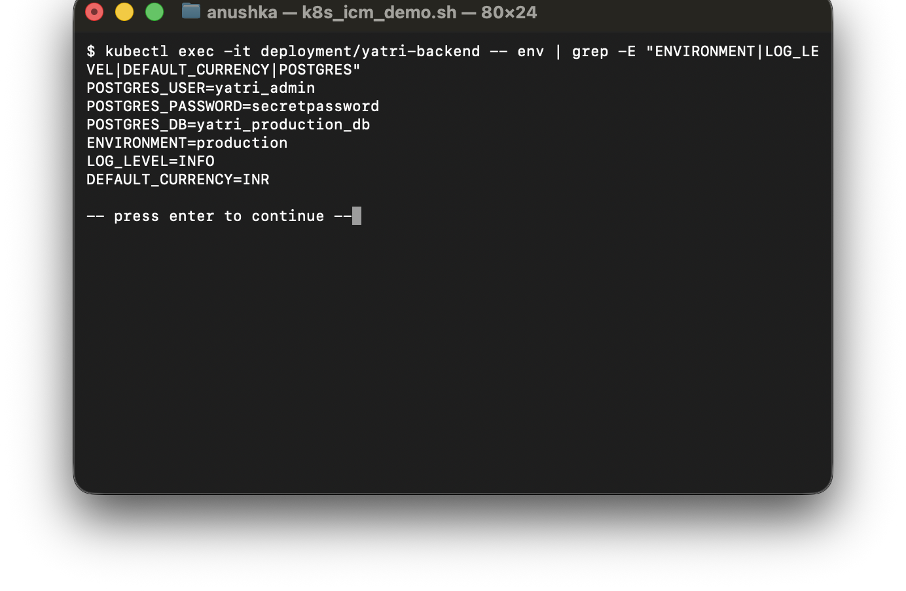
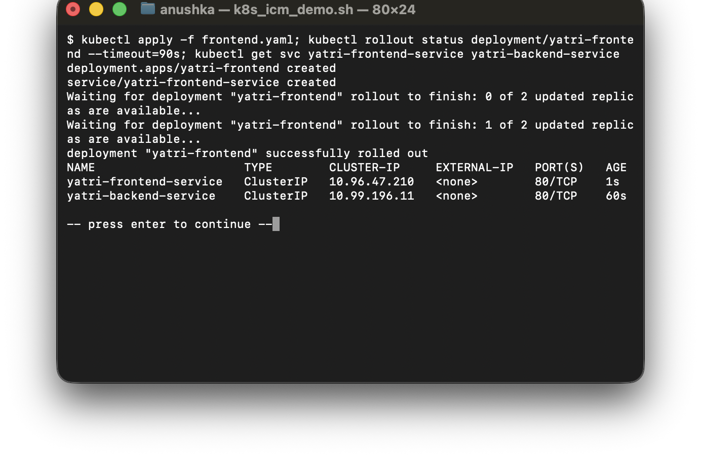
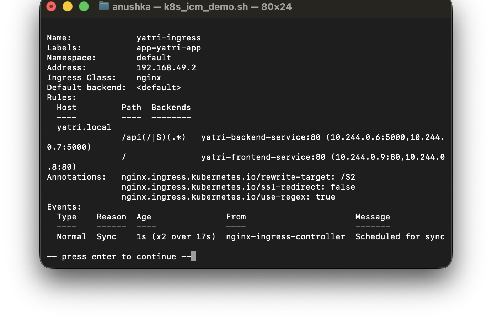


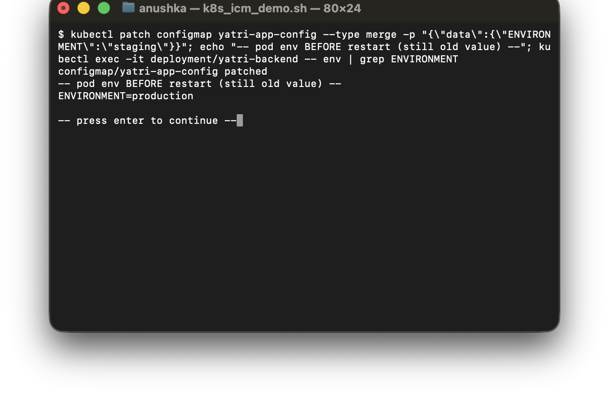
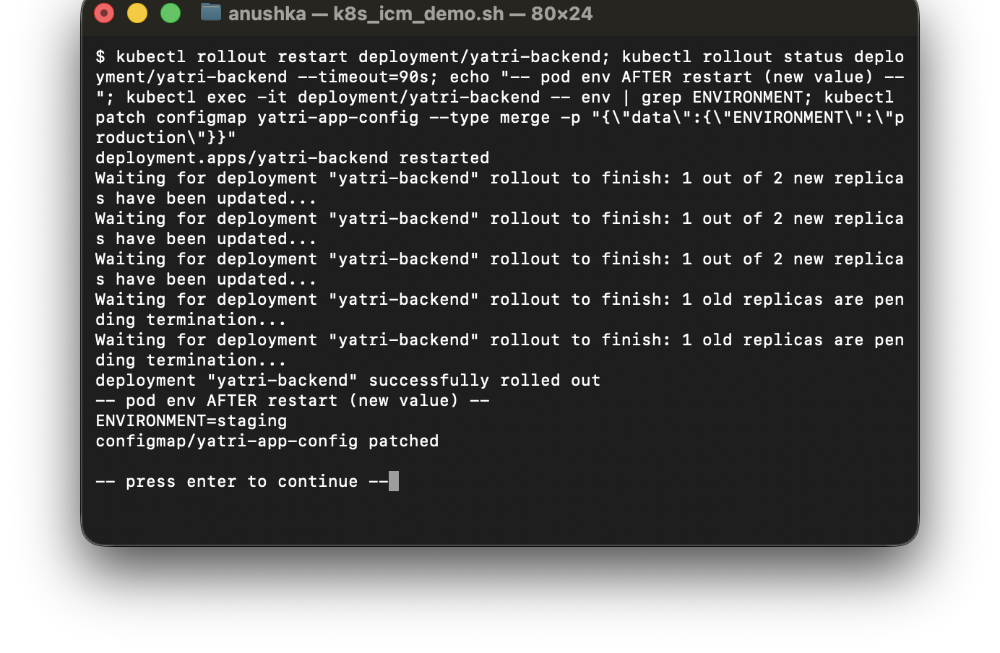
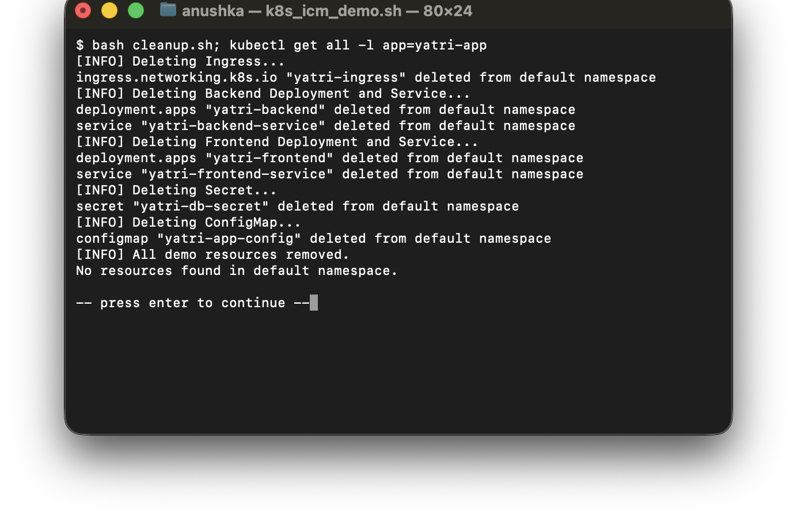
