# Kubernetes Networking & Services Homework

**Name:** Anushka Jain

All output generated on my machine by [`run.sh`](./run.sh) against a local minikube cluster. Manifests are organized the same way as the source repo: [`01-clusterip/`](./01-clusterip), [`02-nodeport/`](./02-nodeport), [`replicaset/`](./replicaset), [`troubleshooting/`](./troubleshooting), [`rolling-update/`](./rolling-update).

## Recap: the four ports in a Service/Pod YAML
- **`containerPort`** — the port the container process listens on.
- **`targetPort`** — the pod's port that a Service forwards traffic to (usually same as containerPort).
- **`port`** — the Service's own port, used for in-cluster communication (`http://service-name:port`).
- **`nodePort`** — a port opened on every worker node (range `30000-32767`) so traffic can enter the cluster from outside.

## Task 1: ClusterIP — the default, internal-only service
`ClusterIP` gives a stable virtual IP that's reachable only from inside the cluster. Verified this two ways: getting the endpoints list, and `exec`-ing into a client pod to `curl` the service by name (proving CoreDNS + service routing works) and by FQDN.

```text
$ kubectl apply -f 01-clusterip/app-deployment.yaml -f 01-clusterip/service.yaml -f 01-clusterip/client-pod.yaml
deployment.apps/web-app-clusterip created
service/web-service-clusterip created
pod/curl-client created

$ kubectl get svc web-service-clusterip
NAME                    TYPE        CLUSTER-IP      EXTERNAL-IP   PORT(S)    AGE
web-service-clusterip   ClusterIP   10.103.126.26   <none>        8080/TCP   22s

$ kubectl get endpoints web-service-clusterip
NAME                    ENDPOINTS                                       AGE
web-service-clusterip   10.244.0.3:80,10.244.0.4:80,10.244.0.5:80       22s

$ kubectl exec curl-client -- curl -s http://web-service-clusterip:8080
<!DOCTYPE html>
<html>
<title>Welcome to nginx!</title>
...

$ kubectl exec curl-client -- curl -s http://web-service-clusterip.default.svc.cluster.local:8080
<!DOCTYPE html>
<html>
<head>
```
3 pod IPs show up as endpoints behind one stable ClusterIP — this is the mechanism that survives pod restarts/rescheduling, unlike hardcoding a pod IP.

## Task 2: NodePort — external access
`NodePort` opens a fixed port (here `30080`) on every node, on top of a normal ClusterIP, so traffic from outside the cluster can reach it.

```text
$ kubectl apply -f 02-nodeport/app-deployment.yaml -f 02-nodeport/service.yaml
deployment.apps/web-app-nodeport created
service/web-service-nodeport created

$ kubectl get svc web-service-nodeport
NAME                   TYPE       CLUSTER-IP     EXTERNAL-IP   PORT(S)        AGE
web-service-nodeport   NodePort   10.96.232.162  <none>        80:30080/TCP   1s

$ curl -s http://localhost:8086 (port-forwarded to the NodePort service; minikube's docker driver doesn't expose node IPs directly on macOS)
<!DOCTYPE html>
<html>
<title>Welcome to nginx!</title>
```

## Task 3: ReplicaSet — selectors, labels, and scaling
The `selector` in a ReplicaSet/Service and the `labels` on a pod must match — that's how Kubernetes knows which pods a given object controls. Used `yatri-backend-rs` (a Python one-liner HTTP server on port 5000) to demonstrate manual scaling with `kubectl scale`.

```text
$ kubectl apply -f replicaset/yatri-backend-rs.yaml -f replicaset/yatri-backend-service.yaml
replicaset.apps/yatri-backend-rs created
service/yatri-backend-service created

$ kubectl get rs
NAME               DESIRED   CURRENT   READY   AGE
yatri-backend-rs   3         3         3       1s

$ kubectl get pods -l app=yatri-backend --show-labels
yatri-backend-rs-bh4jb   1/1   Running   0   1s   app=yatri-backend
yatri-backend-rs-vs2bp   1/1   Running   0   1s   app=yatri-backend
yatri-backend-rs-w8bpq   1/1   Running   0   1s   app=yatri-backend

$ kubectl scale rs/yatri-backend-rs --replicas=5
replicaset.apps/yatri-backend-rs scaled
$ kubectl get pods -l app=yatri-backend
yatri-backend-rs-4tg5v   1/1   Running   0   18s
yatri-backend-rs-bkb2v   1/1   Running   0   18s
yatri-backend-rs-bzl26   1/1   Running   0   4s
yatri-backend-rs-grstf   1/1   Running   0   4s
yatri-backend-rs-r87lt   1/1   Running   0   18s

$ kubectl scale rs/yatri-backend-rs --replicas=1
replicaset.apps/yatri-backend-rs scaled
$ kubectl get pods -l app=yatri-backend
yatri-backend-rs-4tg5v   1/1   Terminating   0   3m52s
yatri-backend-rs-bkb2v   1/1   Terminating   0   3m52s
yatri-backend-rs-bzl26   1/1   Terminating   0   3m38s
yatri-backend-rs-grstf   1/1   Running       0   3m38s
yatri-backend-rs-r87lt   1/1   Terminating   0   3m52s
```
`kubectl scale` immediately reconciles to the requested replica count — 3 to 5 created 2 new pods, 5 to 1 terminated 4.

## Task 4: Troubleshooting — selector mismatch = empty endpoints
Classic real-world bug: a Service whose `selector` doesn't match any pod's labels silently has **zero** endpoints, so it exists but routes nowhere.

```text
$ kubectl apply -f troubleshooting/empty-endpoints.yaml
service/broken-backend-service created

$ kubectl get endpoints broken-backend-service
NAME                      ENDPOINTS   AGE
broken-backend-service    <none>      0s

$ kubectl get endpoints yatri-backend-service
NAME                     ENDPOINTS            AGE
yatri-backend-service    10.244.0.13:5000     4m12s
```
`broken-backend-service` uses `selector: app: wrong-backend-name` while the running pods carry `app: yatri-backend` — a one-word typo is enough to silently break routing. Comparing against the healthy `yatri-backend-service` (correct selector) confirms the diagnosis.

## Task 5: Deployment rolling update (`maxSurge`/`maxUnavailable`)
A Deployment with `strategy.type: RollingUpdate`, `maxSurge: 1`, `maxUnavailable: 0` on 4 replicas: during a rollout at most 5 pods total exist (4 + 1 surge) and never fewer than 4 are available — zero downtime.

```text
$ kubectl apply -f rolling-update/deployment-v1.yaml -f rolling-update/service.yaml
deployment.apps/app-rolling created
service/app-rolling-service created
Waiting for deployment "app-rolling" rollout to finish: 0 of 4 updated replicas are available...
...
deployment "app-rolling" successfully rolled out

$ kubectl get pods -l app=app-rolling --show-labels
app-rolling-86d7d44d5b-2ckfb   1/1   Running   0   27s   version=v1
app-rolling-86d7d44d5b-cldp2   1/1   Running   0   27s   version=v1
app-rolling-86d7d44d5b-gj52d   1/1   Running   0   27s   version=v1
app-rolling-86d7d44d5b-z4fht   1/1   Running   0   27s   version=v1

$ curl -s http://localhost:8084 | grep VERSION
<p>VERSION: v1</p>

# trigger the rollout to v2
$ kubectl apply -f rolling-update/deployment-v2.yaml
deployment.apps/app-rolling configured
Waiting for deployment "app-rolling" rollout to finish: 1 out of 4 new replicas have been updated...
...
Waiting for deployment "app-rolling" rollout to finish: 1 old replicas are pending termination...
deployment "app-rolling" successfully rolled out

# caught mid-rollout: 4 new v2 pods + 1 old v1 pod still terminating
NAME                            READY   STATUS        AGE   LABELS
app-rolling-56bff6d88c-87nxr    1/1     Running       19s   version=v2
app-rolling-56bff6d88c-fnz47    1/1     Running       7s    version=v2
app-rolling-56bff6d88c-jkmdz    1/1     Running       13s   version=v2
app-rolling-56bff6d88c-vmppw    1/1     Running       25s   version=v2
app-rolling-86d7d44d5b-z4fht    1/1     Terminating   2m2s  version=v1

$ curl -s http://localhost:8085 | grep VERSION
<p>VERSION: v2</p>

$ kubectl rollout history deployment/app-rolling
REVISION  CHANGE-CAUSE
1         <none>
2         <none>

# rollback to v1 in one command
$ kubectl rollout undo deployment/app-rolling
deployment.apps/app-rolling rolled back
Waiting for deployment "app-rolling" rollout to finish: 1 out of 4 new replicas have been updated...
...
deployment "app-rolling" successfully rolled out

NAME                            READY   STATUS        AGE    LABELS
app-rolling-56bff6d88c-vmppw    1/1     Terminating   100s   version=v2
app-rolling-86d7d44d5b-g52wg    1/1     Running       25s    version=v1
app-rolling-86d7d44d5b-nkl96    1/1     Running       7s     version=v1
app-rolling-86d7d44d5b-qb79f    1/1     Running       19s    version=v1
app-rolling-86d7d44d5b-xnrwd    1/1     Running       13s    version=v1
```
The service stayed reachable throughout — curl never failed during either the v1→v2 rollout or the rollback.

## Screenshots

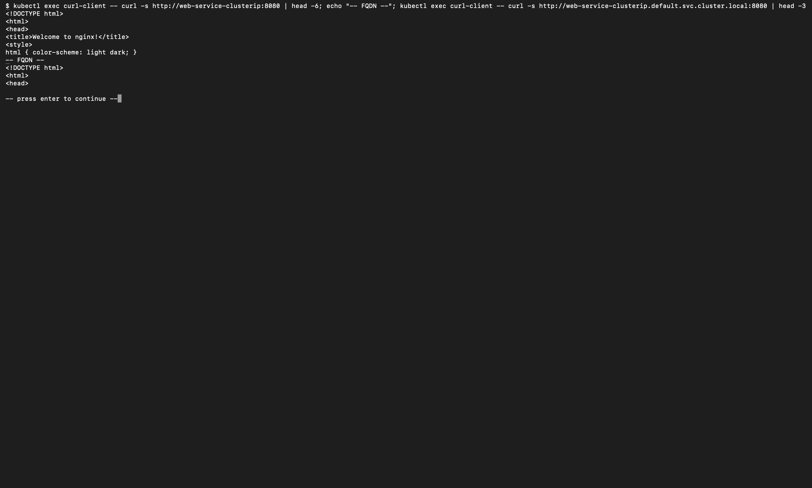
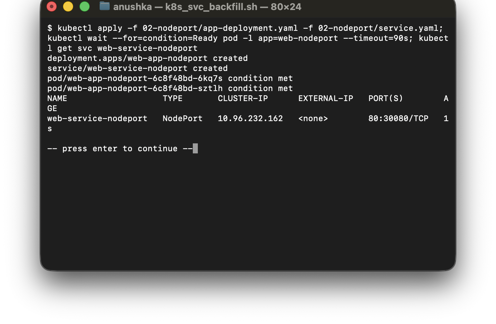
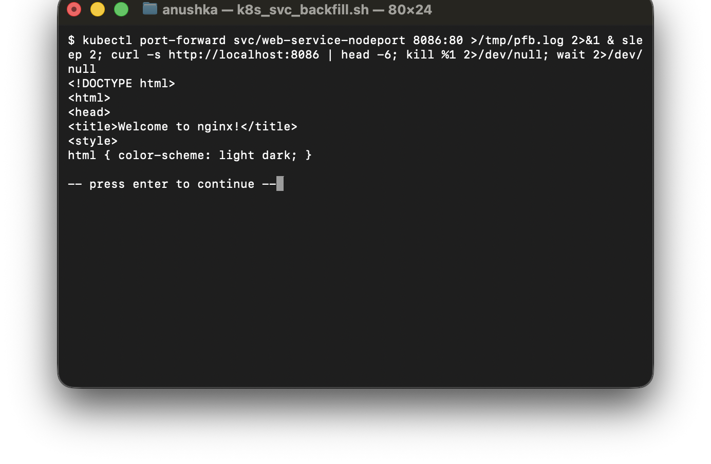
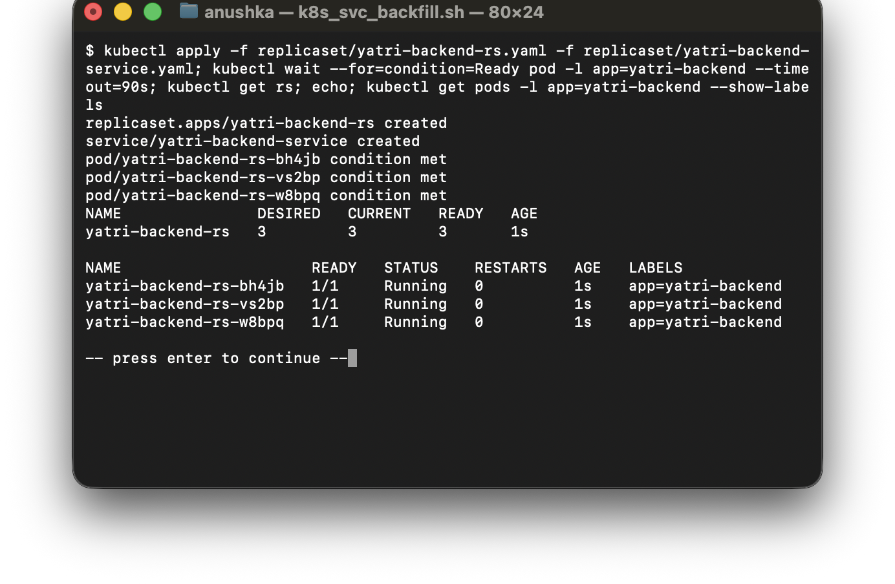
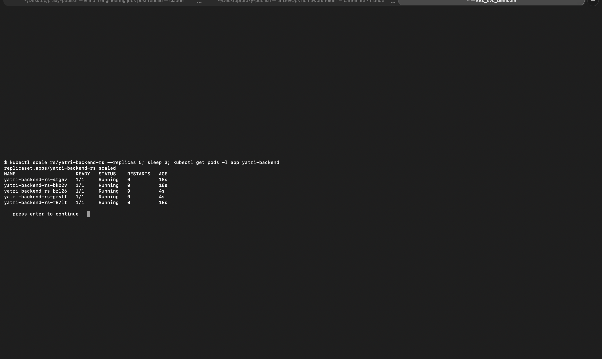
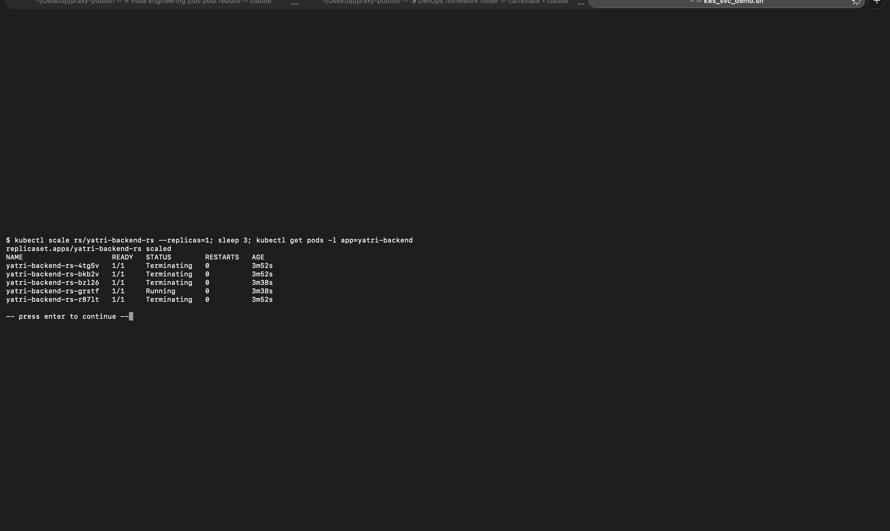
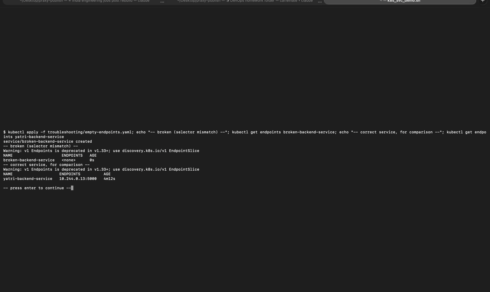
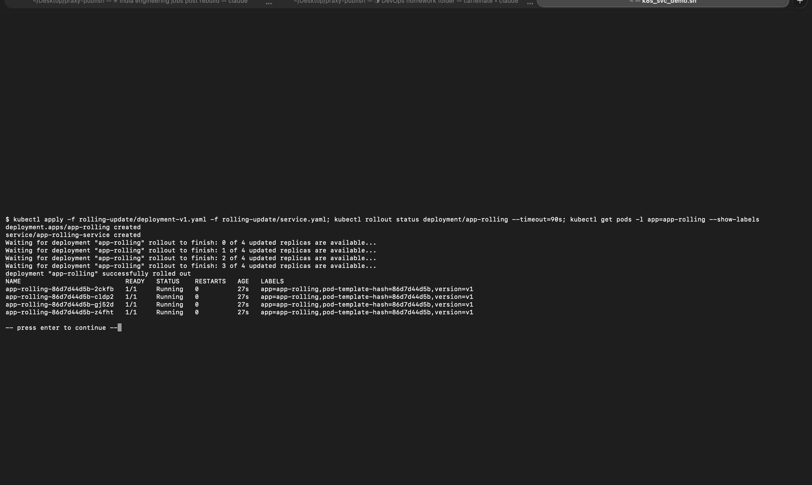
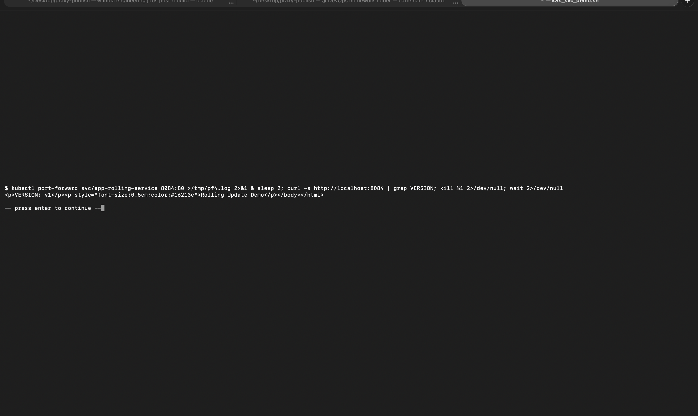
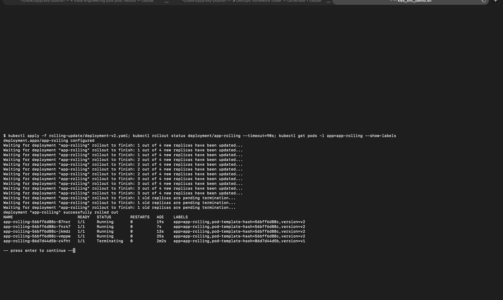
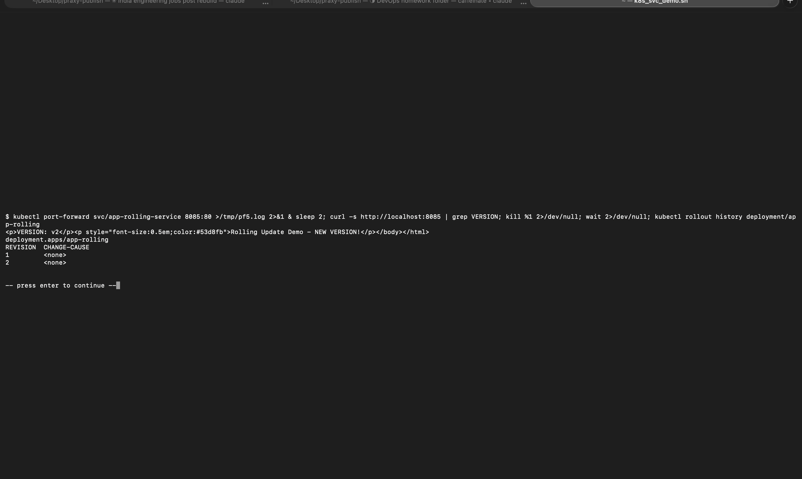
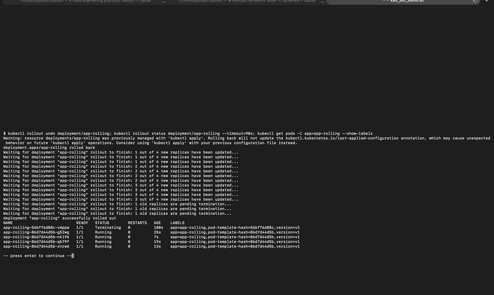

## Cleanup
```bash
kubectl delete -f rolling-update/service.yaml -f rolling-update/deployment-v1.yaml --ignore-not-found
kubectl delete -f replicaset/yatri-backend-service.yaml -f replicaset/yatri-backend-rs.yaml -f troubleshooting/empty-endpoints.yaml --ignore-not-found
kubectl delete -f 02-nodeport/service.yaml -f 02-nodeport/app-deployment.yaml --ignore-not-found
kubectl delete -f 01-clusterip/client-pod.yaml -f 01-clusterip/service.yaml -f 01-clusterip/app-deployment.yaml --ignore-not-found
minikube stop
```
