# Kubernetes Pods, ReplicaSets & Deployments Homework

**Name:** Anushka Jain

All output generated on my machine by [`run.sh`](./run.sh) against a local minikube cluster. YAML manifests: [`pod.yml`](./pod.yml), [`hello.yml`](./hello.yml), [`hello-badimage.yml`](./hello-badimage.yml), [`replicaset.yml`](./replicaset.yml), [`deployment.yml`](./deployment.yml), [`service.yml`](./service.yml).

## Recap: why we need API server in the middle
No two Kubernetes components talk to each other directly — etcd, scheduler, controller-manager and kubelet all only ever talk *through* the API server, which then reads/writes the actual state in etcd. E.g. `kubectl apply -f deployment.yaml` → API server validates + stores the spec in etcd → scheduler polls the API server for unscheduled pods and picks a node with enough resources → controller-manager (replica-set controller) makes sure the right number of pods exist → kubelet on the node actually pulls the image and starts the container, then reports back a heartbeat.

## Task 1: Pod — the smallest deployable unit
A pod is one or more containers sharing the same network and storage. Every Kubernetes manifest needs 4 things: `apiVersion`, `kind`, `metadata`, `spec`.

```text
$ kubectl apply -f pod.yml; sleep 3; kubectl get pods -o wide
pod/nginx-pod created
NAME        READY   STATUS              RESTARTS   AGE   IP       NODE       NOMINATED NODE   READINESS GATES
nginx-pod   0/1     ContainerCreating   0          3s    <none>   minikube   <none>           <none>

$ curl -s http://localhost:8081 (via kubectl port-forward pod/nginx-pod 8081:80)
<!DOCTYPE html>
<html>
<head>
<title>Welcome to nginx!</title>
...
$ kubectl logs nginx-pod
127.0.0.1 - - [18/Sep/2026:03:24:58 +0000] "GET / HTTP/1.1" 200 896 "-" "curl/8.7.1" "-"

$ kubectl delete -f pod.yml
pod "nginx-pod" deleted from default namespace
```

Since minikube is a local cluster, the container port isn't reachable directly on `localhost` from the host — I used `kubectl port-forward` to reach it (the lecture covers `NodePort`/service exposure for this, done in Task 5 below).

## Task 2: Pod lifecycle — `hello.yml` (busybox, runs once and exits)
Unlike nginx (which runs forever), a pod running a one-shot command goes `ContainerCreating` → `Running` (briefly) → `Completed`, because its container has actually finished its task and exited.

```text
$ kubectl apply -f hello.yml; kubectl get pods
pod/hello-pod created
NAME        READY   STATUS              RESTARTS   AGE
hello-pod   0/1     ContainerCreating   0          0s

$ kubectl get pods
NAME        READY   STATUS      RESTARTS   AGE
hello-pod   0/1     Completed   0          21s

$ kubectl logs hello-pod
Hello Kubernetes

$ kubectl delete -f hello.yml
pod "hello-pod" deleted from default namespace
```

## Task 3: Pod error state — bad image (`hello-badimage.yml`)
Interview-relevant point from the lecture: a pod object gets **created** successfully even with a garbage image name — Kubernetes only fails later, at the kubelet's image-pull step.

```text
$ kubectl apply -f hello-badimage.yml; sleep 5; kubectl get pods
pod/hello-badimage-pod created
NAME                 READY   STATUS              RESTARTS   AGE
hello-badimage-pod   0/1     ContainerCreating   0          5s

$ kubectl describe pod hello-badimage-pod
...
Events:
  Normal   Scheduled  29s  default-scheduler  Successfully assigned default/hello-badimage-pod to minikube
  Normal   BackOff    22s  kubelet            spec.containers{hello}: Back-off pulling image "thisimagedoesnotexist123"
  Warning  Failed     22s  kubelet            spec.containers{hello}: Error: ImagePullBackOff
  Normal   Pulling    10s (x2 over 29s)  kubelet  spec.containers{hello}: Pulling image "thisimagedoesnotexist123"
  Warning  Failed     9s (x2 over 23s)   kubelet  spec.containers{hello}: Failed to pull image "thisimagedoesnotexist123": pull access denied, repository does not exist or may require authorization
  Warning  Failed     9s (x2 over 23s)   kubelet  spec.containers{hello}: Error: ErrImagePull

$ kubectl delete -f hello-badimage.yml
```

## Task 4: ReplicaSet — self-healing
A ReplicaSet's whole job is to keep the **desired number of replicas** running. To prove it, I manually deleted one of the 3 pods it owns and watched a replacement get created automatically within seconds.

```text
$ kubectl apply -f replicaset.yml; sleep 3; kubectl get rs
replicaset.apps/nginx-rs created
NAME       DESIRED   CURRENT   READY   AGE
nginx-rs   3         3         1       3s

$ kubectl get pods -o wide -l app=nginx
nginx-rs-97fnh   1/1     Running             0   3s
nginx-rs-bv6xj   0/1     ContainerCreating   0   3s
nginx-rs-d4d97   0/1     ContainerCreating   0   3s

# manually kill one pod
$ kubectl delete pod nginx-rs-97fnh
pod "nginx-rs-97fnh" deleted from default namespace

# 3 seconds later -- back to 3, a brand-new pod was created to replace it
$ kubectl get pods -l app=nginx
NAME             READY   STATUS    RESTARTS   AGE
nginx-rs-bv6xj   1/1     Running   0          33s
nginx-rs-d4d97   1/1     Running   0          33s
nginx-rs-x2zv8   1/1     Running   0          4s   <-- new pod, replaces the deleted one

$ kubectl delete -f replicaset.yml
```

## Task 5: Deployment — manages a ReplicaSet, which manages Pods
A Deployment doesn't create pods directly — it creates a ReplicaSet (named `<deployment>-<hash>`), and that ReplicaSet creates the pods. This is the object hierarchy taught in the lecture, visible directly in the output below.

```text
$ kubectl apply -f deployment.yml; sleep 5; kubectl get deployments
deployment.apps/nginx-deployment created
NAME               READY   UP-TO-DATE   AVAILABLE   AGE
nginx-deployment   0/3     3            0           5s

$ kubectl get rs
NAME                          DESIRED   CURRENT   READY   AGE
nginx-deployment-6946987795   3         3         0       5s

$ kubectl get pods -o wide
nginx-deployment-6946987795-jkh5f   0/1   ContainerCreating   0   5s
nginx-deployment-6946987795-k99r6   0/1   ContainerCreating   0   5s
nginx-deployment-6946987795-r27w2   0/1   ContainerCreating   0   5s
```

## Task 6: Exposing the Deployment with a Service (NodePort)
As covered in the lecture: pods inside the cluster aren't reachable from outside it unless you create a `Service`. `nginx-service` is a `NodePort` service on `30080` that load-balances across all 3 deployment pods via the `app: nginx` label selector.

```text
$ kubectl apply -f service.yml; kubectl get svc
service/nginx-service created
NAME            TYPE        CLUSTER-IP     EXTERNAL-IP   PORT(S)        AGE
kubernetes      ClusterIP   10.96.0.1      <none>        443/TCP        9h
nginx-service   NodePort    10.102.44.97   <none>        80:30080/TCP   0s

$ curl -s http://localhost:8082 (via kubectl port-forward svc/nginx-service 8082:80)
<!DOCTYPE html>
<html>
<head>
<title>Welcome to nginx!</title>
...

$ kubectl delete -f service.yml -f deployment.yml
service "nginx-service" deleted from default namespace
deployment.apps "nginx-deployment" deleted from default namespace
```

## Screenshots
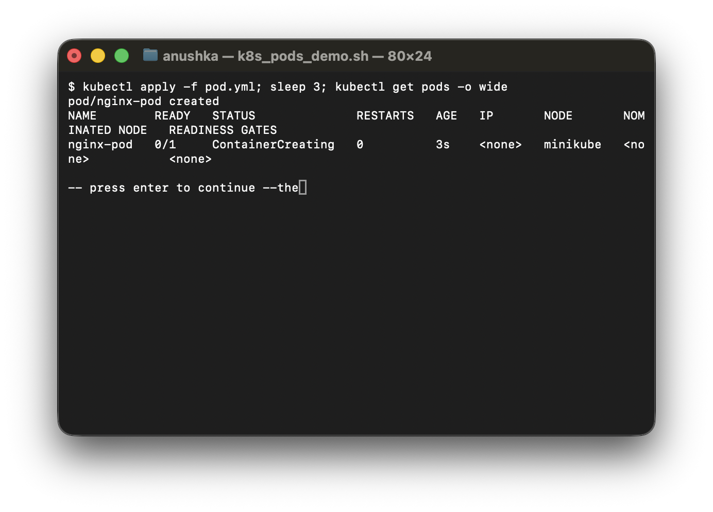
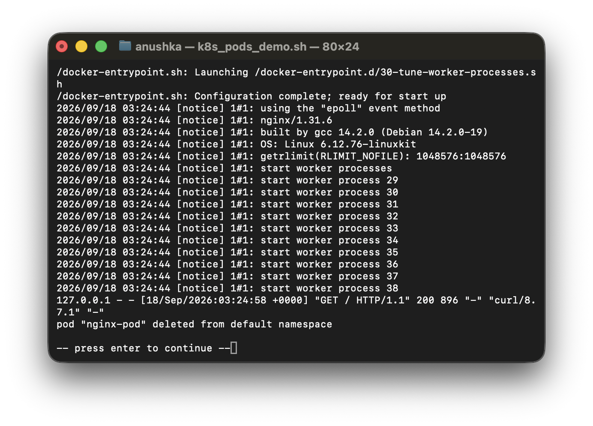
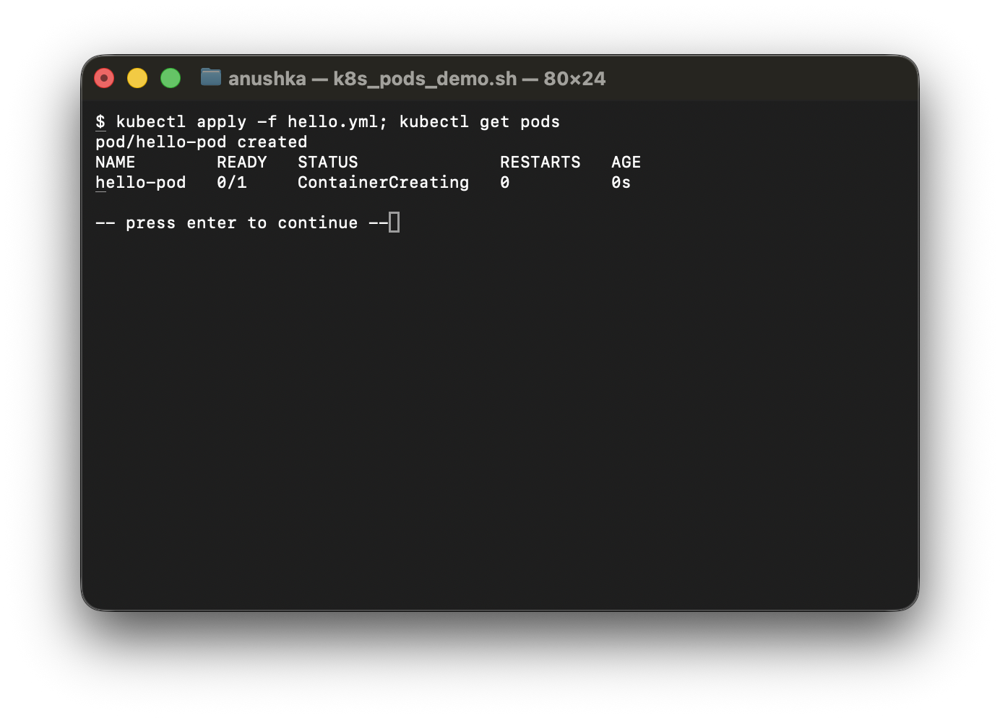
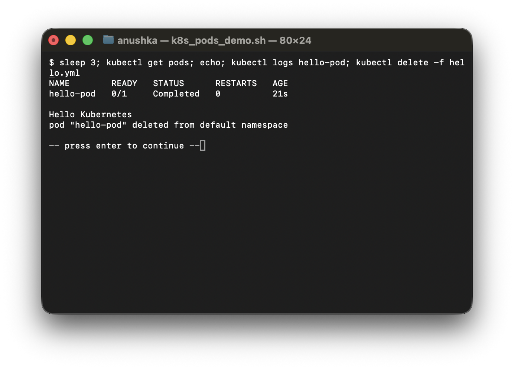
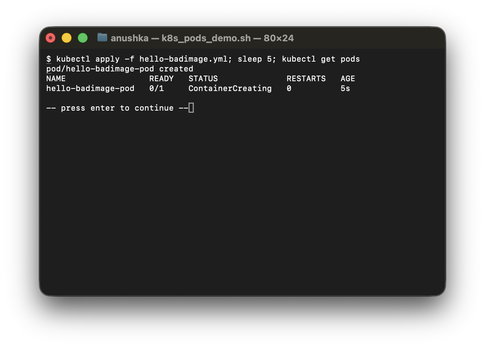
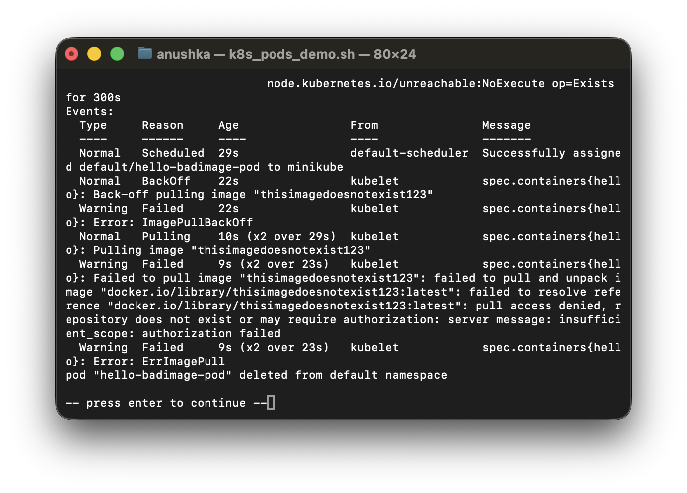
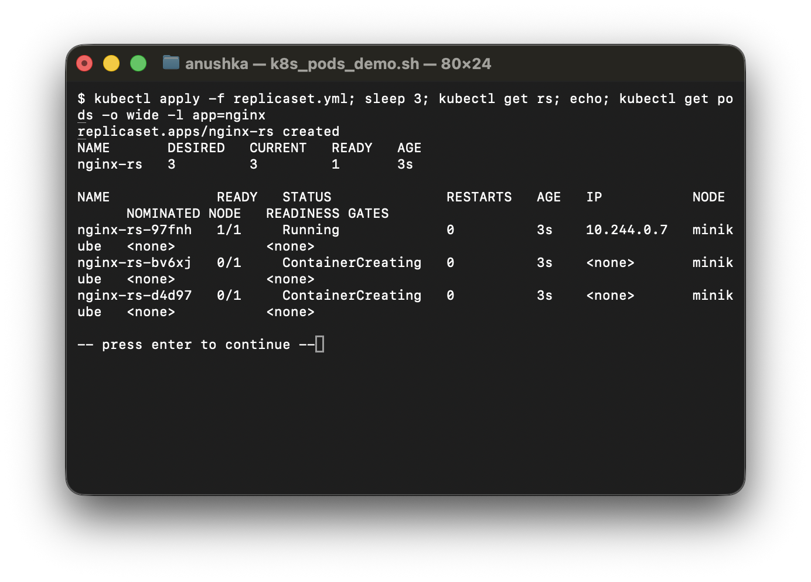
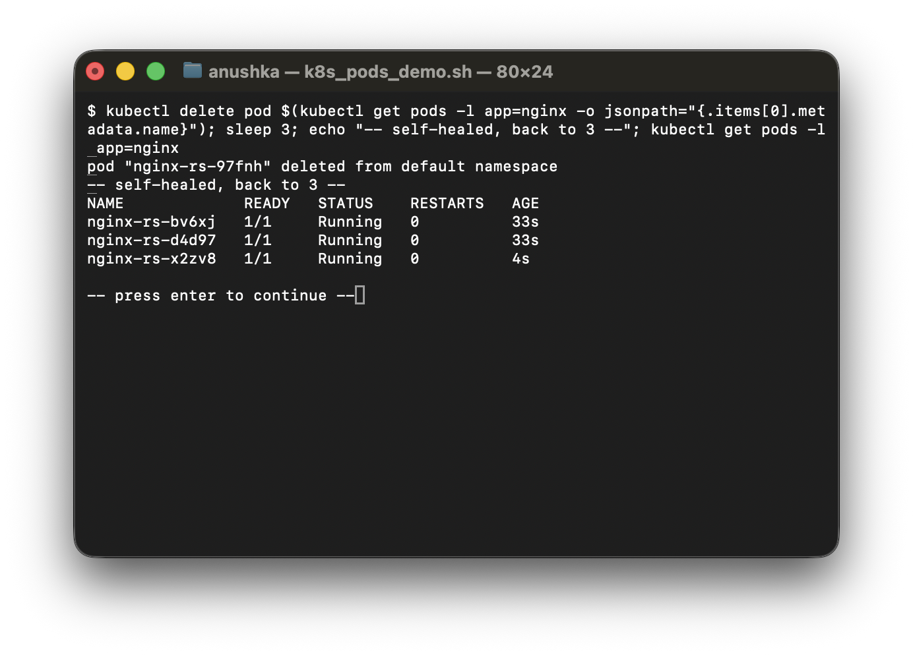
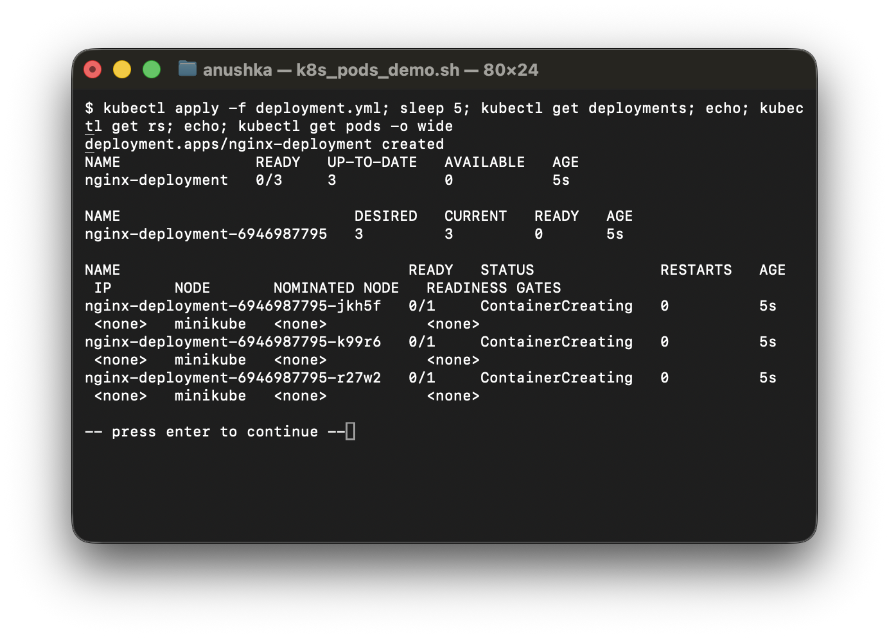
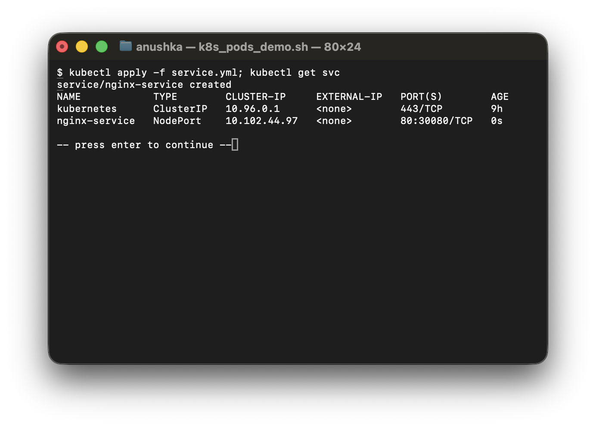
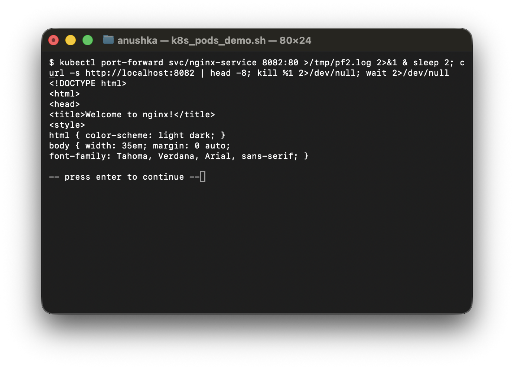

## Cleanup
```bash
kubectl delete -f service.yml -f deployment.yml -f replicaset.yml -f pod.yml -f hello.yml -f hello-badimage.yml --ignore-not-found
minikube stop
```
