# Kubernetes Storage, HPA & Probes Homework

**Name:** Anushka Jain

All output generated on my machine by [`run.sh`](./run.sh) against a local minikube cluster (Docker driver), following Nency's `session-13-storage-hpa-probes` lab and the Session 13 tasks from the homework doc. Cleanup: [`cleanup.sh`](./cleanup.sh).

```text
kubernetes-storage-hpa-probes/
├── 01-kubernetes-volumes/   README.md (Task 1 doc) + emptydir / hostpath / pv / pvc / pod / dynamic-pvc yamls
├── 02-hpa/                  deployment.yaml, service.yaml, hpa.yml, load-generator.yaml
├── 03-probes/               liveness / readiness / startup yamls (+ broken versions)
├── mini-project/            namespace, pvc, deployment, service, hpa + README.md
├── screenshots/
├── run.sh
└── cleanup.sh
```

> Note on the transcript for this lecture: even though it's titled "Storage, HPA & Probes", the audio was a recap of the Kubernetes architecture + a walkthrough of the 5 Service types (ClusterIP, NodePort, LoadBalancer, ExternalName, Headless with a StatefulSet) and FQDN — i.e. Session 11 content. I built this submission from the Session 13 tasks in the homework doc and the matching `session-13-storage-hpa-probes` folder in the repo.

---

## Task 1: Kubernetes Volumes
Full write-up with every example and its output: **[`01-kubernetes-volumes/README.md`](./01-kubernetes-volumes/README.md)** (emptyDir, hostPath, PersistentVolume, PersistentVolumeClaim, StorageClass, dynamic provisioning). Short version of what the hands-on proved:

| Test | Result |
|---|---|
| write file → delete Pod → recreate (**emptyDir**) | `No such file or directory` — data died with the Pod |
| write file → delete Pod → recreate (**hostPath**) | file still there, and visible on the node via `minikube ssh` |
| static **PV** + **PVC** | PV `Available` → `Bound` to `default/student-pvc` |
| write file → delete Pod → recreate (**PVC**) | `Kubernetes Storage - Anushka Jain` — data survived |
| PVC with `storageClassName: standard` | PV `pvc-77ca82d5-…` created automatically (**dynamic provisioning**) |

```text
$ kubectl exec emptydir-demo -- cat /data/message.txt      (after pod delete + recreate)
cat: /data/message.txt: No such file or directory

$ kubectl exec storage-demo -- cat /data/message.txt       (after pod delete + recreate, PVC-backed)
Kubernetes Storage - Anushka Jain

$ kubectl get pv
NAME                                       CAPACITY   ACCESS MODES   RECLAIM POLICY   STATUS   CLAIM                 STORAGECLASS
pvc-77ca82d5-d728-4fb2-9c1d-43813fd86bd1   500Mi      RWO            Delete           Bound    default/dynamic-pvc   standard
student-pv                                 1Gi        RWO            Retain           Bound    default/student-pvc
```

---

## Task 2: HPA hands-on
Files in [`02-hpa/`](./02-hpa): [`deployment.yaml`](./02-hpa/deployment.yaml) (nginx, `requests.cpu: 100m`, `limits.cpu: 200m`), [`service.yaml`](./02-hpa/service.yaml) (ClusterIP `hpa-demo-service`), [`hpa.yml`](./02-hpa/hpa.yml), [`load-generator.yaml`](./02-hpa/load-generator.yaml).

```yaml
# hpa.yml
apiVersion: autoscaling/v2
kind: HorizontalPodAutoscaler
metadata:
  name: hpa-demo
spec:
  scaleTargetRef: {apiVersion: apps/v1, kind: Deployment, name: hpa-demo}   # WHAT to scale
  minReplicas: 1
  maxReplicas: 5
  metrics:
    - type: Resource
      resource:
        name: cpu
        target: {type: Utilization, averageUtilization: 50}                  # keep avg CPU at 50% of the REQUEST
```
**How HPA decides:** every ~15s the HPA controller asks metrics-server for the pods' CPU, computes utilization as a % of the **CPU request** (not the limit), then `desiredReplicas = ceil(currentReplicas × currentUtilization / target)`. That's why `resources.requests.cpu` is mandatory — without it the HPA shows `<unknown>`.

### Step 1 — Metrics Server (HPA needs metrics)
```text
$ minikube addons enable metrics-server
  - Using image registry.k8s.io/metrics-server/metrics-server:v0.9.0
* The 'metrics-server' addon is enabled

$ kubectl get pods -n kube-system | grep metrics-server
metrics-server-768f9f6999-rwtmp    1/1     Running   0             77s

$ kubectl top nodes
NAME       CPU(cores)   CPU(%)   MEMORY(bytes)   MEMORY(%)
minikube   177m         1%       1664Mi          20%
```

### Step 2 — Deploy the app + configure and verify HPA
```text
$ kubectl apply -f deployment.yaml -f service.yaml
deployment.apps/hpa-demo created
service/hpa-demo-service created

$ kubectl apply -f hpa.yml
horizontalpodautoscaler.autoscaling/hpa-demo created

$ kubectl get deployment,svc,hpa
NAME                       READY   UP-TO-DATE   AVAILABLE   AGE
deployment.apps/hpa-demo   1/1     1            1           62s

NAME                       TYPE        CLUSTER-IP       EXTERNAL-IP   PORT(S)   AGE
service/hpa-demo-service   ClusterIP   10.109.175.203   <none>        80/TCP    62s

NAME                                           REFERENCE             TARGETS       MINPODS   MAXPODS   REPLICAS
horizontalpodautoscaler.autoscaling/hpa-demo   Deployment/hpa-demo   cpu: 1%/50%   1         5         1

$ kubectl top pods -l app=hpa-demo
NAME                        CPU(cores)   MEMORY(bytes)
hpa-demo-5d6676989b-xcxm7   1m           8Mi
```
Idle: 1m of a 100m request = 1% → stays at minReplicas 1.

### Step 3 — Deploy the load generator
A single `kubectl run` busybox loop barely moves a static nginx page, so I made it a Deployment of 3 busybox pods each doing `while true; do wget -q -O- http://hpa-demo-service; done` (hitting the Service by its DNS name).
```text
$ kubectl apply -f load-generator.yaml
deployment.apps/load-generator created

$ kubectl get pods -l app=load-generator
NAME                              READY   STATUS    RESTARTS   AGE
load-generator-5bc8f9cd58-72b7h   1/1     Running   0          8s
load-generator-5bc8f9cd58-kgwsz   1/1     Running   0          8s
load-generator-5bc8f9cd58-vmnn6   1/1     Running   0          8s
```

### Step 4 — Observe CPU going up and Pods scaling out
```text
$ kubectl get hpa hpa-demo -w     (sampled every 15s)
NAME       REFERENCE             TARGETS        MINPODS   MAXPODS   REPLICAS   AGE
hpa-demo   Deployment/hpa-demo   cpu: 1%/50%    1     5     1     69s
hpa-demo   Deployment/hpa-demo   cpu: 1%/50%    1     5     1     115s
hpa-demo   Deployment/hpa-demo   cpu: 76%/50%   1     5     1     2m11s    <- metrics catch up with the load
hpa-demo   Deployment/hpa-demo   cpu: 76%/50%   1     5     2     2m26s    <- scale 1 -> 2
hpa-demo   Deployment/hpa-demo   cpu: 79%/50%   1     5     2     3m12s
hpa-demo   Deployment/hpa-demo   cpu: 67%/50%   1     5     2     4m13s
hpa-demo   Deployment/hpa-demo   cpu: 67%/50%   1     5     3     4m28s    <- scale 2 -> 3
hpa-demo   Deployment/hpa-demo   cpu: 48%/50%   1     5     3     5m14s    <- load spread over 3 pods, under target
hpa-demo   Deployment/hpa-demo   cpu: 48%/50%   1     5     3     6m

$ kubectl get pods -l app=hpa-demo
NAME                        READY   STATUS    RESTARTS   AGE
hpa-demo-5d6676989b-cw988   1/1     Running   0          2m35s
hpa-demo-5d6676989b-gmmsm   1/1     Running   0          4m35s
hpa-demo-5d6676989b-xcxm7   1/1     Running   0          6m36s

$ kubectl top pods -l app=hpa-demo
NAME                        CPU(cores)   MEMORY(bytes)
hpa-demo-5d6676989b-cw988   45m          8Mi
hpa-demo-5d6676989b-gmmsm   44m          8Mi
hpa-demo-5d6676989b-xcxm7   45m          8Mi
```
It did **not** go to maxReplicas 5 — and that's correct: once the same load was split across 3 pods each was at ~45% (< 50%), so 3 was enough. Check: `ceil(2 × 67/50) = ceil(2.68) = 3`.

### Step 5 — `kubectl describe hpa`
```text
$ kubectl describe hpa hpa-demo
Metrics:                                               ( current / target )
  resource cpu on pods  (as a percentage of request):  44% (44m) / 50%
Min replicas:                                          1
Max replicas:                                          5
Deployment pods:                                       3 current / 3 desired
Conditions:
  AbleToScale     True    ReadyForNewScale    recommended size matches current size
  ScalingActive   True    ValidMetricFound    the HPA was able to successfully calculate a replica count from cpu resource utilization (percentage of request)
  ScalingLimited  False   DesiredWithinRange  the desired count is within the acceptable range
Events:
  Warning  FailedGetResourceMetric       5m50s (x4 over 6m35s)  failed to get cpu utilization: unable to get metrics for resource cpu: no metrics returned from resource metrics API
  Normal   SuccessfulRescale             4m35s                  New size: 2; reason: cpu resource utilization (percentage of request) above target
  Normal   SuccessfulRescale             2m35s                  New size: 3; reason: cpu resource utilization (percentage of request) above target
```
The two warnings at the very start are from the first ~40s after creating the HPA, before metrics-server had scraped the new pod — this is the `<unknown>` state. Then the two `SuccessfulRescale` events show exactly when and why it scaled.

### Step 6 — Stop the load and watch scale-down
```text
$ kubectl delete -f load-generator.yaml
deployment.apps "load-generator" deleted from default namespace

$ kubectl get hpa hpa-demo -w     (sampled every 30s)
NAME       REFERENCE             TARGETS        MINPODS   MAXPODS   REPLICAS   AGE
hpa-demo   Deployment/hpa-demo   cpu: 44%/50%   1     5     3     6m35s
hpa-demo   Deployment/hpa-demo   cpu: 12%/50%   1     5     3     8m6s
hpa-demo   Deployment/hpa-demo   cpu: 0%/50%    1     5     3     9m7s
hpa-demo   Deployment/hpa-demo   cpu: 0%/50%    1     5     3     12m      <- CPU is 0% but still 3 replicas...
hpa-demo   Deployment/hpa-demo   cpu: 0%/50%    1     5     1     13m      <- ...until the 5-min window passes, then 3 -> 1

$ kubectl get pods -l app=hpa-demo
NAME                        READY   STATUS    RESTARTS   AGE
hpa-demo-5d6676989b-xcxm7   1/1     Running   0          13m
```
**Scale up is fast, scale down is slow on purpose:** the default scale-down *stabilization window* is 300s — HPA uses the highest recommendation of the last 5 minutes, so a short dip in traffic doesn't kill pods that are needed again a minute later (avoids "flapping"). It can be tuned with `spec.behavior.scaleDown.stabilizationWindowSeconds`.

```text
Load ──► CPU usage ──► metrics-server ──► HPA controller ──► Deployment.replicas ──► more / fewer Pods
```

---

## Task 3: Probes (liveness / readiness / startup)
Files in [`03-probes/`](./03-probes). A Pod being `Running` only means the process started — probes let the kubelet check the *application* is actually OK.

| Probe | Question | On failure |
|---|---|---|
| **startupProbe** | Has the app finished starting? | container restarted; liveness/readiness are **paused** until it passes (protects slow starters like Java apps) |
| **readinessProbe** | Can it receive traffic right now? | Pod marked `NotReady` (0/1), **removed from Service endpoints** — container is NOT restarted |
| **livenessProbe** | Is it still alive / not stuck? | kubelet **kills and restarts** the container |

Probe mechanisms: `httpGet` (2xx/3xx = success), `tcpSocket`, `exec` (exit code 0), `grpc`. Timing knobs: `initialDelaySeconds`, `periodSeconds`, `timeoutSeconds`, `failureThreshold`. E.g. the startup probe here allows `30 × 2s = 60s` to start.

### All healthy
```text
$ kubectl apply -f liveness.yaml -f readiness.yaml -f startup.yaml
pod/liveness-demo created
pod/readiness-demo created
pod/startup-demo created

$ kubectl get pods liveness-demo readiness-demo startup-demo
NAME             READY   STATUS    RESTARTS   AGE
liveness-demo    1/1     Running   0          6s
readiness-demo   1/1     Running   0          6s
startup-demo     1/1     Running   0          6s

$ kubectl describe pod startup-demo | grep -E 'Liveness|Readiness|Startup'
    Liveness:       http-get http://:80/ delay=0s timeout=1s period=5s successThreshold=1 failureThreshold=3
    Readiness:      http-get http://:80/ delay=0s timeout=1s period=5s successThreshold=1 failureThreshold=3
    Startup:        http-get http://:80/ delay=0s timeout=1s period=2s successThreshold=1 failureThreshold=30

$ kubectl expose pod readiness-demo --name=readiness-service --port=80
$ kubectl get endpoints readiness-service
NAME                ENDPOINTS        AGE
readiness-service   10.244.0.23:80   2s          <- ready pod IS an endpoint
```

### Breaking readiness ([`readiness-broken.yaml`](./03-probes/readiness-broken.yaml), path `/wrong-path`)
```text
$ kubectl get pod readiness-broken
NAME               READY   STATUS    RESTARTS   AGE
readiness-broken   0/1     Running   0          26s           <- Running, but NOT ready, 0 restarts

$ kubectl get endpoints readiness-broken-service
NAME                       ENDPOINTS   AGE
readiness-broken-service               26s                    <- empty! Service sends it no traffic

$ kubectl describe pod readiness-broken
  Warning  Unhealthy  5s (x4 over 20s)  kubelet  Readiness probe failed: HTTP probe failed with statuscode: 404
```

### Breaking liveness ([`liveness-broken.yaml`](./03-probes/liveness-broken.yaml), path `/wrong-path`)
```text
$ kubectl get pod liveness-broken
NAME              READY   STATUS    RESTARTS     AGE
liveness-broken   1/1     Running   3 (5s ago)   50s          <- restarted 3 times in 50s

$ kubectl describe pod liveness-broken
Events:
  Normal   Killing    5s (x3 over 35s)   kubelet  Container nginx failed liveness probe, will be restarted
  Warning  Unhealthy  0s (x10 over 45s)  kubelet  Liveness probe failed: HTTP probe failed with statuscode: 404
```
Same 404 failure, two completely different reactions: **readiness failure ≠ restart** (just pulled out of the Service), **liveness failure = restart** (and if it keeps failing it ends up in `CrashLoopBackOff`).

---

## Task 4: Mini project — production-ready web app (PVC + HPA + all 3 probes)
Full write-up: **[`mini-project/README.md`](./mini-project/README.md)**. Namespace `production-webapp`, a 500Mi dynamically provisioned PVC mounted at `/data`, a 2-replica nginx Deployment with startup + readiness + liveness probes and CPU requests, a ClusterIP Service, and an HPA (2–5 replicas @ 50% CPU).
```text
$ kubectl get pvc,pods,svc,hpa -n production-webapp
persistentvolumeclaim/web-data   Bound    pvc-fd2cecb4-d0e9-4c87-8d54-994e36ad7975   500Mi   RWO   standard
pod/web-app-d45775485-mq8rq   1/1     Running   0          91s
pod/web-app-d45775485-rc6wm   1/1     Running   0          91s
service/web-service   ClusterIP   10.104.63.65   <none>        80/TCP    91s
horizontalpodautoscaler.autoscaling/web-app-hpa   Deployment/web-app   cpu: 1%/50%   2   5   2

$ kubectl exec -n production-webapp web-app-d45775485-jwvnn -- cat /data/student.txt     (new pod, after deleting the writer)
Student: Anushka Jain

$ curl -s http://localhost:8081 | grep -i '<title>'          (via kubectl port-forward svc/web-service 8081:80)
<title>Welcome to nginx!</title>

web-app-hpa   Deployment/web-app   cpu: 62%/50%   2     5     3     4m      <- scaled 2 -> 3 under load
```

---

## Cleanup
```text
$ bash cleanup.sh
[INFO] Deleting mini project namespace (deployment, service, hpa, pvc)...
namespace "production-webapp" deleted
[INFO] Deleting probe demo pods and services...
[INFO] Deleting HPA demo...
[INFO] Deleting volume demo pods, PVCs and PV...
persistentvolumeclaim "student-pvc" deleted from default namespace
persistentvolumeclaim "dynamic-pvc" deleted from default namespace
persistentvolume "student-pv" deleted
[INFO] All demo resources removed.
```

## Screenshots
**Task 1 — Volumes**
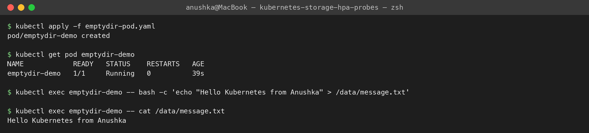
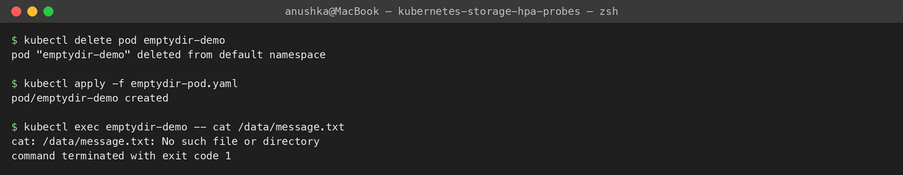
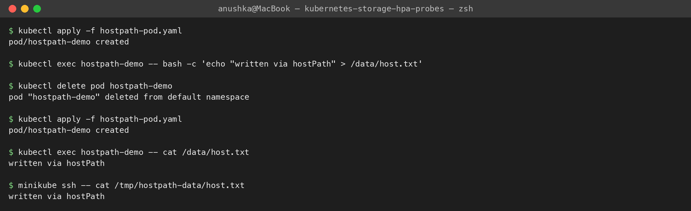
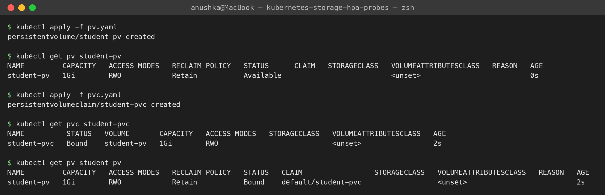
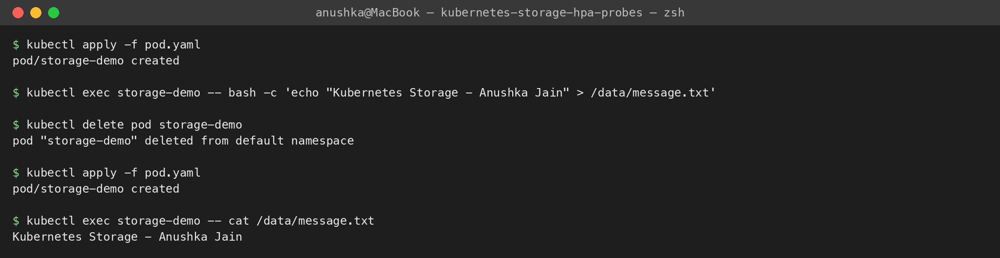
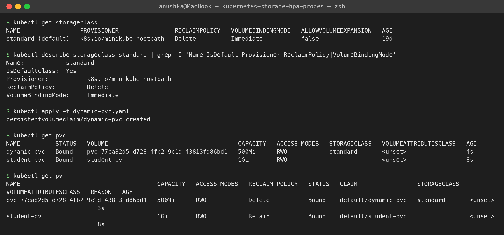

**Task 2 — HPA**
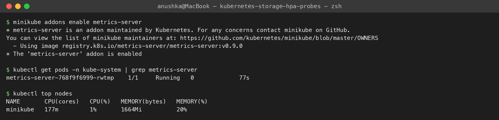
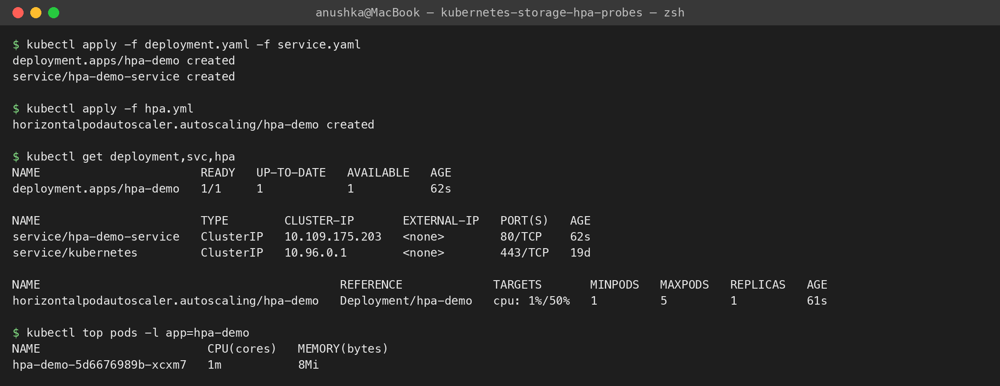
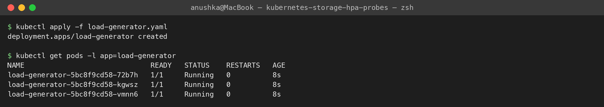
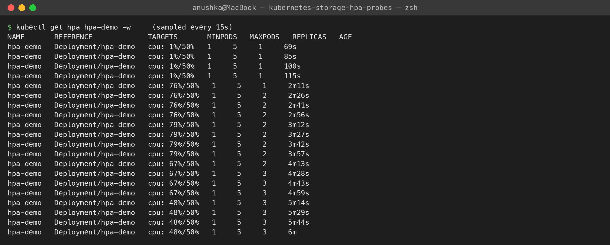
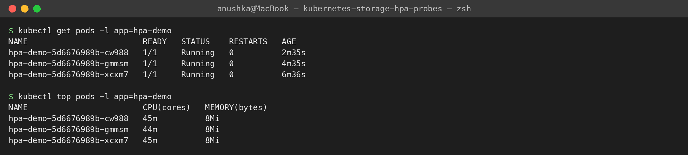
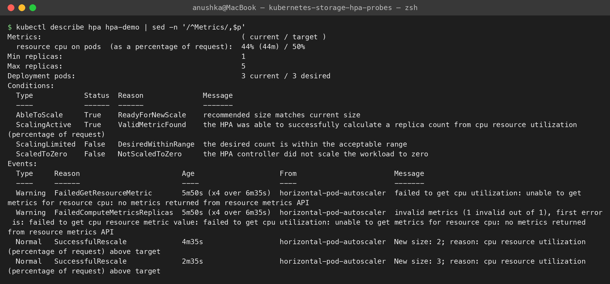
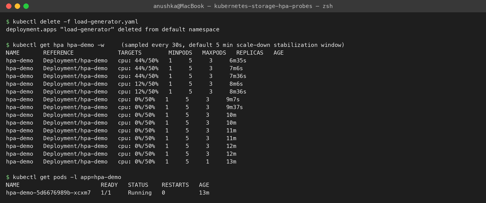

**Task 3 — Probes**
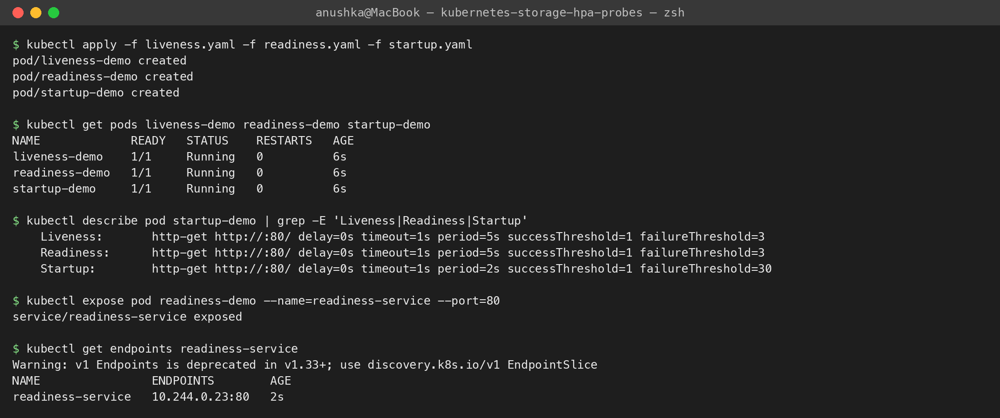
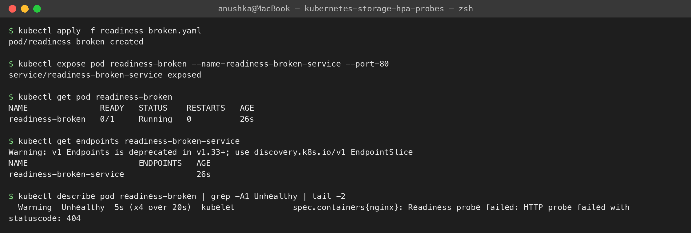
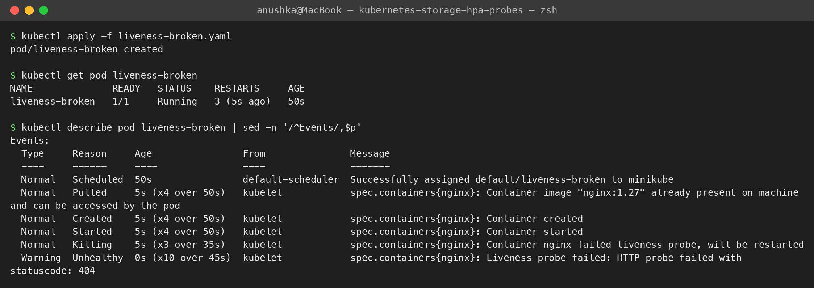

**Task 4 — Mini project**
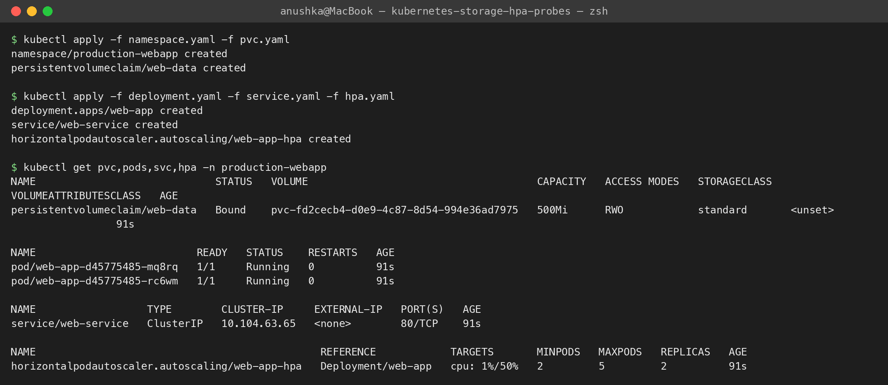
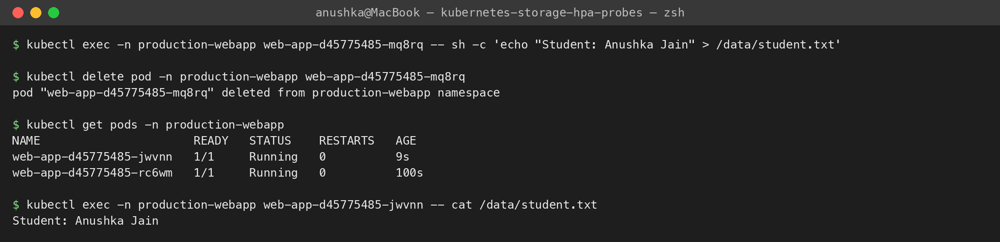
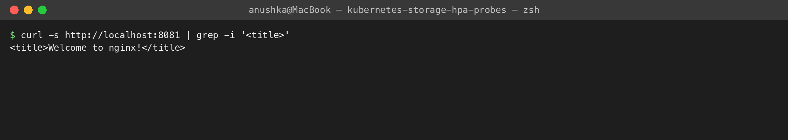
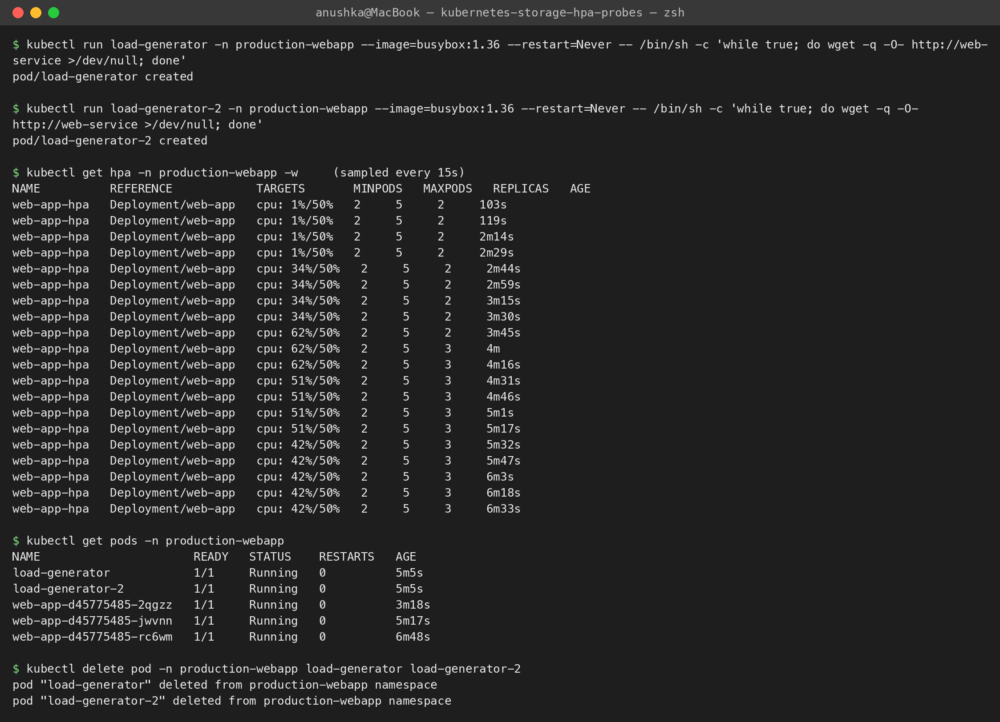

**Cleanup**
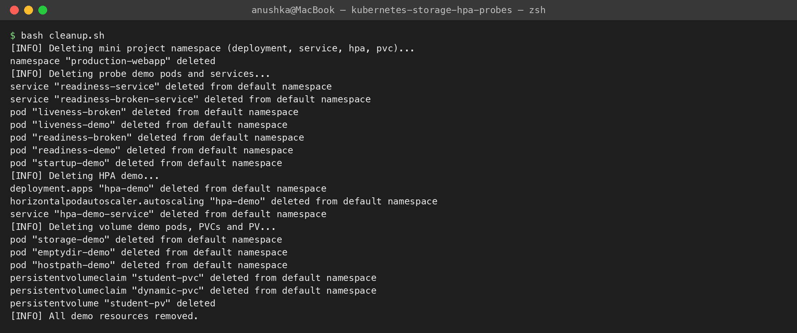

---

## Class homework (from the lecture)
### hostPath with my own path — [`hostpath-custom-pod.yaml`](./01-kubernetes-volumes/hostpath-custom-pod.yaml)
The class asked us to change the hostPath to our own path. Node path `/tmp/anushka-jain-data`, mounted at `/anushka-data`:
```text
$ kubectl exec hostpath-anushka -- sh -c 'echo "Anushka was here" > /anushka-data/note.txt'
$ kubectl delete pod hostpath-anushka && kubectl apply -f 01-kubernetes-volumes/hostpath-custom-pod.yaml
$ kubectl exec hostpath-anushka -- cat /anushka-data/note.txt
Anushka was here
$ minikube ssh -- ls -l /tmp/anushka-jain-data
-rw-r--r-- 1 root root 17 Oct  8 05:05 note.txt
```
emptyDir = Pod-level, hostPath = node-level, PV/PVC = cluster-level storage.

### Probes pasted into a broken pod — [`crashing-pod-with-probes.yaml`](./03-probes/crashing-pod-with-probes.yaml)
The probe block added to a busybox container that never serves HTTP on port 80:
```text
$ kubectl get pod probes-on-broken-app
NAME                   READY   STATUS    RESTARTS     AGE
probes-on-broken-app   0/1     Running   3 (6s ago)   2m4s
$ kubectl describe pod probes-on-broken-app
  Normal   Killing    36s (x3 over 114s)  kubelet  Container app failed startup probe, will be restarted
  Warning  Unhealthy  0s (x11 over 2m)    kubelet  Startup probe failed: Get "http://10.244.0.104:80/": dial tcp 10.244.0.104:80: connect: connection refused
```
Order: **startup** probe runs first (liveness and readiness wait for it); it failed 3 times (`failureThreshold: 3`), so the kubelet restarted the container again and again. The readiness and liveness probes never even ran.

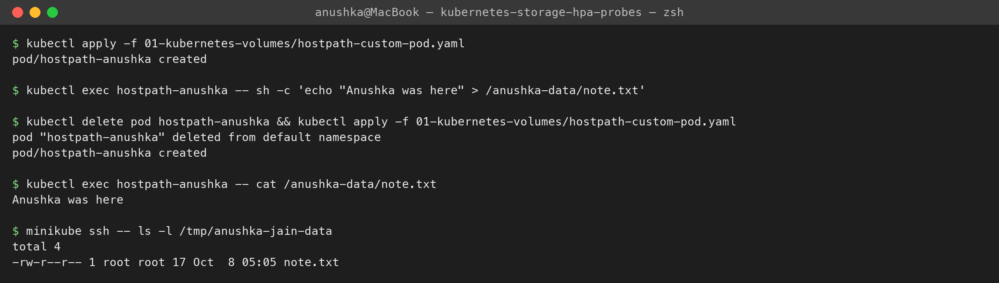
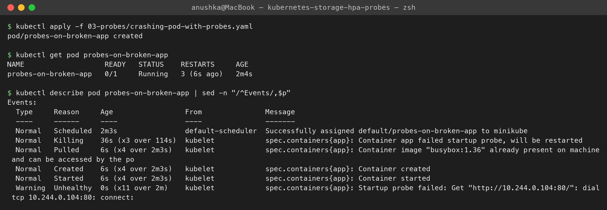
