# Kubernetes Troubleshooting Homework

**Name:** Anushka Jain

All output generated on my machine by [`run.sh`](./run.sh) against a local minikube cluster (with the metrics-server addon), following Nency's `session-14-kubernetes-troubleshooting` lab and the Session 14 tasks from the homework doc. Cleanup: [`cleanup.sh`](./cleanup.sh).

```text
kubernetes-troubleshooting/
├── 01-commands/pod.yaml                 logs-demo pod used for the command practice (Task 1)
├── 02-common-issues/                    one folder per issue, each with broken + fixed manifests (Task 2)
│   ├── 01-crashloopbackoff/   02-imagepullbackoff/   03-pending/
│   ├── 04-containercreating/  05-service-connectivity/ 06-dns/
│   └── 07-pod-networking/     08-configuration/      09-oomkilled/
├── mini-project/                        troubleshooting challenge + 5-scenario triage gauntlet (Task 3)
├── screenshots/
├── run.sh
└── cleanup.sh
```

## The troubleshooting mindset
Don't randomly change YAML. Follow the same loop every time:
```text
Observe → identify the resource → status (get) → details (describe) → events → logs
        → look inside (exec) → test connectivity → ROOT CAUSE → fix → verify
```
| Status you see | First command | Usual root causes |
|---|---|---|
| `CrashLoopBackOff` / `Error` | `kubectl logs <pod> --previous` | app exits: missing env/config, bad command, crash, failing liveness probe |
| `ErrImagePull` / `ImagePullBackOff` | `kubectl describe pod` → Events | wrong image name/tag, private registry without `imagePullSecrets`, registry down |
| `Pending` | `kubectl describe pod` → `FailedScheduling` | requests larger than any node, nodeSelector/affinity/taints, unbound PVC |
| `ContainerCreating` (stuck) | `kubectl describe pod` → `FailedMount` | missing ConfigMap/Secret/PVC volume, CNI problem |
| `CreateContainerConfigError` | `kubectl describe pod` | env from a missing Secret/ConfigMap/key, runAsNonRoot with non-numeric user |
| `OOMKilled` (exit 137) | `kubectl describe pod` → Last State | memory limit lower than the app needs, memory leak |
| Running but unreachable | `kubectl get endpoints`, `describe svc` | selector ≠ pod labels, wrong `targetPort`, readiness failing, wrong DNS name |

---

## Task 1: Troubleshooting commands
Practised on [`01-commands/pod.yaml`](./01-commands/pod.yaml) (a busybox "app" that logs a health line every 5 s).

### `kubectl get` / `kubectl get -o wide` — *"what is happening?"*
```text
$ kubectl get pods
NAME        READY   STATUS    RESTARTS   AGE
logs-demo   1/1     Running   0          27s

$ kubectl get pods -o wide                       <- adds pod IP, node, nominated node, readiness gates
NAME        READY   STATUS    RESTARTS   AGE   IP            NODE       NOMINATED NODE   READINESS GATES
logs-demo   1/1     Running   0          27s   10.244.0.72   minikube   <none>           <none>

$ kubectl get pod logs-demo -o jsonpath='{.status.phase}{"  "}{.status.podIP}{"  "}{.spec.nodeName}{"\n"}'
Running  10.244.0.72  minikube                   <- pull out exact fields (great for scripts)
```

### `kubectl describe` — *"what details explain the problem?"*
```text
$ kubectl describe pod logs-demo
Name:             logs-demo
Node:             minikube/192.168.49.2
Status:           Running
IP:               10.244.0.72
Containers:
  app:
    Image:         busybox:1.36
    State:          Running
    Ready:          True
    Restart Count:  0
    Limits:     cpu: 50m   memory: 32Mi
    Requests:   cpu: 10m   memory: 16Mi
...
Events: ...                                      <- the most useful part when something is broken
```

### `kubectl logs` and `kubectl exec` — *"what is the app saying / what does it see?"*
```text
$ kubectl logs logs-demo --tail=5               (also: -f to follow, --previous for the crashed container, -c for multi-container pods)
15:24:17 Application is healthy
15:24:22 Application is healthy
15:24:27 Application is healthy

$ kubectl exec logs-demo -- sh -c 'hostname; ps; cat /etc/resolv.conf'
logs-demo
PID   USER     TIME  COMMAND
    1 root      0:00 sh -c echo "Application started" ...
search default.svc.cluster.local svc.cluster.local cluster.local
nameserver 10.96.0.10                            <- CoreDNS service IP
options ndots:5
```

### `kubectl events` — *"what did Kubernetes try, and what happened?"*
```text
$ kubectl events --for pod/logs-demo
LAST SEEN   TYPE     REASON      OBJECT          MESSAGE
27s         Normal   Scheduled   Pod/logs-demo   Successfully assigned default/logs-demo to minikube
26s         Normal   Pulled      Pod/logs-demo   Container image "busybox:1.36" already present on machine
26s         Normal   Created     Pod/logs-demo   Container created
25s         Normal   Started     Pod/logs-demo   Container started

$ kubectl get events --sort-by=.lastTimestamp | tail -6     <- whole namespace, newest last
```
(The older events in the screenshot are from my first run of the script — events are kept for ~1 hour.)

### `kubectl explain` and `kubectl top`
```text
$ kubectl explain pod.spec.containers.livenessProbe        <- built-in API docs for any field
FIELD: livenessProbe <Probe>
DESCRIPTION:
    Periodic probe of container liveness. Container will be restarted if the probe fails. ...

$ kubectl top nodes                                        <- needs metrics-server
NAME       CPU(cores)   CPU(%)   MEMORY(bytes)   MEMORY(%)
minikube   221m         2%       1756Mi          22%

$ kubectl top pod logs-demo
NAME        CPU(cores)   MEMORY(bytes)
logs-demo   2m           0Mi
```

| Command | Question it answers |
|---|---|
| `kubectl get` (`-o wide`, `-o yaml`, `-o jsonpath`, `-w`) | What is the state? Where is it running? |
| `kubectl describe` | Full config + status + **events** of one object |
| `kubectl logs` (`--previous`, `-f`, `-c`) | What did the application print? |
| `kubectl exec -it … -- sh` | What does the world look like from inside the container? |
| `kubectl events` / `get events` | What did the scheduler / kubelet / controllers do? |
| `kubectl explain <path>` | What does this YAML field mean / which fields exist? |
| `kubectl top nodes/pods` | Is something out of CPU or memory? |

---

## Task 2: Common issues — identify → investigate → root cause → fix → verify

### 1. CrashLoopBackOff — [`01-crashloopbackoff/`](./02-common-issues/01-crashloopbackoff)
**Identify**
```text
$ kubectl get pod crash-demo
NAME         READY   STATUS             RESTARTS      AGE
crash-demo   0/1     CrashLoopBackOff   5 (65s ago)   4m2s
```
**Investigate**
```text
$ kubectl logs crash-demo --previous             <- logs of the container that crashed
Application starting...
[FATAL] DATABASE_URL environment variable is missing!

$ kubectl describe pod crash-demo
    State:          Waiting
      Reason:       CrashLoopBackOff
    Last State:     Terminated
      Reason:       Error
      Exit Code:    1
    Restart Count:  5
  Warning  BackOff  ...  Back-off restarting failed container app
```
**Root cause:** the app requires a `DATABASE_URL` env var that the Pod doesn't set → it exits with code 1 → kubelet restarts it with an increasing back-off (10s, 20s, 40s … max 5 min) = CrashLoopBackOff.
**Fix:** add the env var ([`fixed.yaml`](./02-common-issues/01-crashloopbackoff/fixed.yaml)). **Verify:**
```text
$ kubectl get pod crash-demo
NAME         READY   STATUS    RESTARTS   AGE
crash-demo   1/1     Running   0          3s
$ kubectl logs crash-demo
Application starting...
Connected to postgres://db.default.svc.cluster.local:5432/app
```
> Side lesson: on my first attempt the fixed pod's `kubectl logs` was **empty** — Python buffers stdout when it isn't a terminal, so prints never reached the log. Running `python3 -u` (unbuffered) fixed it. Same thing happens with many runtimes in containers (set `PYTHONUNBUFFERED=1`).

### 2. ErrImagePull → ImagePullBackOff — [`02-imagepullbackoff/`](./02-common-issues/02-imagepullbackoff)
```text
$ kubectl get pod image-demo
image-demo   0/1     ErrImagePull       0          5s        <- first failed pull
$ kubectl get pod image-demo
image-demo   0/1     ImagePullBackOff   0          25s       <- kubelet now backing off between retries

$ kubectl describe pod image-demo
  Normal   Pulling  ...  Pulling image "nginx:this-image-does-not-exist"
  Warning  Failed   ...  Failed to pull image "nginx:this-image-does-not-exist": rpc error: code = NotFound
                         desc = failed to pull and unpack image ... not found
  Warning  Failed   ...  Error: ErrImagePull
  Normal   BackOff  ...  Back-off pulling image "nginx:this-image-does-not-exist"
  Warning  Failed   ...  Error: ImagePullBackOff
```
**Root cause:** the tag doesn't exist in Docker Hub (`NotFound`). (Other variants: `unauthorized` → private registry, needs `imagePullSecrets`; `i/o timeout` → registry/network.) **Fix:** `nginx:1.27`. **Verify:** `image-demo 1/1 Running`.

### 3. Pending — [`03-pending/`](./02-common-issues/03-pending)
```text
$ kubectl get pod pending-demo -o wide
NAME           READY   STATUS    RESTARTS   AGE   IP       NODE
pending-demo   0/1     Pending   0          0s    <none>   <none>        <- never scheduled, no node, no IP

$ kubectl describe pod pending-demo
  Warning  FailedScheduling  default-scheduler  0/1 nodes are available: 1 Insufficient cpu, 1 Insufficient memory.

$ kubectl describe node minikube | grep -A6 'Allocatable:'
Allocatable:
  cpu:                10
```
**Root cause:** the pod *requests* 500 CPUs and 1000Gi RAM; the node only has 10 allocatable CPUs — the scheduler can't place it anywhere. (Other causes: nodeSelector/affinity matching no node, taints without tolerations, PVC not bound.) **Fix:** realistic requests (`100m`, `64Mi`). **Verify:** `pending-demo 1/1 Running 10.244.0.64 minikube`.

### 4. Stuck in ContainerCreating — [`04-containercreating/`](./02-common-issues/04-containercreating)
```text
$ kubectl get pod creating-demo
creating-demo   0/1     ContainerCreating   0          7s

$ kubectl describe pod creating-demo
  Warning  FailedMount  4s (x4 over 7s)  kubelet  MountVolume.SetUp failed for volume "site" : configmap "site-content" not found

$ kubectl get configmap site-content
Error from server (NotFound): configmaps "site-content" not found
```
**Root cause:** the pod mounts a ConfigMap volume that was never created, so the kubelet can't set up the volume and the container is never started. **Fix:** create it ([`configmap.yaml`](./02-common-issues/04-containercreating/configmap.yaml)) — no need to touch the pod, the kubelet retries the mount. **Verify:**
```text
$ kubectl apply -f configmap.yaml
$ kubectl get pod creating-demo
creating-demo   1/1     Running   0          8s
$ kubectl exec creating-demo -- curl -s localhost
<h1>Hello from Anushka's ConfigMap</h1>
```

### 5. Service connectivity — selector mismatch — [`05-service-connectivity/`](./02-common-issues/05-service-connectivity)
```text
$ kubectl exec client -- curl -s -m 3 http://web-service
command terminated with exit code 7                        <- connection failed

$ kubectl get endpoints web-service
NAME          ENDPOINTS   AGE
web-service   <none>      7s                               <- Service has NO backends

$ kubectl describe svc web-service | grep -E 'Selector|Endpoints'
Selector:                 app=web-ahsgdf
$ kubectl get pods -l app=web --show-labels
web-557577df75-97hhc   1/1   Running   ...   app=web,pod-template-hash=557577df75
```
**Root cause:** the Service selector `app=web-ahsgdf` (typo, straight from the lab) matches no pod labels (`app=web`) → empty endpoints. **Fix:** `selector: app: web`. **Verify:**
```text
$ kubectl get endpoints web-service
web-service   10.244.0.66:80,10.244.0.67:80   10s
$ kubectl exec client -- curl -s -m 3 http://web-service | grep -i '<title>'
<title>Welcome to nginx!</title>
```
**Rule: whenever a Service "doesn't work", check `kubectl get endpoints` first.**

### 6. DNS issues — [`06-dns/`](./02-common-issues/06-dns)
A client pod keeps calling `http://web-svc.production.svc.cluster.local`:
```text
$ kubectl logs dns-client --tail=3
request failed
000
request failed

$ kubectl exec dns-test -- nslookup web-svc.production.svc.cluster.local
Server:		10.96.0.10
** server can't find web-svc.production.svc.cluster.local: NXDOMAIN

$ kubectl get svc -A
NAMESPACE     NAME          TYPE        CLUSTER-IP    PORT(S)
default       web-service   ClusterIP   10.98.37.7    80/TCP          <- the real name + namespace
kube-system   kube-dns      ClusterIP   10.96.0.10    53/UDP,53/TCP
```
Investigate DNS itself (is CoreDNS healthy? does a correct name resolve?):
```text
$ kubectl exec dns-test -- cat /etc/resolv.conf
search default.svc.cluster.local svc.cluster.local cluster.local
nameserver 10.96.0.10
options ndots:5

$ kubectl exec dns-test -- nslookup web-service.default.svc.cluster.local
Name:	web-service.default.svc.cluster.local
Address: 10.98.37.7

$ kubectl get pods -n kube-system -l k8s-app=kube-dns
coredns-559f6c778d-75q4q   1/1     Running   4 (18d ago)   19d
```
**Root cause:** not a DNS outage — CoreDNS is fine and the real Service resolves. The client used the **wrong service name and wrong namespace**. FQDN format: `<service>.<namespace>.svc.cluster.local`. (The short name `web-service` also works from the same namespace thanks to the `search` list — busybox's `nslookup` prints NXDOMAIN for each search suffix it tries before the one that matches.)
**Fix:** use `web-service.default.svc.cluster.local`. **Verify:**
```text
$ kubectl logs dns-client --tail=3
200
200
```
> Real-world bonus: the lab's DNS test image `registry.k8s.io/e2e-test-images/dnsutils:1.3` **no longer exists** — my first run got `ImagePullBackOff` with `not found`. I diagnosed it with `describe` and switched to `busybox:1.36`, which has `nslookup`.

### 7. Pod networking — wrong targetPort — [`07-pod-networking/`](./02-common-issues/07-pod-networking)
```text
$ kubectl exec client -- curl -s -m 3 http://web-port-service
command terminated with exit code 7

$ kubectl get endpoints web-port-service
web-port-service   10.244.0.79:8080,10.244.0.80:8080     <- endpoints exist, but on port 8080

$ kubectl exec client -- curl -s -o /dev/null -w '%{http_code}\n' http://10.244.0.79:80
200                                                      <- pod itself is fine on 80
$ kubectl exec client -- curl -s -m 3 http://10.244.0.79:8080
command terminated with exit code 7                     <- nothing listens on 8080
```
**Root cause:** Service `targetPort: 8080`, but nginx listens on `80`. Testing the **pod IP directly** splits the problem: pod OK → the Service mapping is wrong. **Fix:** `targetPort: 80`. **Verify:** endpoints `…:80`, curl returns `<title>Welcome to nginx!</title>`.

### 8. Configuration issue — CreateContainerConfigError — [`08-configuration/`](./02-common-issues/08-configuration)
```text
$ kubectl get pod config-demo
config-demo   0/1     CreateContainerConfigError   0          2s

$ kubectl describe pod config-demo
  Warning  Failed  2s (x2 over 2s)  kubelet  Error: secret "db-secret" not found
```
**Root cause:** `env.valueFrom.secretKeyRef` points at a Secret that doesn't exist, so the kubelet can't build the container's environment. **Fix:** create the Secret ([`secret.yaml`](./02-common-issues/08-configuration/secret.yaml)); the kubelet retries automatically. **Verify:**
```text
$ kubectl get pod config-demo
config-demo   1/1     Running   0          16s
$ kubectl logs config-demo
DB_PASSWORD is set: 16 chars
```

### 9. OOMKilled (bonus) — [`09-oomkilled/`](./02-common-issues/09-oomkilled)
```text
$ kubectl get pod oom-demo
oom-demo   1/1     Running   1 (1s ago)   2s       <- looks "Running", but RESTARTS keeps climbing

$ kubectl describe pod oom-demo | grep -A4 'Last State'
    Last State:     Terminated
      Reason:       OOMKilled
      Exit Code:    137                           <- 128 + 9 (SIGKILL from the kernel OOM killer)
```
**Root cause:** the app allocates ~100 MB but `limits.memory: 20Mi`. **Fix:** limit `256Mi`. **Verify:**
```text
$ kubectl get pod oom-demo
oom-demo   1/1     Running   0          3s
$ kubectl logs oom-demo
Allocating 100MB...
Allocated, serving...
```

---

## Task 3: Mini project
### Part A — Troubleshooting challenge ([`mini-project/`](./mini-project))
Deploy, then check the app the way the lab asks (pods → describe → logs → exec → service → endpoints):
```text
$ kubectl get pods -o wide -l app=troubleshooting-app
troubleshooting-app-59d4957864-2clt6   1/1     Running   0     1s    10.244.0.113   minikube
troubleshooting-app-59d4957864-nw5sr   1/1     Running   0     1s    10.244.0.114   minikube

$ kubectl describe service troubleshooting-service | grep -E 'Selector|TargetPort|Endpoints'
Selector:                 app=troubleshooting-app
TargetPort:               80/TCP
Endpoints:                10.244.0.114:80,10.244.0.113:80

$ kubectl exec troubleshooting-app-59d4957864-2clt6 -- curl -s localhost | grep -i '<title>'
<title>Welcome to nginx!</title>
```
Selector matches the pod labels, targetPort = containerPort, both pod IPs are endpoints → the healthy baseline. Then the broken pod:
```text
$ kubectl get pod project-broken-pod
project-broken-pod   0/1     ErrImagePull   0          17s

$ kubectl describe pod project-broken-pod
  Normal   Pulling  ...  Pulling image "nginx:this-tag-does-not-exist"
  Warning  Failed   ...  Failed to pull image "nginx:this-tag-does-not-exist": rpc error: code = NotFound ...
  Warning  Failed   ...  Error: ErrImagePull
  Normal   BackOff  ...  Back-off pulling image "nginx:this-tag-does-not-exist"
  Warning  Failed   ...  Error: ImagePullBackOff
```
**Question 1: What is the Pod status?** `ErrImagePull`, which turns into `ImagePullBackOff` as the kubelet keeps retrying with back-off. READY 0/1, the container never started.
**Question 2: What is the actual error?** `Failed to pull image "nginx:this-tag-does-not-exist": rpc error: code = NotFound` — the tag `this-tag-does-not-exist` does not exist in the `nginx` repository on Docker Hub.
**Question 3: Which command helped you find the reason?** `kubectl describe pod project-broken-pod` — the **Events** section shows the pull attempt and the exact registry error. (`kubectl logs` can't help: the container never ran.)

Fix ([`fixed-pod.yaml`](./mini-project/fixed-pod.yaml), image `nginx:1.27`) → `project-broken-pod 1/1 Running`.

### Part B — Triage gauntlet ([`mini-project/scenarios/`](./mini-project/scenarios))
Nency's [`triage_all.sh`](./mini-project/scenarios/triage_all.sh) deploys 5 broken pods at once:
```text
=== CURRENT CLUSTER CARNAGE ===
NAME                     READY   STATUS         RESTARTS     AGE
fail-1-crashloop-pod     0/1     Error          1 (5s ago)   6s
fail-2-imagepull-pod     0/1     ErrImagePull   0            6s
fail-3-pending-pod       0/1     Pending        0            6s
fail-4-dns-failure-pod   1/1     Running        0            6s      <- "Running" but broken inside!
fail-5-oomkilled-pod     0/1     OOMKilled      1 (5s ago)   6s
```
| # | Symptom | Diagnosis command → evidence | Root cause | Fix (`fixed.yaml`) |
|---|---|---|---|---|
| 1 | Error / CrashLoopBackOff | `kubectl logs` → `[FATAL ERROR]: DATABASE_URL environment variable is MISSING!` | required env var not set | add `DATABASE_URL`; keep the process running |
| 2 | ImagePullBackOff | `describe` → `Failed to pull image "yatri-api-service:v999-invalid-tag-does-not-exist"` | image/tag doesn't exist | `nginx:1.27-alpine` |
| 3 | Pending | `describe` → `0/1 nodes are available: 1 Insufficient cpu, 1 Insufficient memory` | requests 500 CPU / 1000Gi | requests `100m`/`64Mi` + limits |
| 4 | Running, but app can't reach its DB | `logs` show no response; `exec … nslookup postgres-db-wrong-name.production.svc.cluster.local` → `NXDOMAIN` | wrong hostname in FQDN | call an existing Service by correct FQDN |
| 5 | OOMKilled | `jsonpath …lastState.terminated` → `OOMKilled  exitCode=137` | 20Mi limit, app needs ~200MB | limit `512Mi` (request `256Mi`) |

Note #4: a pod can be `1/1 Running` and still be broken — status only tells you the process is alive, not that it works.

After applying all five fixes:
```text
$ kubectl get pods -l tier=triage-gauntlet
NAME                     READY   STATUS    RESTARTS   AGE
fail-1-crashloop-pod     1/1     Running   0          6s
fail-2-imagepull-pod     1/1     Running   0          6s
fail-3-pending-pod       1/1     Running   0          6s
fail-4-dns-failure-pod   1/1     Running   0          6s
fail-5-oomkilled-pod     1/1     Running   0          6s

$ kubectl logs fail-1-crashloop-pod
Application started successfully!
$ kubectl logs fail-4-dns-failure-pod
Attempting connection to internal service...
<title>Welcome to nginx!</title>
```

## Cleanup
```text
$ bash cleanup.sh
[INFO] Deleting mini project + triage gauntlet...
deployment.apps "troubleshooting-app" deleted from default namespace
service "troubleshooting-service" deleted from default namespace
[INFO] Deleting any leftover demo resources...
[INFO] All demo resources removed.

$ kubectl get all
NAME                 TYPE        CLUSTER-IP   EXTERNAL-IP   PORT(S)   AGE
service/kubernetes   ClusterIP   10.96.0.1    <none>        443/TCP   20d
```

## Screenshots
**Task 1 — Commands**
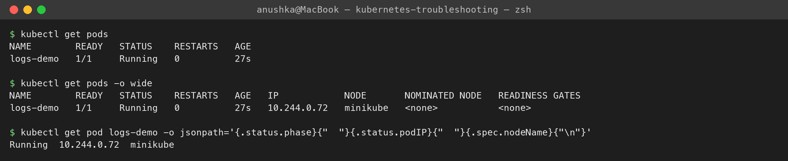
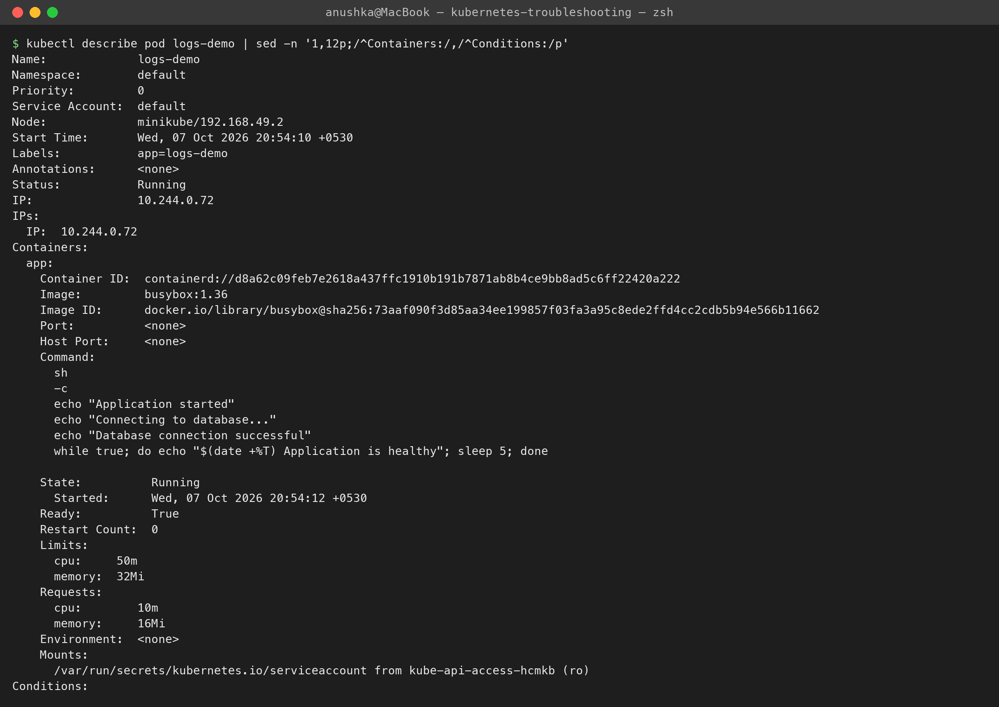
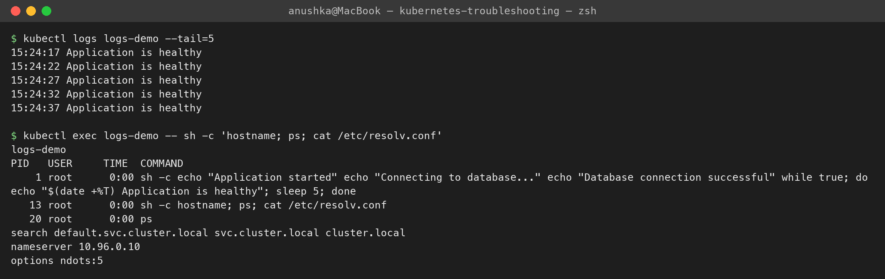
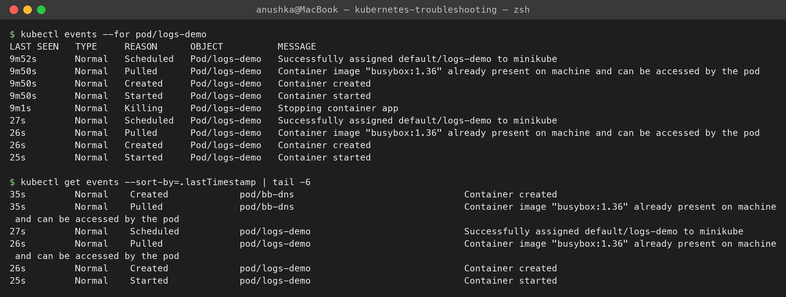
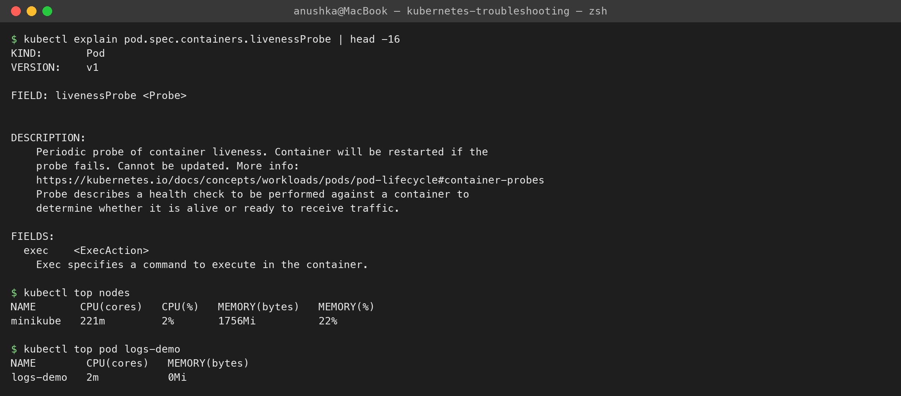

**Task 2 — Common issues**
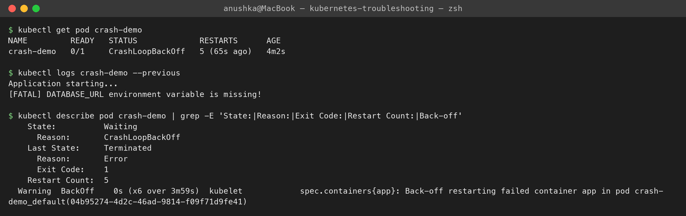
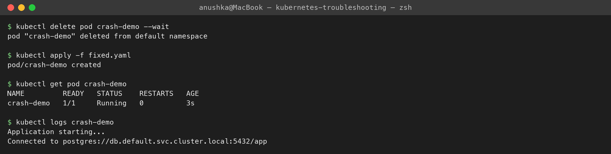
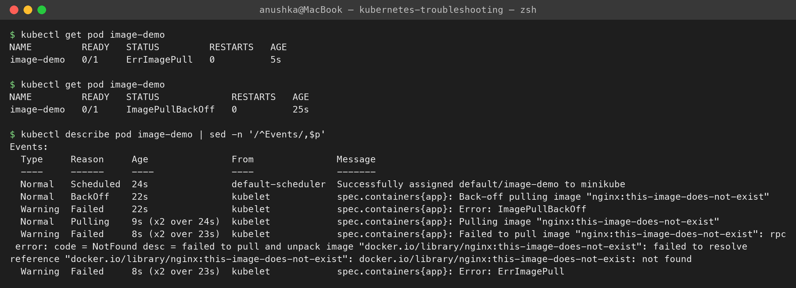
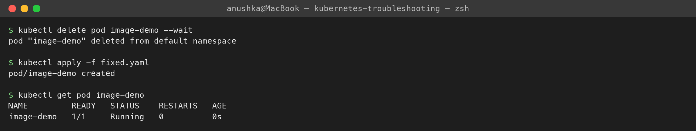
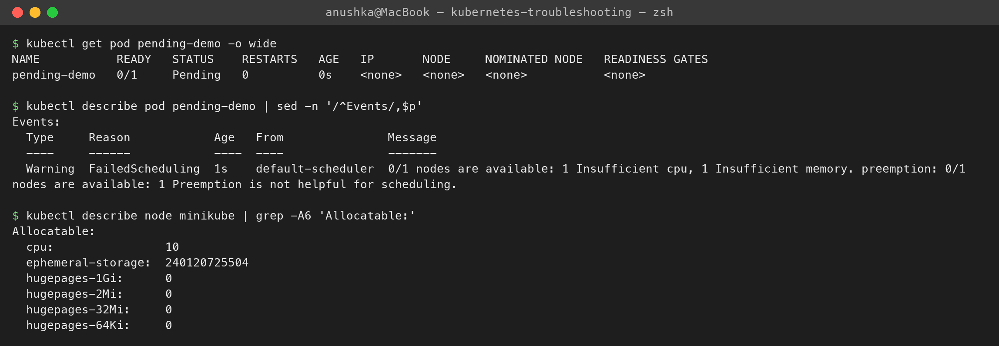
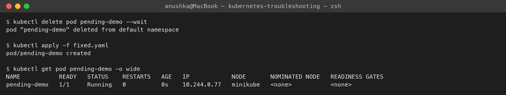
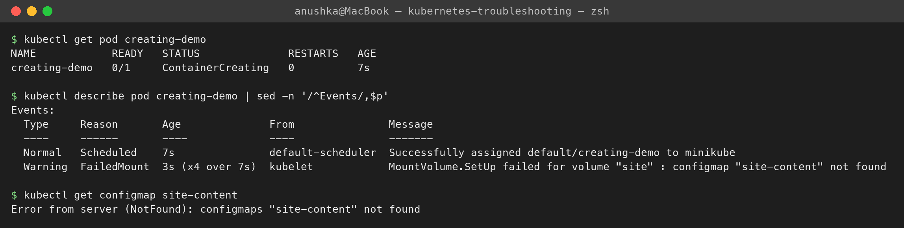
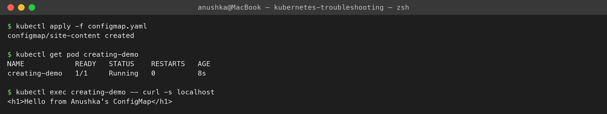
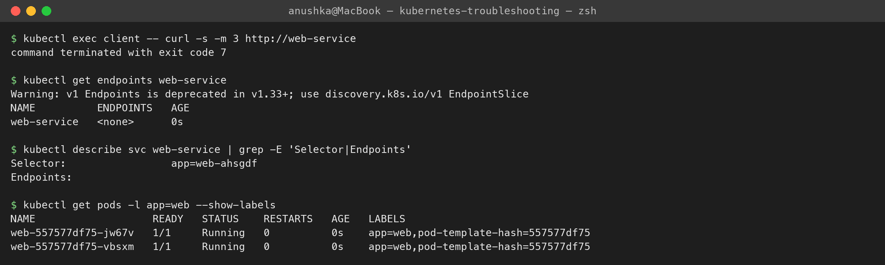
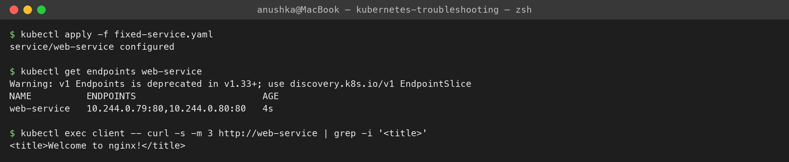
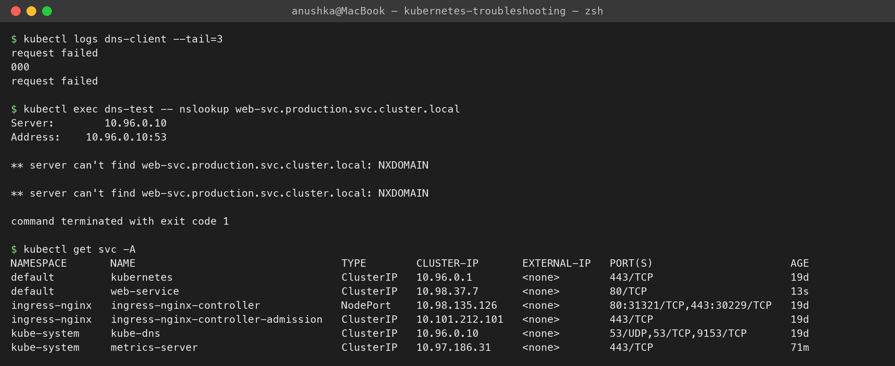
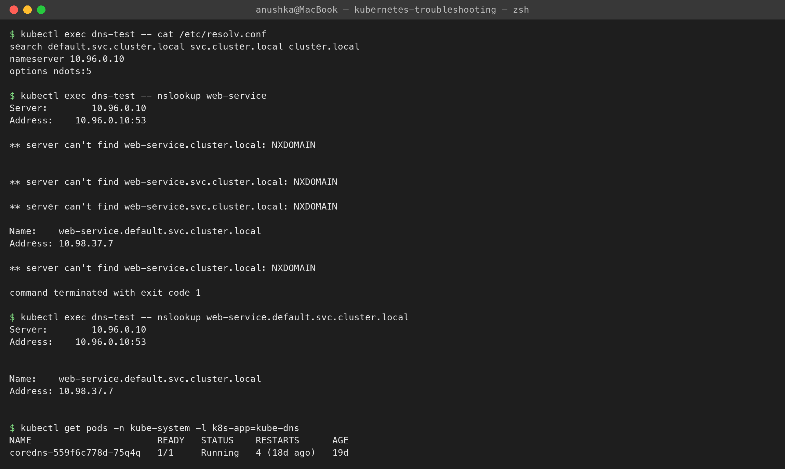
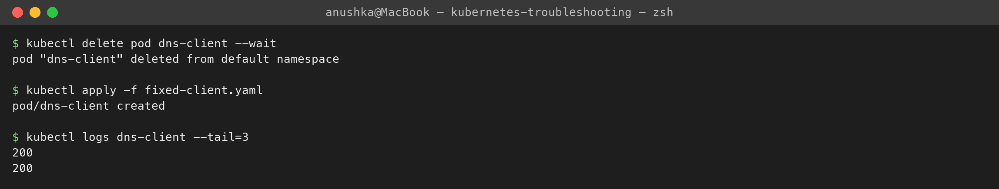
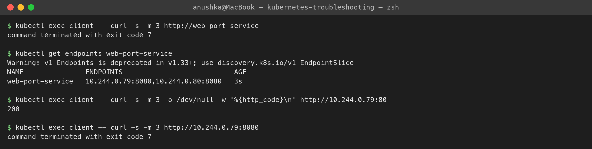
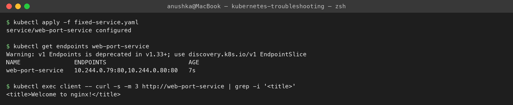
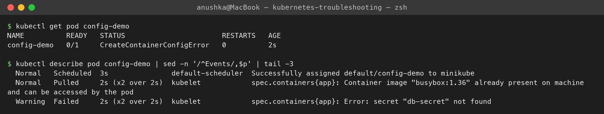
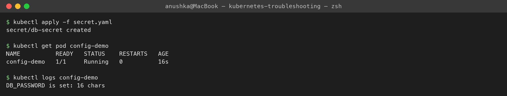
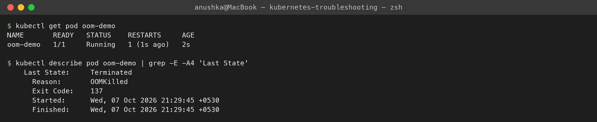
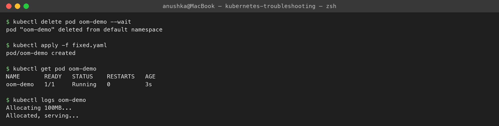

**Task 3 — Mini project**
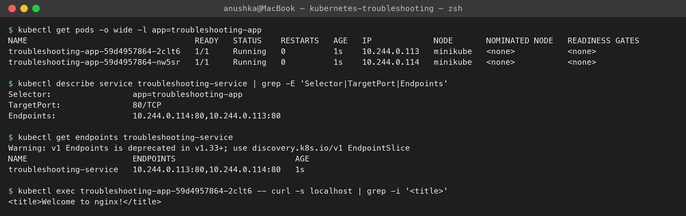
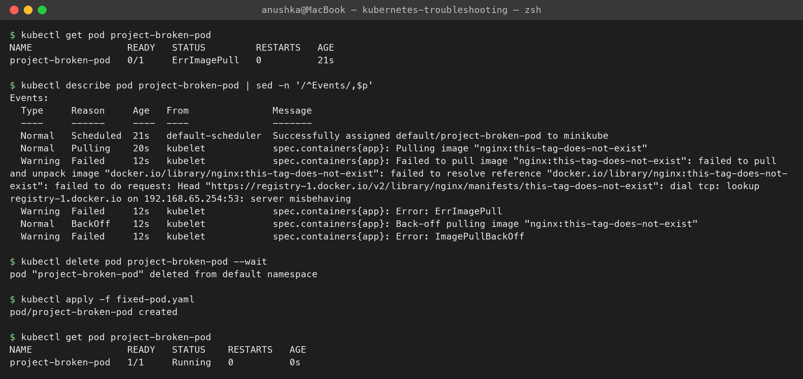
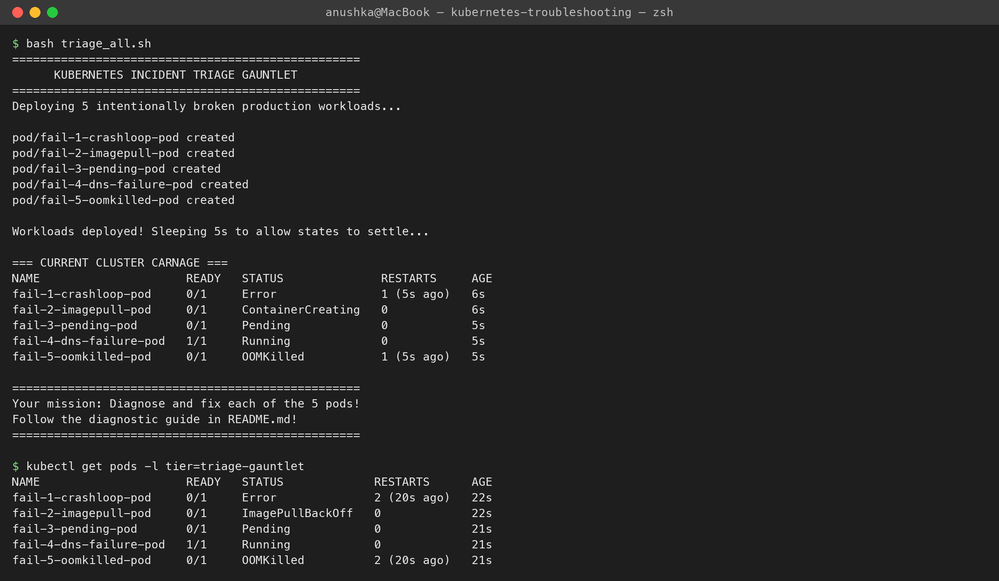
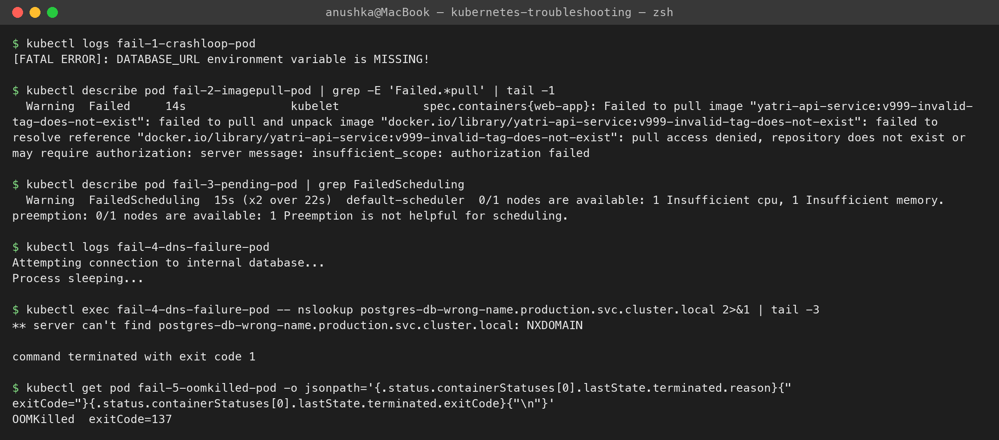
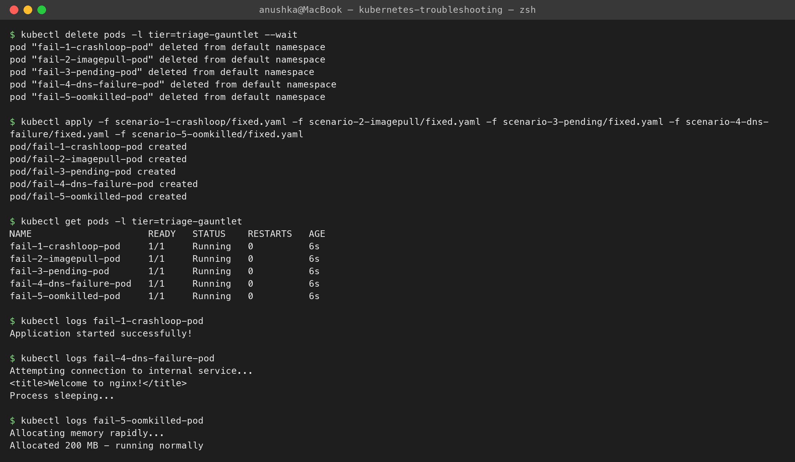
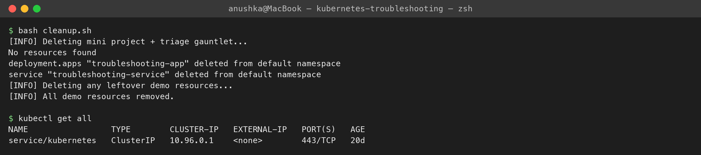
