# Monitoring, Observability & GitOps Homework

**Name:** Anushka Jain

Session 20 tasks from the homework doc, following Nency's `session20-monitoring-observability-gitops` lab. Everything ran on my local minikube cluster via [`run.sh`](./run.sh) (`./run.sh monitoring`, `./run.sh gitops`, `./run.sh cleanup`).

```text
monitoring-gitops/
├── 01-monitoring/
│   ├── values-kube-prometheus-stack.yaml   Helm values: Prometheus + Alertmanager + Grafana + exporters
│   ├── demo-app.yaml                       nginx app + Prometheus exporter sidecar + Service + ServiceMonitor
│   ├── alerts.yaml                         PrometheusRule: 4 alerts (CPU, memory, traffic, app down)
│   ├── load-generator.yaml                 3 busybox pods hammering the app
│   └── promql.sh                           tiny helper: run a PromQL query from the terminal
├── 02-observability/README.md              Task 2: metrics / logs / traces write-up
├── 03-gitops/
│   ├── app/                                Kubernetes manifests that Argo CD syncs from GitHub
│   └── argocd-application.yaml             the Argo CD Application (applied once, outside app/)
├── screenshots/
└── run.sh
```

---

## Task 1: Monitoring demo
### Stack
```text
            ┌─────────────────────────── kube-prometheus-stack (Helm) ───────────────────────────┐
 demo-app ──┤ exporter sidecar :9113 ─┐                                                           │
 kubelet / cAdvisor (CPU, memory) ────┼──scrape──► Prometheus ──rules──► Alertmanager ─► (Slack, │
 kube-state-metrics (replicas, ready)─┤   every 15s    │  PromQL           (group, inhibit,   email…)│
 node-exporter (node resources) ──────┘                ▼                    silence, route)         │
                                                    Grafana dashboards                             │
            └──────────────────────────────────────────────────────────────────────────────────────┘
```
| Component | Role |
|---|---|
| **Prometheus Operator** | runs Prometheus/Alertmanager from CRDs; watches `ServiceMonitor` + `PrometheusRule` objects |
| **Prometheus** | pulls (scrapes) `/metrics` endpoints, stores time series, evaluates alert rules |
| **Alertmanager** | receives firing alerts, de-duplicates, groups, inhibits, silences and routes them to receivers |
| **Grafana** | dashboards (ships ~25 Kubernetes dashboards) on top of Prometheus |
| **kube-state-metrics** | Kubernetes object state as metrics (desired/available replicas, pod phase, restarts) |
| **node-exporter** | node-level CPU, memory, disk, network |
| **nginx-prometheus-exporter** (my sidecar) | turns nginx `stub_status` into `nginx_http_requests_total`, `nginx_connections_*`, `nginx_up` |

### 1. Install the stack (Helm)
```text
$ helm upgrade --install kps prometheus-community/kube-prometheus-stack --version 92.1.0 \
    -n monitoring --create-namespace -f 01-monitoring/values-kube-prometheus-stack.yaml --wait
$ kubectl get pods -n monitoring
alertmanager-kps-kube-prometheus-stack-alertmanager-0   2/2     Running
kps-grafana-7648864f66-6qmbb                            3/3     Running
kps-kube-prometheus-stack-operator-66d869554d-mdrch     1/1     Running
kps-kube-state-metrics-747b7b996-ghs9d                  1/1     Running
kps-prometheus-node-exporter-9wbt4                      1/1     Running
prometheus-kps-kube-prometheus-stack-prometheus-0       2/2     Running
```
> **Two real incidents during this step** (both documented in the screenshots):
> 1. Halfway through the first install, **Docker Desktop's storage started returning `input/output error`** (my Mac's disk was 91% full and minikube had written ~19 GB during these labs). The minikube API server froze. I restarted Docker Desktop and minikube — the cluster came back with its state.
> 2. Afterwards **kube-state-metrics was in `CrashLoopBackOff` with exit code 139** (segfault) and no logs — its image layers had been corrupted by that storage error. Fix: `crictl rmi` the image inside minikube and delete the pod so a clean copy was pulled → `1/1 Running`.
> 3. The interrupted install also left the **Helm release stuck in `pending-install`**, so later upgrades failed with `another operation (install/upgrade/rollback) is in progress`. `helm history` showed revision 1 stuck; I uninstalled and reinstalled the release → `STATUS: deployed` ([`01b`](screenshots/01b-helm-stuck-release-fix.png)).

### 2. Application under monitoring
```text
$ kubectl apply -f 01-monitoring/demo-app.yaml -f 01-monitoring/alerts.yaml
namespace/monitoring-demo created
configmap/demo-app-nginx created
deployment.apps/demo-app created
service/demo-app created
servicemonitor.monitoring.coreos.com/demo-app created
prometheusrule.monitoring.coreos.com/demo-app-alerts created

$ kubectl -n monitoring-demo exec deploy/demo-app -c nginx -- wget -qO- localhost:9113/metrics | grep '^nginx_'
nginx_connections_accepted 2
nginx_connections_active 1
nginx_http_requests_total 2
nginx_up 1
```
The `ServiceMonitor` selects the Service by label and tells Prometheus to scrape its `metrics` port — no Prometheus config file edited:
```text
$ curl -s localhost:9090/api/v1/targets | jq ...
demo-app      http://10.244.0.25:9113/metrics              up
demo-app      http://10.244.0.26:9113/metrics              up
kube-state-metrics   http://10.244.0.12:8080/metrics       up
kubelet       https://192.168.49.2:10250/metrics/cadvisor  up
node-exporter http://192.168.49.2:9100/metrics             up
...
```

### 3. Metrics — CPU utilization, memory utilization, application health
Baseline (idle) with PromQL:
```text
# CPU (cores) per pod
$ promql.sh 'sum by (pod) (rate(container_cpu_usage_seconds_total{namespace="monitoring-demo",container="nginx"}[1m]))'
demo-app-6dc4676878-rclhx  0
demo-app-6dc4676878-2rwnx  0
# memory working set (MiB) per pod
$ promql.sh 'sum by (pod) (container_memory_working_set_bytes{namespace="monitoring-demo",container="nginx"}) / 1024 / 1024'
demo-app-6dc4676878-rclhx  8.215
demo-app-6dc4676878-2rwnx  8.297
# request rate (req/s)
$ promql.sh 'sum(rate(nginx_http_requests_total{namespace="monitoring-demo"}[1m]))'
value  0.161                                <- just Prometheus' own scrapes
# application health
$ promql.sh 'kube_deployment_status_replicas_available{namespace="monitoring-demo"}'
demo-app  2
$ promql.sh 'nginx_up{namespace="monitoring-demo"}'
demo-app-6dc4676878-2rwnx  1
demo-app-6dc4676878-rclhx  1
```
Under load (3 load-generator pods):
```text
CPU (cores)      demo-app-…-rclhx 0.064    demo-app-…-2rwnx 0.051
memory (MiB)     demo-app-…-rclhx 8.512    demo-app-…-2rwnx 8.684
request rate     2610.151 req/s
```
Why `rate()`: `container_cpu_usage_seconds_total` and `nginx_http_requests_total` are **counters** that only grow; `rate(x[1m])` turns them into "per second over the last minute".

### 4. Alerts
[`alerts.yaml`](./01-monitoring/alerts.yaml) defines four rules:
| Alert | Expression (simplified) | for | Severity |
|---|---|---|---|
| `DemoAppHighCPU` | per-pod nginx CPU > 0.05 cores | 30s | warning |
| `DemoAppHighMemory` | working set > 80% of the memory limit | 1m | warning |
| `DemoAppHighRequestRate` | total req/s > 50 | 30s | info |
| `DemoAppDown` | available replicas < 1 (or metric missing) | 30s | critical |

Alert lifecycle: **inactive → pending** (condition true, waiting out `for:`) **→ firing** (sent to Alertmanager) → resolved.
```text
$ curl -s localhost:9090/api/v1/alerts | jq ...                (Prometheus)
DemoAppHighCPU          firing   demo-app-6dc4676878-rclhx  High CPU on demo-app-6dc4676878-rclhx
DemoAppHighCPU          pending  demo-app-6dc4676878-2rwnx  High CPU on demo-app-6dc4676878-2rwnx
DemoAppHighRequestRate  firing   -                          Traffic spike: 2.61k req/s

$ curl -s localhost:9093/api/v2/alerts | jq ...                (Alertmanager)
DemoAppHighRequestRate  info     suppressed  -                          2026-10-08T02:53:27
DemoAppHighCPU          warning  active      demo-app-6dc4676878-rclhx  2026-10-08T02:54:12
```
Note `suppressed`: kube-prometheus-stack's default **inhibition rule** mutes `info` alerts while a `warning`/`critical` alert is firing in the same namespace — so on-call only gets paged for the alert that matters.

### 5. Application health — break it and watch
```text
$ kubectl -n monitoring-demo scale deploy/demo-app --replicas=0        (simulate an outage)
$ promql.sh 'kube_deployment_status_replicas_available{namespace="monitoring-demo"}'
demo-app  0
$ curl -s localhost:9093/api/v2/alerts | jq ...
DemoAppDown  critical  active  No ready pods behind the demo-app Service - users get errors.

$ kubectl -n monitoring-demo scale deploy/demo-app --replicas=2        (recover)
$ promql.sh 'kube_deployment_status_replicas_available{namespace="monitoring-demo"}'
demo-app  2
DemoAppDown alerts still active: 0                                      <- auto-resolved
```

### 6. Dashboards (Grafana)
```text
$ curl -s localhost:3000/api/health
{ "database": "ok", "version": "13.2.3", ... }
$ curl -s 'localhost:3000/api/search?query=Compute%20Resources' | jq ...
efa86fd1d0c121a26444b636a3f509a8  Kubernetes / Compute Resources / Cluster
85a562078cdf77779eaa1add43ccec1e  Kubernetes / Compute Resources / Namespace (Pods)
6581e46e4e5c7ba40a07646395ef7b23  Kubernetes / Compute Resources / Pod
...
```
Real screenshot of the **Kubernetes / Compute Resources / Namespace (Pods)** dashboard for `monitoring-demo` (taken with headless Chrome), with two load tests visible:

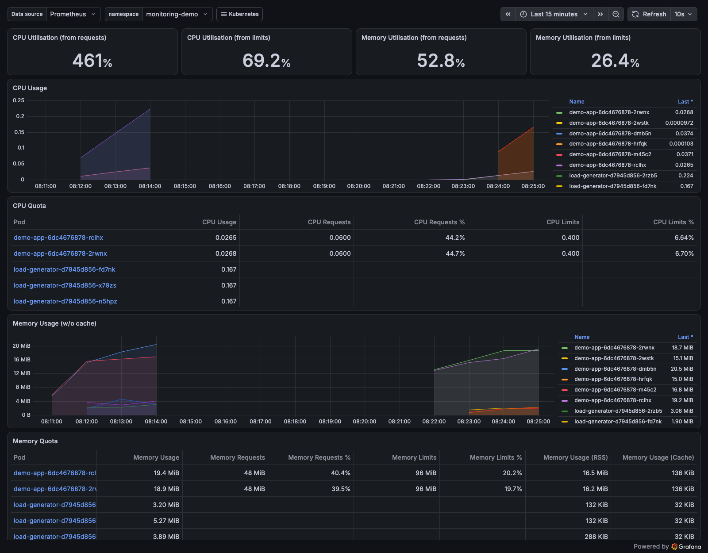

### 7. Logs
```text
$ kubectl -n monitoring-demo logs -l app=demo-app -c nginx --tail=3 --prefix
[pod/demo-app-6dc4676878-2rwnx/nginx] 10.244.0.28 - - [08/Oct/2026:02:55:54 +0000] "GET / HTTP/1.1" 200 615 "-" "Wget" "-"
[pod/demo-app-6dc4676878-2rwnx/nginx] 10.244.0.27 - - [08/Oct/2026:02:55:54 +0000] "GET / HTTP/1.1" 200 615 "-" "Wget" "-"
[pod/demo-app-6dc4676878-rclhx/nginx] 10.244.0.29 - - [08/Oct/2026:02:55:54 +0000] "GET / HTTP/1.1" 200 615 "-" "Wget" "-"
...

$ kubectl -n monitoring-demo logs -l app=demo-app -c nginx --tail=2000 | awk '{print $9}' | sort | uniq -c
4000 200                                     <- status code breakdown straight from the access log
```
`--prefix` labels every line with its pod/container, and `-l app=demo-app` merges the logs of all replicas — the IPs are the three load-generator pods.
`kubectl logs` works per pod and only while the pod exists; in production a log agent (Fluent Bit / Promtail / Alloy) ships these to Loki or Elasticsearch so they can be searched in Grafana next to the metrics (see the [observability write-up](./02-observability/README.md)).

---

## Task 2: Observability
Full write-up: **[`02-observability/README.md`](./02-observability/README.md)** — monitoring vs observability, the three pillars (metrics, logs, traces) with examples, how they correlate, why observability is required, common tools, and Kubernetes observability layers.

---

## Task 3: GitOps with Argo CD
### What is GitOps?
**Git is the single source of truth for the desired state of the system.** Everything (manifests, Helm values) is **declarative** and lives in Git; an **agent inside the cluster** (Argo CD) **continuously reconciles** the live state to match Git — *pulling* changes rather than CI *pushing* into the cluster.
```text
developer ──git commit/push──► GitHub (desired state)
                                   ▲  │ poll / webhook
                                   │  ▼
                          Argo CD (in the cluster): compare Git vs live ──► sync (apply diff)
                                                   └── selfHeal: undo manual drift
                                                   └── prune:    delete what was removed from Git
```
| Principle | In this demo |
|---|---|
| Declarative | plain YAML in [`03-gitops/app/`](./03-gitops/app) |
| Versioned & immutable | every change is a commit with author, message, diff |
| Pulled automatically | Argo CD watches `main` of this repo, path `monitoring-gitops/03-gitops/app` |
| Continuously reconciled | `automated: {prune: true, selfHeal: true}` |

Benefits: audit trail for free, **rollback = `git revert`**, no cluster credentials in CI, drift is impossible to keep, the same review process (PRs) for app code and infrastructure.

### 1. Install Argo CD
```text
$ kubectl apply -n argocd --server-side --force-conflicts -f https://raw.githubusercontent.com/argoproj/argo-cd/stable/manifests/install.yaml
$ kubectl get pods -n argocd
argocd-application-controller-0                     1/1     Running     <- compares Git vs cluster, syncs
argocd-applicationset-controller-…                  1/1     Running
argocd-dex-server-…                                 0/1     ErrImagePull  (transient registry error - Running a minute later)
argocd-notifications-controller-…                   1/1     Running
argocd-redis-…                                      1/1     Running     <- cache
argocd-repo-server-…                                1/1     Running     <- clones Git, renders manifests
argocd-server-…                                     1/1     Running     <- API + UI
$ kubectl -n argocd get deploy argocd-server -o jsonpath=...
quay.io/argoproj/argocd:v3.5.4
```

### 2. Point Argo CD at this repository (applied once)
[`03-gitops/argocd-application.yaml`](./03-gitops/argocd-application.yaml):
```yaml
source:
  repoURL: https://github.com/anushkabhansalii/devops-homework.git
  targetRevision: main
  path: monitoring-gitops/03-gitops/app
destination:
  server: https://kubernetes.default.svc
  namespace: session20-gitops
syncPolicy:
  automated: {prune: true, selfHeal: true}
  syncOptions: [CreateNamespace=true]
```
```text
$ kubectl apply -f 03-gitops/argocd-application.yaml
application.argoproj.io/session20-gitops created
$ kubectl -n argocd get applications
NAME               SYNC STATUS   HEALTH STATUS
session20-gitops   Synced        Healthy
$ kubectl get deploy,pods,svc -n session20-gitops
deployment.apps/gitops-web   2/2     2            2           1s
pod/gitops-web-566cc65d84-5ks9s   1/1     Running   0          1s
pod/gitops-web-566cc65d84-nqpvq   1/1     Running   0          1s
service/gitops-web   ClusterIP   10.105.92.57   <none>        80/TCP    1s
```
I never ran `kubectl apply` on `deployment.yaml` or `service.yaml` — Argo CD created them from GitHub.

### 3. Change the app **through Git**
```text
$ git diff -- 03-gitops/app/deployment.yaml
-  replicas: 2
+  replicas: 3
-          image: nginx:1.27-alpine
+          image: nginx:1.28-alpine
$ git commit -m 'GitOps demo: scale gitops-web to 3 replicas and upgrade nginx to 1.28' && git push
3cd93e2 GitOps demo: scale gitops-web to 3 replicas and upgrade nginx to 1.28

$ kubectl -n argocd get application session20-gitops -o jsonpath=...
Synced / Healthy  revision=3cd93e2067001d7c6361247d6e5a98a4617b9e2c     <- the commit I just pushed
$ kubectl -n session20-gitops get deploy gitops-web -o jsonpath=...
3 replicas, image nginx:1.28-alpine
```
(Argo CD polls Git every ~3 minutes; I annotated the Application with `argocd.argoproj.io/refresh=normal` to make it check immediately — in production a GitHub webhook does this.) Commit: [3cd93e2](https://github.com/anushkabhansalii/devops-homework/commit/3cd93e2067001d7c6361247d6e5a98a4617b9e2c).

### 4. Drift → self-heal (Git wins)
```text
# someone 'hot-fixes' production by hand, bypassing Git:
$ kubectl -n session20-gitops scale deploy/gitops-web --replicas=6
$ kubectl -n session20-gitops get deploy gitops-web
gitops-web   3/6     3            3           55s
# 15 seconds later - Argo CD detected the drift and put Git's value back:
gitops-web   3/3     3            3           70s

$ kubectl -n session20-gitops delete service gitops-web
service "gitops-web" deleted
$ kubectl -n session20-gitops get svc gitops-web
gitops-web   ClusterIP   10.107.213.24   <none>        80/TCP    5s      <- recreated
```

### 5. Rollback = `git revert`
```text
$ git revert --no-edit HEAD && git push
48f83fa Revert "GitOps demo: scale gitops-web to 3 replicas and upgrade nginx to 1.28"
3cd93e2 GitOps demo: scale gitops-web to 3 replicas and upgrade nginx to 1.28
2cef8c8 Add GitOps app manifests watched by Argo CD (session 20)

$ kubectl -n session20-gitops get deploy gitops-web -o jsonpath=...
2 replicas, image nginx:1.27-alpine

$ kubectl -n argocd get application session20-gitops -o jsonpath='{range .status.history[*]}...'
0  2cef8c891ae70291fdea43ef23783169f079f489  2026-10-08T02:58:27Z     initial sync
1  3cd93e2067001d7c6361247d6e5a98a4617b9e2c  2026-10-08T02:58:33Z     scale + upgrade
2  48f83fa09e6d7ecc2a8f1ea6ea66d94924d09161  2026-10-08T02:59:46Z     revert
```
Every deployment maps 1-to-1 to a Git commit, so "what is running and who changed it?" is answered by `git log`.

## Screenshots
**Monitoring**
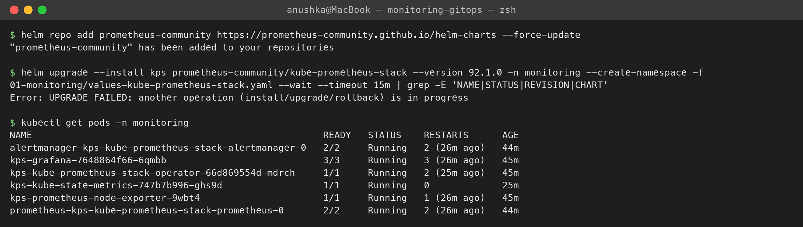
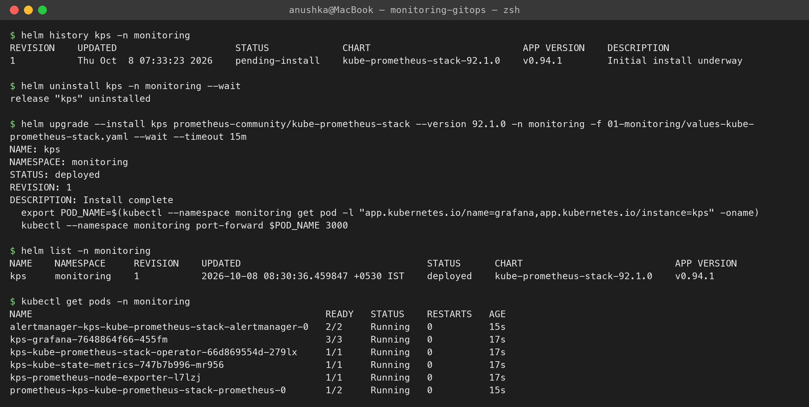
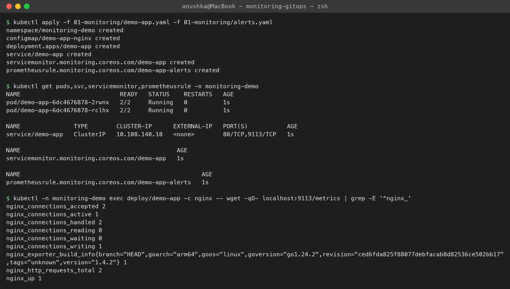
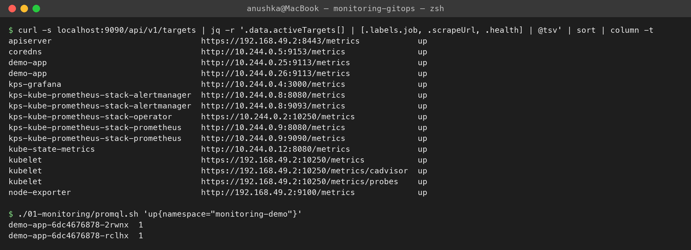
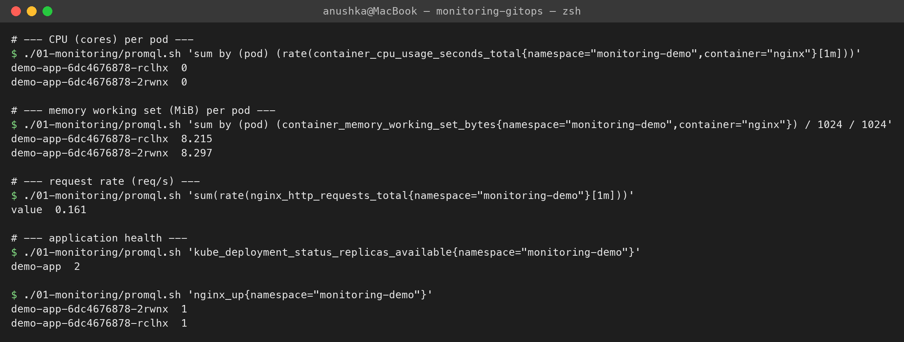
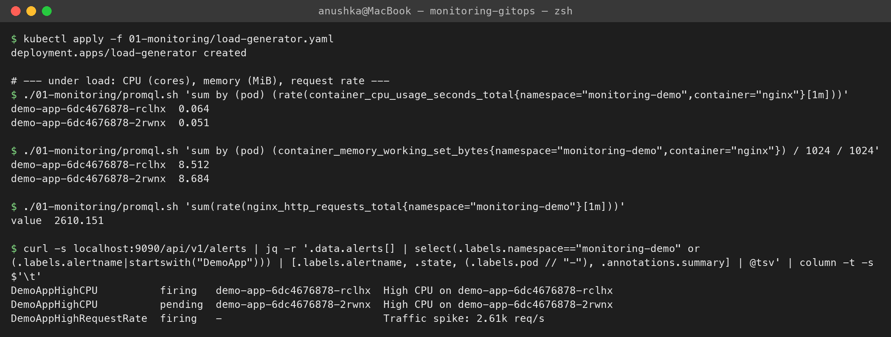
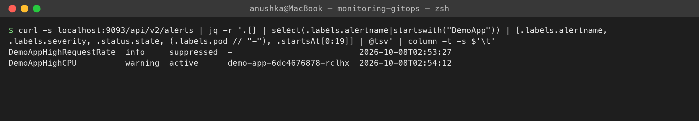
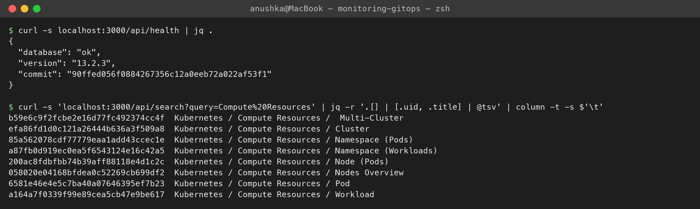

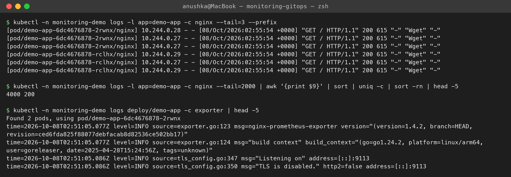
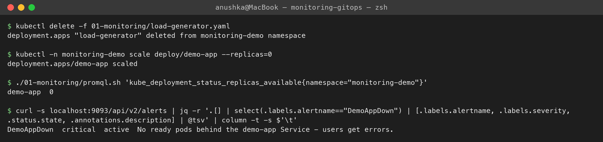
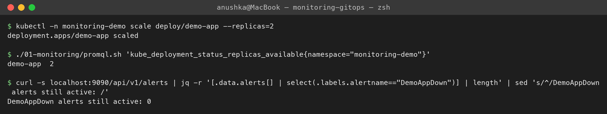

**GitOps**
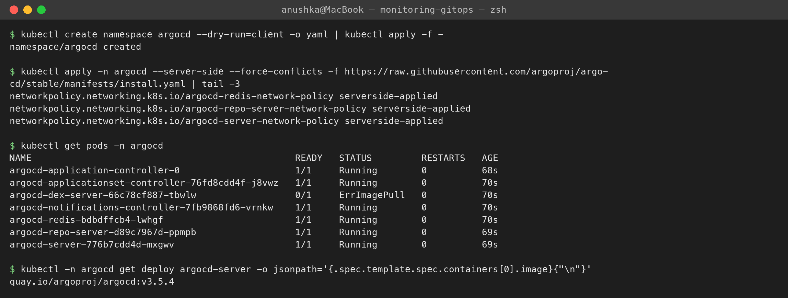
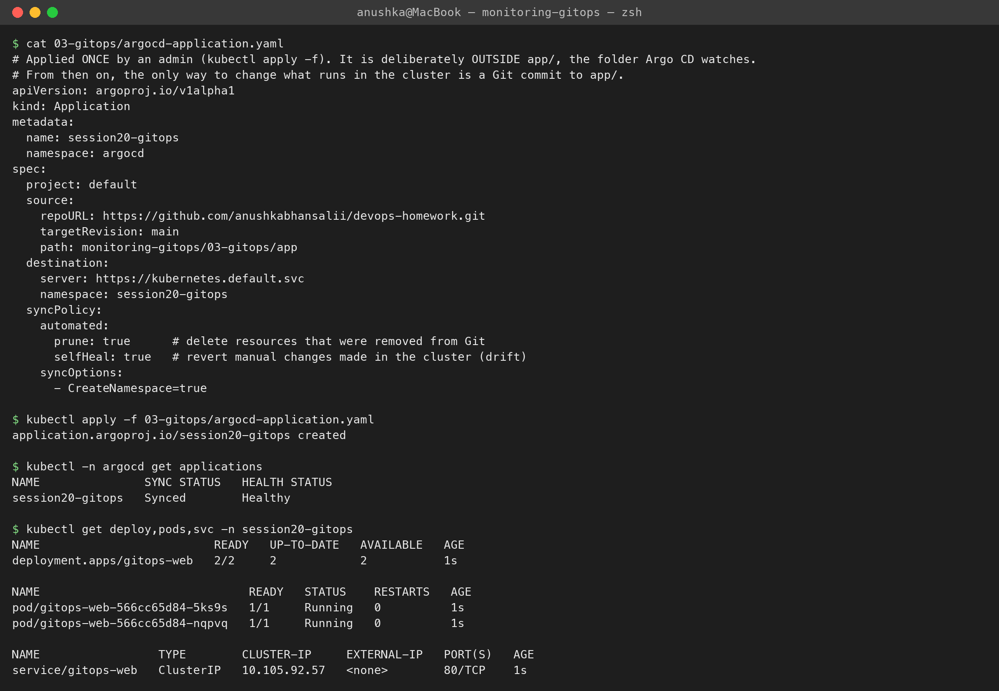
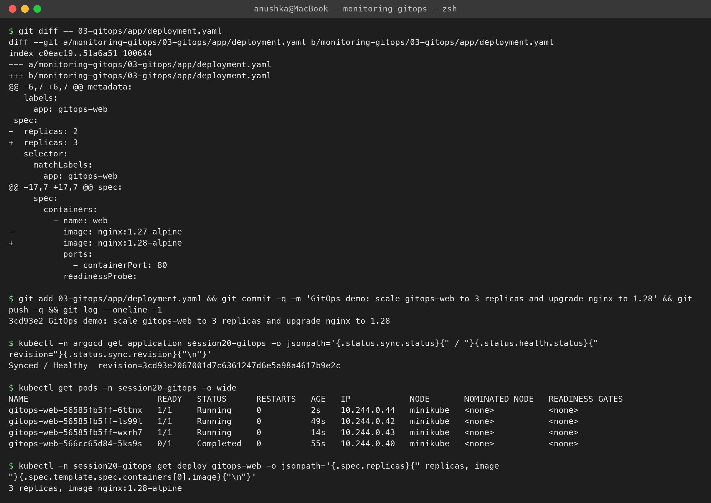
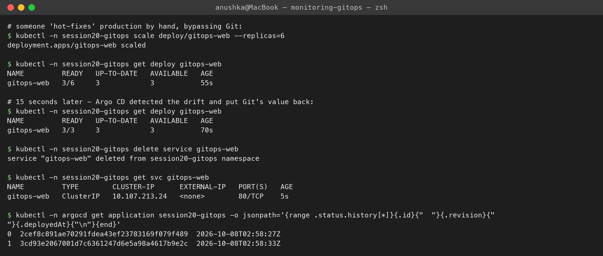
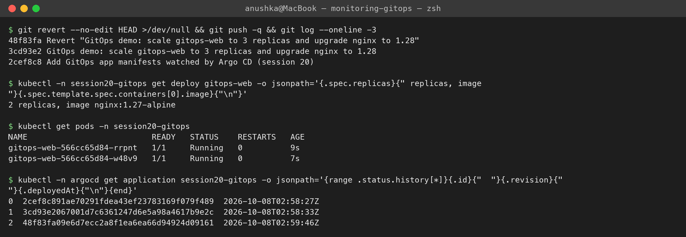
