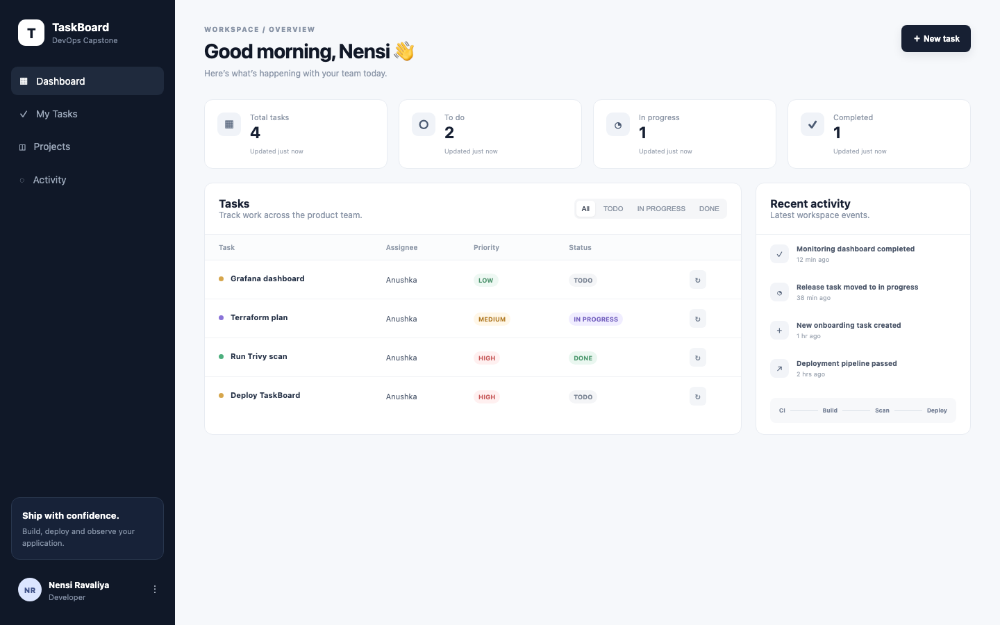
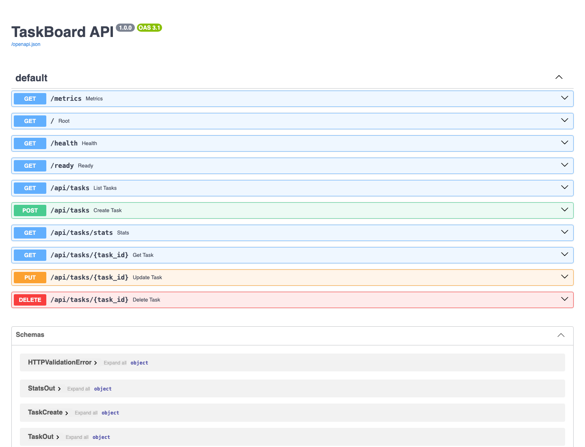
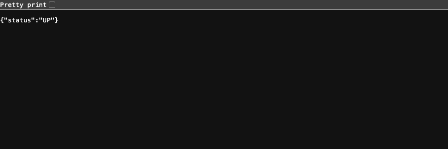
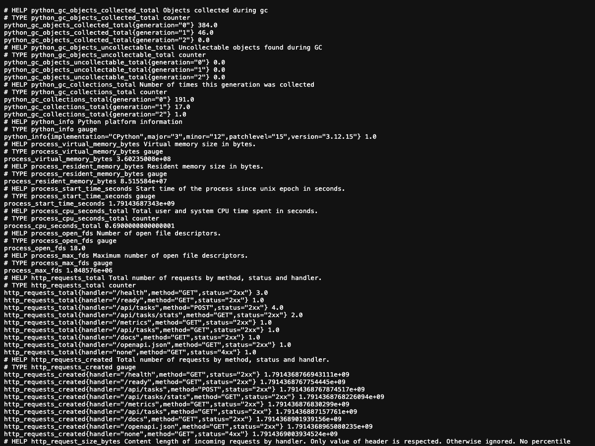
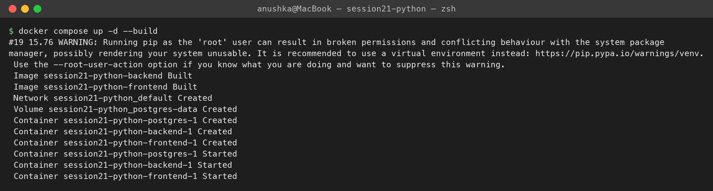
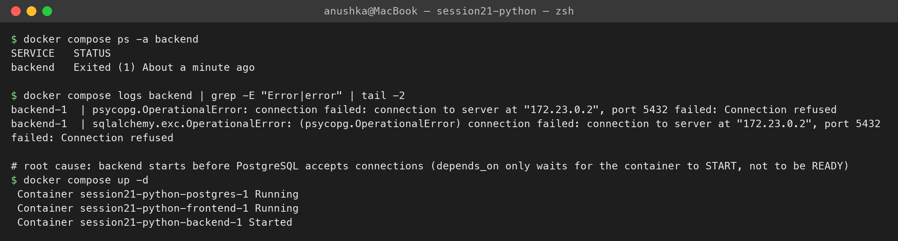
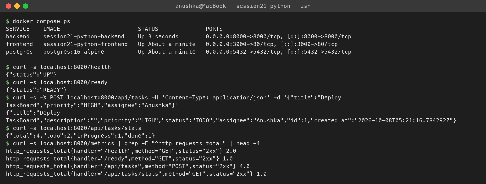
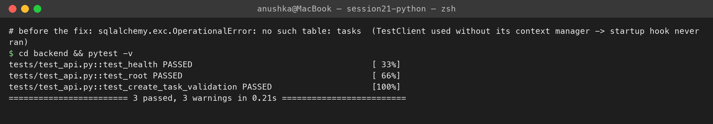

# Session 21 — TaskBoard (session21-python) Homework

**Name:** Anushka Jain

Homework from the final class: run Nency's `session21-python` project (React frontend + FastAPI backend + PostgreSQL) following its README ([`README-class.md`](./README-class.md)), test the backend endpoints and add screenshots. My full end-to-end version of this project (CI/CD, DevSecOps, Helm, Terraform, GitOps, monitoring) is in [`../final-devops-project`](../final-devops-project).

## 1. Docker Compose up
```text
$ docker compose up -d --build
 Image session21-python-backend Built
 Image session21-python-frontend Built
 Volume session21-python_postgres-data Created
 Container session21-python-postgres-1 Started
 Container session21-python-backend-1 Started
 Container session21-python-frontend-1 Started
```

## 2. Backend exited — and the fix (same as in class)
```text
$ docker compose ps -a backend
backend   Exited (1)
$ docker compose logs backend
psycopg.OperationalError: connection failed: connection to server at "172.23.0.2", port 5432 failed: Connection refused
$ docker compose up -d
 Container session21-python-backend-1 Started
```
Root cause: `depends_on` only waits for the postgres **container to start**, not for PostgreSQL to **accept connections**, so the backend's `alembic upgrade head` ran too early. Running `up -d` again fixed it (as in class); the permanent fix is a postgres `healthcheck` + `depends_on: condition: service_healthy` (used in my final project).

## 3. Testing the backend endpoints
```text
$ docker compose ps
backend    session21-python-backend    Up    0.0.0.0:8000->8000/tcp
frontend   session21-python-frontend   Up    0.0.0.0:3000->80/tcp
postgres   postgres:16-alpine          Up    0.0.0.0:5432->5432/tcp
$ curl -s localhost:8000/health
{"status":"UP"}
$ curl -s localhost:8000/ready
{"status":"READY"}
$ curl -s -X POST localhost:8000/api/tasks -d '{"title":"Deploy TaskBoard","priority":"HIGH","assignee":"Anushka"}'
{"title":"Deploy TaskBoard","description":"","priority":"HIGH","status":"TODO","assignee":"Anushka","id":1,...}
$ curl -s localhost:8000/api/tasks/stats
{"total":4,"todo":2,"inProgress":1,"done":1}
$ curl -s localhost:8000/metrics | grep ^http_requests_total
http_requests_total{handler="/health",method="GET",status="2xx"} 2.0
http_requests_total{handler="/api/tasks",method="POST",status="2xx"} 4.0
```
| Endpoint | Purpose |
|---|---|
| `/health` | liveness — the process is up |
| `/ready` | readiness — also checks the DB connection |
| `/metrics` | Prometheus metrics (request counts, latency histograms) |
| `/docs` | Swagger UI for every REST endpoint (GET, POST, PUT, DELETE) |

## 4. Tests (pytest)
```text
$ cd backend && pytest -v
tests/test_api.py::test_health PASSED
tests/test_api.py::test_root PASSED
tests/test_api.py::test_create_task_validation PASSED
3 passed
```
Found while running it: `test_create_task_validation` first **failed** with `no such table: tasks` — the test created `TestClient(app)` without entering its context manager, so FastAPI's startup hook (which creates the tables) never ran. Fixed in [`backend/tests/test_api.py`](./backend/tests/test_api.py).

## Screenshots
**Frontend (http://localhost:3000)**

**Backend /docs, /health, /metrics (http://localhost:8000)**



**Terminal**




