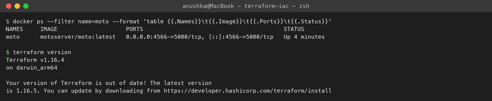
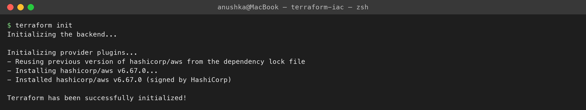
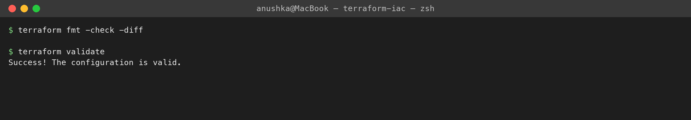
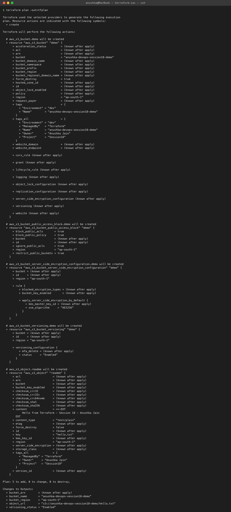
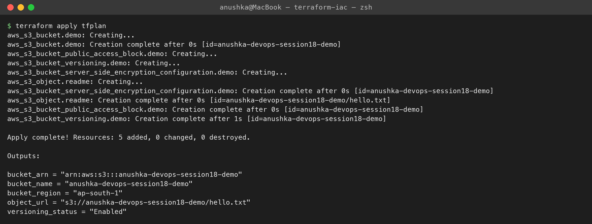
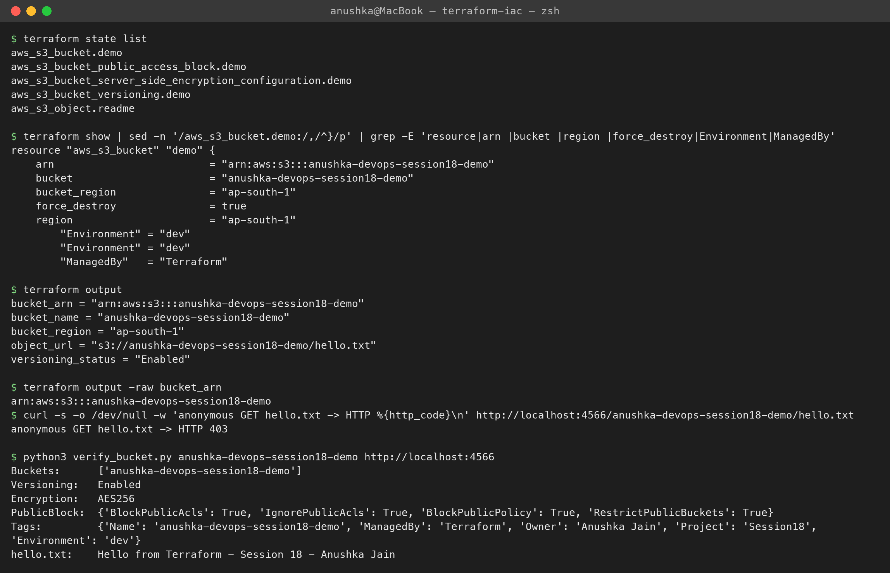
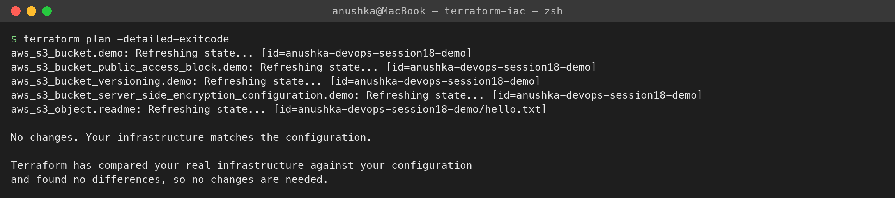
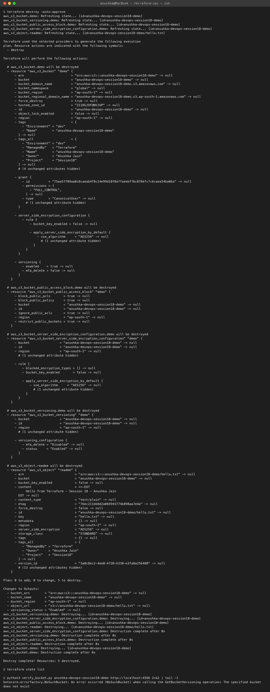

# Terraform & Infrastructure as Code Homework

**Name:** Anushka Jain

Session 18 tasks from the homework doc, following Nency's `session18-terraform-iac` lab. All terminal output was generated on my machine by [`run.sh`](./run.sh).

```text
terraform-iac/
├── terraform-s3-demo/        Task 1: S3 bucket with Terraform (main.tf, variables.tf, outputs.tf, provider.tf, terraform.tfvars, README.md)
├── aws-services/             Task 2: AWS services research
│   ├── 01-iam/README.md            IAM - governance
│   ├── 02-ec2/README.md            EC2 - compute
│   ├── 03-s3/README.md             S3 - storage
│   ├── 04-vpc/README.md            VPC - networking
│   └── 05-dynamodb-rds/README.md   DynamoDB & RDS - databases
├── screenshots/
└── run.sh                    init → fmt → validate → plan → apply → show → output → destroy
```

## What is Infrastructure as Code?
Instead of clicking through the AWS console, the infrastructure is described in **code** (HCL files), kept in **Git**, reviewed like any other change, and applied by a tool. Benefits: repeatable (same config → same infra in dev/stage/prod), versioned and reviewable, no configuration drift, documentation that can't go stale, and easy to tear down.

Terraform is **declarative**: you describe the *desired end state*; Terraform works out the steps by comparing the config, the **state file**, and the real infrastructure (via **providers** that call each platform's API).
```text
.tf files ──► terraform plan ──► diff (config vs state vs real infra) ──► terraform apply ──► AWS API
                                                                                  │
                                                                         terraform.tfstate updated
```

## Task 1: Terraform S3 demo
Full walkthrough with every command and its output: **[`terraform-s3-demo/README.md`](./terraform-s3-demo/README.md)**.

Summary of what happened:
| Step | Result |
|---|---|
| `terraform init` | installed `hashicorp/aws v6.67.0` |
| `terraform fmt -check` / `validate` | clean / `Success! The configuration is valid.` |
| `terraform plan -out=tfplan` | `Plan: 5 to add, 0 to change, 0 to destroy.` |
| `terraform apply tfplan` | `Apply complete! Resources: 5 added` — bucket + versioning + AES256 encryption + public access block + `hello.txt` |
| `terraform show` / `state list` / `output` | ARN `arn:aws:s3:::anushka-devops-session18-demo`, region `ap-south-1`, versioning `Enabled` |
| verification | anonymous GET → **403** (public access blocked); signed read returns the object, tags, encryption |
| `terraform plan` again | `No changes.` (idempotent) |
| `terraform destroy` | `5 destroyed`, bucket gone (`NoSuchBucket`) |

> I ran this against **Moto**, an open-source local AWS emulator in Docker, because there's no AWS account configured on this laptop — same Terraform, same provider, no cloud cost. `use_local_emulator = false` targets real AWS.

## Task 2: AWS services research
| Service | Category | Doc |
|---|---|---|
| IAM | Governance | [`aws-services/01-iam`](./aws-services/01-iam/README.md) — users, groups, roles, policies, permissions, least privilege, best practices |
| EC2 | Compute | [`aws-services/02-ec2`](./aws-services/02-ec2/README.md) — AMI, instance types, key pairs, security groups, EBS, public vs private IP, lifecycle |
| S3 | Storage | [`aws-services/03-s3`](./aws-services/03-s3/README.md) — buckets, objects, storage classes, versioning, lifecycle, encryption, bucket policies |
| VPC | Networking | [`aws-services/04-vpc`](./aws-services/04-vpc/README.md) — CIDR, subnets, route tables, IGW, NAT, SGs, NACLs, public vs private subnets |
| DynamoDB & RDS | Databases | [`aws-services/05-dynamodb-rds`](./aws-services/05-dynamodb-rds/README.md) — NoSQL tables/items/keys vs relational engines, Multi-AZ, read replicas, backups |

## Screenshots








